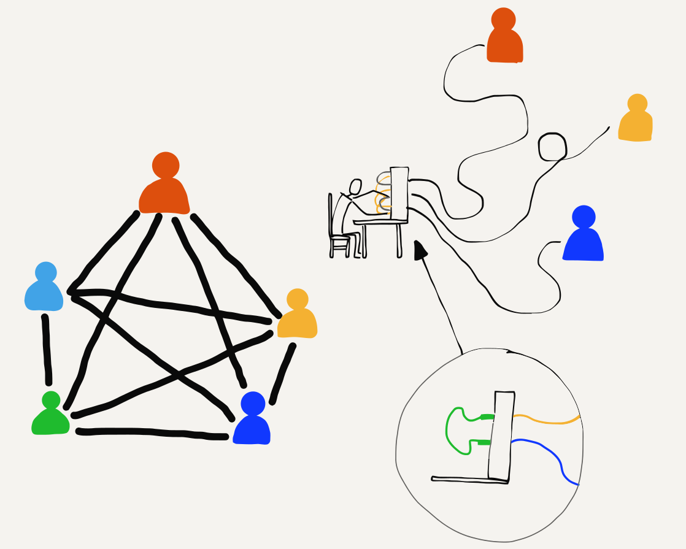
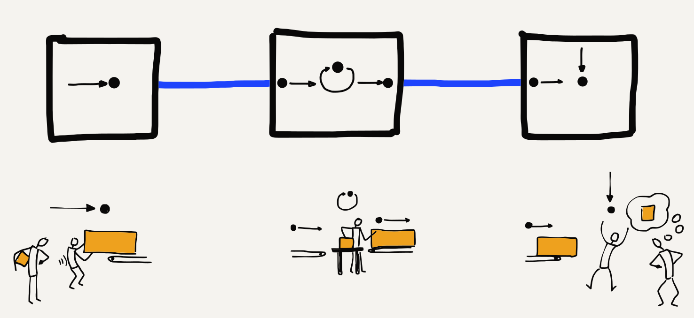
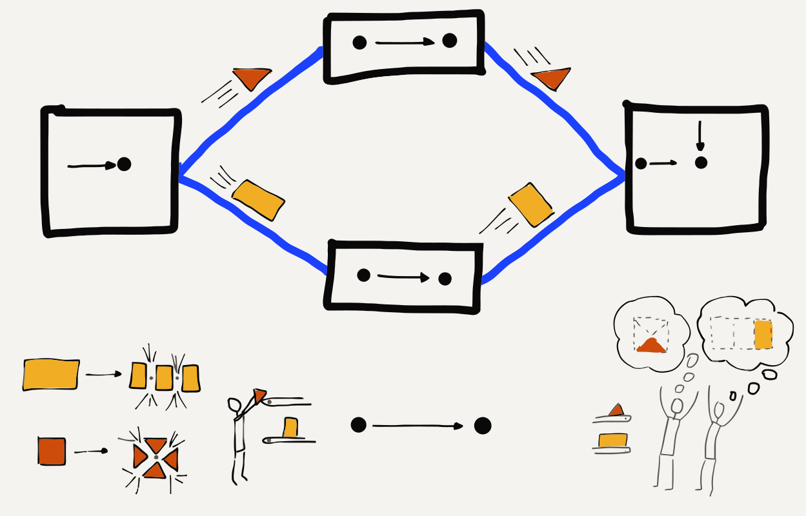
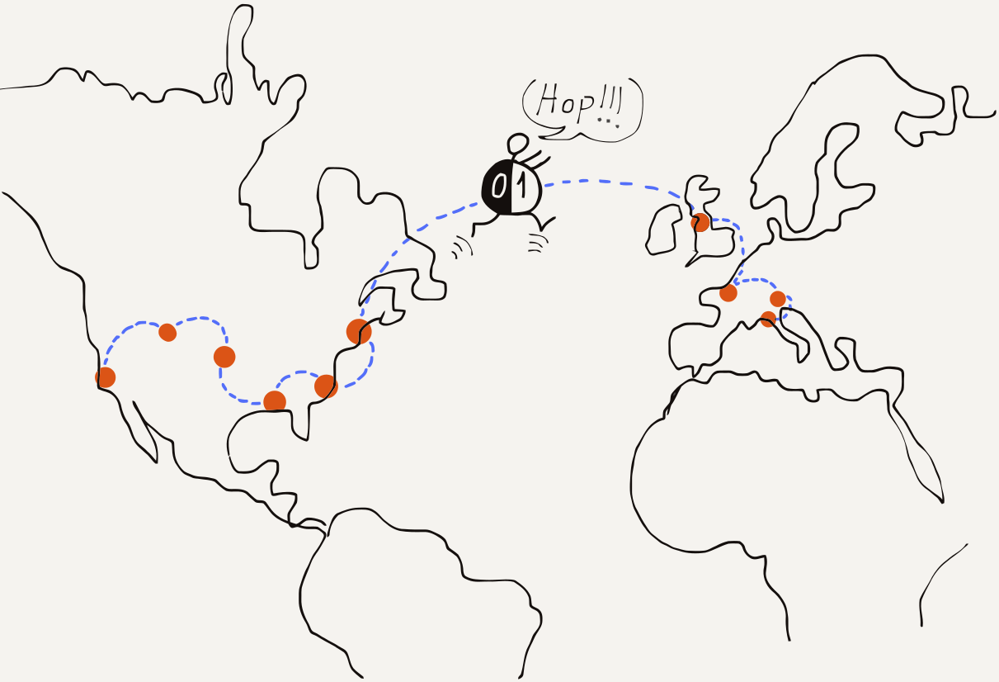

---
hide:
  - navigation
---

# 简介

**Introduction**

=== "中文"

    使用互联网似乎非常简单。我们输入一个网址，页面就会显示出来。或者我们打开自己喜欢的社交网站，查看朋友、家人和宠物的照片。但实际上，需要大量复杂的软件和硬件才能让互联网看起来如此简单。如今互联网所依赖的技术设计始于20世纪60年代，经过20多年的研究，学者们才在1980年代后期通过一个名为NSFNet的项目建立了第一个“互联网”。自那时起，随着网络变得越来越大、速度更快，遍布全球的数十亿台计算机，关于改进网络技术的研究和开发工作一直在持续进行。
    
    为了更好地理解今天的互联网如何运作，我们将回顾人类和计算机通过技术进行通信的历程。

=== "英文"

    Using the Internet seems pretty easy. We go to a web address and up comes a page. Or we go to our favorite social site and see pictures of our friends, families, and pets. But it takes a lot of complex software and hardware to make the Internet seem so simple. The design of the technologies that make today's Internet work started in the 1960s, and there were over 20 years of research into how to build internetworking technologies before the first "Internet" was built in the late 1980s by academics in a project called NSFNet. Since then, the research and development into improving network technologies has continued as networks have become far larger and faster and globally distributed with billions of computers.
    
    In order to better understand how today's Internet works, we will take a look at how humans and computers have communicated using technology over the years.

## 远程通信

**Communicating at a Distance**

=== "中文"

    想象一群五个人坐在一个房间里，围成一个圈。只要他们礼貌一点，并且不同时进行多于一个对话，那么任何人都可以很自然地和其他人交谈。他们只需要能够听到彼此的声音，并协调如何使用房间内的共享空间。
    
    但是，如果我们把这些人分别放在不同的房间里，他们再也看不到或听不到彼此，该如何进行交流呢？一种方式可能是每对人之间拉一根线，在线的一端连接一个麦克风，另一端连接一个扬声器。这样，所有人仍然可以听到所有的对话。他们仍然需要礼貌，确保同时只有一场对话在进行。
    
    每个人需要四个扬声器（每个扬声器对应其他四个人中的一个）以及足够的电线来连接所有的麦克风和扬声器。对于五个人来说，这已经是个问题了，而当人数达到几百或几千人时，问题会变得更糟。
    
    使用电线、麦克风和扬声器是20世纪初期电话系统的运作方式。由于无法为每一对电话配备单独的电线，这些系统并不能让所有的人同时连接。每个人只和一个电话接线员连接，当接线员将两根电话线连接起来时，两个人便可以通话，通话结束后接线员再断开连接。
    
    
    
    当用户的家或公司离接线员所在的建筑较近时，最早的本地电话系统运行良好，可以直接从接线员的建筑到用户家中拉一根电话线。
    
    但是，如果成千上万、相隔数百公里的人需要通信呢？我们不能从每个家庭到一个中心办公室铺设100公里的电话线。电话公司采用的解决方案是设立多个中心办公室，并在中心办公室之间架设几根电话线，然后在办公室之间共享这些线路。长距离通话可能需要经过多个中心办公室。在光纤出现之前，长途电话是通过城市间架设的电线杆上传输的，电线杆上挂满了许多独立的电话线。电线的数量代表了可以同时进行的长途电话通话数量。
    
    
    
    由于线路越长，成本越高，这些办公室之间的长途连接安装和维护成本非常昂贵，而且数量稀少。因此，在电话的早期，市内通话一般非常便宜，而长途通话则更贵，按分钟计费。这是合理的，因为每当你在进行长途通话时，意味着其他人无法使用这条长途线路。电话公司希望你尽量缩短通话时间，以便其他用户能使用长途线路。
    
    当电话公司开始使用光纤时，采用了更先进的技术，可以在一根光纤上传输多路长途通话。如果你看到旧照片上有很多电线挂在同一个电线杆上，那通常意味着它们是电话线，而不是用于输送电力的线路。

=== "英文"

    Imagine a group of five people in a room sitting in a circle. As long as they are courteous and don't have more than one conversation at the same time, it's quite natural for any person to talk to any other person in the room. They just need to be able to hear each other and coordinate how to use the shared space in the room.
    
    But what if we put these people in different rooms so they can no longer see or hear each other? How could pairs of people communicate with each other then?  One way might be to run a wire between each pair of people with a microphone on one end and a speaker on the other end. Now everyone could still hear all the conversations. They would still need to be courteous to make sure that there was only one conversation going on at the same time.
    
    Each person would need four speakers (one for each of the other people) and enough pieces of wire to connect all the microphones and speakers. This is a problem with five people and it gets far worse when there are hundreds or thousands of people.
    
    Using wires, microphones, and speakers is how early telephone systems from the 1900s allowed people to make phone calls.  Because they could not have separate wires between every pair of telephones, these systems did not allow all pairs of people to be connected at the same time. Each person had a single connection to a human "operator". The operator would connect two wires together to allow a pair of people to talk, and then disconnect them when the conversation was finished.
    
    
    
    The first local telephone systems worked well when a customer's home or
    business was close to the operator's building and a wire could be strung
    directly from the operator's building to the person's home.
    
    But what if thousands people who are hundreds of kilometers apart need to be able to communicate? We can't run 100-kilometer wires from each home to a single central office. What the telephone companies did instead was to have many central offices and run a few wires between the central offices, then share connections between central offices. For long distances, a connection might run through a number of central offices. Before the advent of fiber optic, long-distance telephone calls were carried between cities on poles with lots of separate wires. The number of wires on the poles represented the number of possible simultaneous long-distance phone calls that could use those wires.
    
    
    
    Since the cost of the wires went up as the length of the wire increased, these longer connections between offices were quite expensive to install and maintain, and they were scarce. So in the early days of telephones, local calls were generally quite inexpensive. But long-distance calls were more expensive and they were charged by the minute. This made sense because each minute you talked on a long-distance call, your use of the long-distance wires meant no one else could use them. The telephone companies wanted you to keep your calls short so their long-distance lines would be available for other customers.
    
    When telephone companies started using fiber optic, more advanced techniques were used to carry many simultaneous long-distance conversations on a single fiber. When you look at an old photo and see lots of wires on a single pole, it generally means they were telephone wires and not used to carry electricity.

## 计算机的通信方式

**Computers Communicate Differently**

=== "中文"

    当人类通过电话交谈时，他们拨打电话，聊一会儿，然后挂断。从统计学上看，大多数时间人类并不在通话中，至少在每个人拥有智能手机之前是这样。但计算机（包括你智能手机上的应用程序）的通信方式与人类不同。有时，计算机会发送简短的消息来检查另一台计算机是否可用。有时，计算机会发送中等大小的信息，如一张图片或一封长电子邮件。而有时，计算机会发送大量信息，比如一部完整的电影或一款需要数分钟甚至数小时才能下载完成的软件。因此，计算机之间的消息可以是短的、中等的或长的。
    
    在最早期，计算机之间通过电线连接。将数据从一台计算机发送到另一台计算机的最简单方式是将发送的消息排成队列，并按顺序一个接一个地发送，计算机和电线能够尽可能快地传输数据。每条消息都要等待它前面的消息发送完毕，才能有机会通过连接发送。
    
    当计算机位于同一栋建筑内时，建筑的拥有者可以铺设电线连接它们。如果计算机位于同一城镇，通常需要从电话公司租用电线来连接它们。他们通常会要求电话公司在中心办公室将这些电线连接起来，这样就不需要一台计算机“拨号”到另一台计算机以发送数据。这些租赁线路在计算机通信中非常方便，因为它们是“始终在线”的，但它们也非常昂贵，因为每天24小时都在使用。
    
    当计算机相距更远，位于不同的城市时，租赁线路通过连接各中心办公室的长电线延伸。由于中心办公室之间的电线非常少，这些长途租赁线路的成本非常高，并且随着线路长度的增加，费用会急剧上升。但如果你有足够的资金，你可以租赁直接的连接线路，使你的计算机能够交换数据。这种方式运行良好，只要你只使用一个品牌的计算机，因为每个计算机公司都有自己使用电话线连接计算机并发送数据的方式。a.

=== "英文"

    When humans talk on the phone, they make a call, talk for a while, and then hang up. Statistically, most of the time, humans are not talking on the phone. At least they weren't before everyone had smartphones. But computers, including the applications on your smartphone, communicate differently than humans do. Sometimes computers send short messages to check if another computer is available. Computers sometimes send medium-sized information like a single picture or a long email message. And sometimes computers send a lot of information like a whole movie or a piece of software to install that might take minutes or even hours to download. So messages between computers can be short, medium, or long.
    
    In the earliest days of connecting computers to one another, pairs of computers were connected with wires. The simplest way to send data from one computer to another was to line up the outgoing messages in a queue and send the messages one after another as fast as the computers and the wires could carry the data. Each message would wait for its turn until the messages ahead of it were sent, and then it would get its chance to be sent across the connection.
    
    
    When the computers were in the same building, the building owner could run wires to connect them. If the computers were in the same town, the owners of the computers generally had to lease wires from the telephone companies to connect their computers. They often would have the phone company connect the wires together in their central office so that it was not necessary for one computer to "dial" the other computer to send data. These leased lines were convenient for computer communications because they were "always on", but they were also quite expensive because they were used 24 hours a day.
    
    When the computers were even farther away, in different cities, the leased lines were extended using the longer wires connecting the central offices. Since there were so few wires between central offices, these long-distance leased lines were quite expensive and their cost increased dramatically as the length of the leased line increased. But if you had enough money, you could lease direct connections between your computers so they could exchange data. This worked pretty well as long as you were only using one brand of computers, because each computer company had their own way of using telephone wires to connect their computers together and send data.

## 早期广域存储转发网络

**Early Wide Area Store-and-Forward Networks**

=== "中文"

    在20世纪70年代和80年代，世界各地大学的工作人员希望通过这些计算机之间的连接发送数据和消息。由于每个连接的成本非常高，并且随着距离的增加而上升，计算机通常只能连接到附近的其他计算机。但是，如果你所连接的计算机又连接到另一台计算机，而那台计算机又连接到另一台计算机，依此类推，只要沿途的每台计算机同意存储并转发你的消息，你就可以将消息发送到远处。
    
    
    
    随着时间的推移，即便有相对较少的连接，你依然可以通过网络连接的拼接方式长距离传输数据，只要你足够耐心。一路上，消息到达某台计算机后，必须等待其轮到发送下一个计算机时才会被转发。消息到达中间计算机后，可能会被存储一段时间（取决于流量，可能是数小时），然后再转发到下一个连接（或“跳跃”）。
    
    以这种方式逐一发送完整的消息，消息可能需要几分钟、几小时，甚至几天才能到达最终目的地，取决于每次跳跃的流量情况。不过，即使电子邮件消息需要几个小时才能从国家的一部分传送到另一部分，仍然比发送信件或明信片要快得多。

=== "英文"

    In the 1970s and 1980s, people working at universities around the world wanted to send each other data and messages using these computer-to-computer connections. Since the cost for each connection was so high and increased with distance, computers generally only had connections to other nearby computers. But if the computer that you were connected to was connected to another computer and that computer in turn was connected to another computer, and so on, you could send a message a long distance as long as each of the computers along the route of the message agreed to store and forward your message.
    
    
    
    Over time, with relatively few connections you could send data long distances across a patchwork of network connections as long as you were patient.  Along the way, after your message reached one computer, it would have to wait until its turn came to be sent to the next computer along the route. A message would arrive at an intermediate computer, be stored for a while (perhaps hours, depending on traffic), and then be forwarded one more connection (or "hop").
    
    Sending entire messages one at a time this way, a message might take minutes, hours, or even days to arrive at its ultimate destination, depending on the traffic at each of the hops.  But even if it took a few hours for an email message to find its way from one part of the country to another, this was still much quicker and easier than sending a letter or postcard.

## 数据包和路由器

**Packets and Routers**

=== "中文"

    允许消息在多跳网络中更快传输的最重要创新是将每条消息分成小的片段，并单独发送每个片段。在网络术语中，这些消息的片段称为“数据包”。将消息拆分为数据包的理念在20世纪60年代就已提出，但直到20世纪80年代才广泛应用，因为它需要更多的计算能力和更复杂的网络软件。
    
    当消息被拆分为数据包并单独发送时，如果在一条长消息开始传输后发送一条短消息，那么短消息不需要等待整条长消息传输完毕。短消息的第一个数据包只需等待当前长消息的数据包传输完毕即可。系统交替发送长消息和短消息的数据包，直到短消息完全发送完毕，长消息才恢复占用整个网络连接。
    
    将消息拆分为数据包也大大减少了中间计算机所需的存储量，因为中间计算机无需像过去那样长时间存储整条消息，而只需在几秒钟内存储少量数据包，等待它们通过出站链接进行转发。
    
    
    
    随着网络逐渐摆脱存储与转发的方法，开始引入专门处理数据包传输的计算机。这些计算机最初被称为“接口消息处理器”（IMPs），因为它们充当了通用计算机与网络其他部分之间的接口。后来，这些专用于通信的计算机被称为“路由器”，因为它们的主要作用是将接收到的数据包路由到最终目的地。
    
    通过构建专门用于跨多跳传输数据包的路由器，将来自不同厂商的计算机连接到同一个网络变得更加简单。现在，要将任何计算机连接到网络，你只需将它连接到一个路由器，剩下的通信细节则由其他路由器处理。
    
    当多个计算机通过物理线路连接在一个“局域网”（LAN）中时，你可以将一个路由器连接到局域网。通过路由器发送数据，局域网中的所有计算机都可以将数据发送到“广域网”（WAN）。

=== "英文"

    The most important innovation that allowed messages to move more quickly across a multi-hop network was to break each message into small fragments and send each fragment individually. In networking terms, these pieces of messages are called "packets". The idea of breaking a message into packets was pioneered  in the 1960s, but it was not widely used until the 1980s because it required more computing power and more sophisticated networking software.
    
    When messages are broken into packets and each packet is sent separately, if a short message was sent after a large message had begun, the short message did not have to wait until the entire long message was finished. The first packet of the short message only had to wait for the current packet of the large message to be finished. The system alternated sending packets from the long and short messages until after a while the short message was completely sent and the long message resumed making full use of the network connection.
    
    Breaking the message into packets also greatly reduced the amount of storage needed in the intermediate computers because instead of needing to store an entire message for as long as a few hours, the intermediate computer only needed to store a few packets for a few seconds while the packets waited for their turns on the outbound link.
    
    
    
    As networks moved away from the store-and-forward approach, they started to include special-purpose computers that specialized in moving packets. These were initially called "Interface Message Processors" or "IMPs" because they acted as the interface between general-purpose computers and the rest of the network. Later these computers dedicated to communications were called "routers" because their purpose was to route the packets they received towards their ultimate destination.
    
    By building routers that specialized in moving packets across multiple hops, it became simpler to connect computers from multiple vendors to the same network. To connect any computer to the network, now all you needed to do was connect it to one router and then the rest of the communication details were handled by the other routers.
    
    When multiple computers at one location were connected together in a "Local Area Network" (or LAN) using physical wiring, you would connect a router to the local area network. By sending data through the router, all the computers on the local area network could send data across the "Wide Area Network" (or WAN).

## 地址和数据包

**Addressing and Packets**

=== "中文"

    在早期的存储与转发网络中，了解每条消息的源计算机和目标计算机是非常重要的。每台计算机都有一个唯一的名称或编号，称为计算机的“地址”。要将消息发送到另一台计算机，必须在发送消息之前为其添加源地址和目标地址。通过在每条消息中包含源地址和目标地址，负责存储和转发消息的计算机能够在有多条路径可供选择时，选取最佳的路径来传递消息。
    
    当一条长消息被拆分为更小的数据包并单独发送时，必须为每个数据包添加源地址和目标地址，以便路由器能够选择最佳路径来转发每个数据包。除了源地址和目标地址，还需要在每个数据包中添加指示该数据包在整体消息中的“偏移量”或位置的数据，以便接收方计算机能够将这些数据包按正确的顺序重新组合，恢复原始消息。

=== "英文"

    In the early store-and-forward networks it was important to know the source and destination computers for every message. Each computer was given a unique name or number that was called the "address" of the computer. To send a message to another computer, you needed to add the source and destination address to the message before sending the message along its way. By having a source and destination address in each message, the computers that stored and forwarded the message would be able to pick the best path for the message if more than one path was available.
    
    When a long message was split into much smaller packets and each packet was sent individually, the source and destination addresses had to be added to each packet, so that routers could choose the best path to forward each packet of the message. In addition to the source and destination addresses, it was also necessary to add data to each packet indicating the "offset" or position of the packet in the overall message so that the receiving computer could put the packets back together in the right order to reconstruct the original message.

## 整合全部内容

**Putting It All Together**

=== "中文"

    当我们将这些内容结合起来时，我们可以理解当今互联网的基本运作方式。我们有一些专用的计算机，称为“路由器”，它们知道如何沿着一条路径将数据包从源计算机路由到目标计算机。在数据包从源计算机到目标计算机的过程中，每个数据包都会经过多个路由器。
    
    即使这些数据包属于一条较大的消息，路由器也会根据数据包的源地址和目标地址单独转发每个数据包。同一条消息的不同数据包可能会沿着不同的路径从源计算机传送到目标计算机。有时，数据包甚至会无序到达：后发送的数据包可能先到达，而先发送的数据包可能因为“数据拥塞”而晚到。每个数据包都包含一个相对于消息开头的“偏移量”，这样目标计算机可以按正确顺序重新组合这些数据包，以恢复原始消息。
    
    
    
    通过构建一个由多个短跳组成的网络，跨越大面积地理区域的通信成本可以分摊给大量的连接群体和个人。通常，数据包会选择源地址和目标地址之间的最短路径，但如果该路径上的某个链接超载或断开，路由器可以协作，重新路由流量，走稍微长一点的路径，将数据包尽快从源地址传递到目标地址。
    
    互联网的核心是一组合作的路由器，它们能够同时将数据包从多个源传递到多个目标。每台计算机或局域网都连接到一个路由器，该路由器将流量从其所在位置转发到互联网中的各个目标。一个路由器可能处理来自单台计算机（如智能手机）、同一建筑内多台计算机，或者连接到大学校园网络的数千台计算机的数据。“互联网”这个术语源自“互联网络”的概念，它体现了将多个网络连接在一起的想法。我们的计算机连接到本地网络，而互联网将这些本地网络连接在一起，使得我们的计算机能够彼此通信。

=== "英文"

    So when we combine all this together we can understand the basic operation of today's Internet. We have specialized computers called "routers" that know how to route packets along a path from a source to a destination. Each packet will pass through multiple routers during its journey from the source computer to the destination computer.
    
    Even though the packets may be part of a larger message, the routers forward each packet separately based on its source and destination addresses. Different packets from the same message may take different routes from the source to the destination. And sometimes packets even arrive out of order; a later packet might arrive before an earlier packet, perhaps because of a data "traffic jam". Each packet contains an "offset" from the beginning of the message so that the destination computer can reassemble the packets in the correct order to reconstruct the original message.
    
    
    
    By creating a network using multiple short hops, the overall cost of communicating across a large geographical area could be spread across a large number of connecting groups and individuals. Normally, packets would find the shortest path between the source and destination, but if a link on that path was an overloaded or broken, the routers could cooperate and reroute traffic to take slightly longer paths that would get packets from a source to a destination as quickly as possible.
    
    The core of the Internet is a set of cooperating routers that move packets from many sources to many destinations at the same time. Each computer or local area network is connected to a router that forwards the traffic from its location to the various destinations on the Internet. A router might handle data from a single computer like a smartphone, from several computers in the same building, or from thousands of computers connected to a university campus network. The term "Internet" comes from the idea of "internetworking", which captures the idea of connecting many networks together. Our computers connect to local networks and the Internet connects the local networks together so all of our computers can talk to each other.

## 术语表

**Glossary**

=== "中文"

    **地址**：分配给计算机的数字，以便消息能够被路由到该计算机。
    
    **跳**：单一物理网络连接。一个互联网数据包通常会经过多个“跳”从源计算机到达目的地。
    
    **局域网（LAN）**：局部区域网络。覆盖一个由组织能够布线或无线电发射器的功率限制的区域的网络。
    
    **租用线路**：一个“始终在线”的连接，组织从电话公司或其他公用事业公司租用，以在更长距离上传输数据。
    
    **电话接线员**：在电话公司工作的人，帮助人们拨打电话。
    
    **数据包**：大型消息的有限大小片段。大型消息或文件被拆分成多个数据包并通过互联网发送。典型的最大数据包大小在1000到3000个字符之间。
    
    **路由器**：一种专用计算机，旨在接收来自多个链接的传入数据包，并快速将数据包转发到最佳的出站链接，以加速数据包到达目的地。
    
    **存储转发网络**：一种网络，其中数据从一台计算机发送到另一台计算机，消息在中间计算机中存储相对较长的时间，等待出站网络连接变得可用。
    
    **广域网（WAN）**：覆盖较长距离的网络，能够将数据传输到全球各地。广域网通常由多个不同组织拥有和管理的通信链接构成。

=== "英文"

    **address**: A number that is assigned to a computer so that messages can be routed to the computer.
    
    **hop**: A single physical network connection.  A packet on the Internet will typically make several "hops" to get from its source computer to its destination.
    
    **LAN**: Local Area Network.  A network covering an area that is limited by the ability for an organization to run wires or the power of a radio transmitter.
    
    **leased line**: An "always up" connection that an organization leased from a telephone company or other utility to send data across longer distances.
    
    **operator (telephone)**: A person who works for a telephone company and helps people make telephone calls.
    
    **packet**: A limited-size fragment of a large message. Large messages or files are split into many packets and sent across the Internet. The typical maximum packet size is between 1000 and 3000 characters.
    
    **router**: A specialized computer that is designed to receive incoming packets on many links and quickly forward the packets on the best outbound link to speed the packet to its destination.
    
    **store-and-forward network**: A network where data is sent from one computer to another with the message being stored for relatively long periods of time in an intermediate computer waiting for an outbound network connection to become available.
    
    **WAN**: Wide Area Network.  A network that covers longer distances, up to sending data completely around the world.  A WAN is generally constructed using communication links owned and managed by a number of different organizations.

## 问题

**Questions**

=== "中文"

    您可以在以下网址在线参加此测验：<http://www.net-intro.com/quiz/>
    
    1. 早期的电话接线员做了什么？
    
        a) 维护手机塔
    
        b) 连接电线对以便人们通话
    
        c) 在城市之间安装铜线
    
        d) 对数据包进行排序以发送到正确的目的地
    
    2. 租用线路是什么？
    
        a) 租用与自有电话设备之间的界限
    
        b) 键盘与显示器之间的连接
    
        c) 从一个电话公司办公室到另一个办公室的电缆
    
        d) 一个“始终在线”的电话连接
    
    3. 在存储转发网络中，消息可能在中间计算机中存储多长时间？
    
        a) 少于一秒
    
        b) 不超过四秒
    
        c) 少于一分钟
    
        d) 可能长达几个小时
    
    4. 数据包是什么？
    
        a) 一种用于包装运输物品的技术
    
        b) 用于存储的小盒子
    
        c) 通过网络发送的较大消息的一部分
    
        d) 早期穿孔卡上可以存储的数据量
    
    5. 以下哪个最像路由器？
    
        a) 邮件分拣设施
    
        b) 冰箱
    
        c) 高速列车
    
        d) 海底通信电缆
    
    6. 早期网络路由器被称为什么？
    
        a) 宗教间消息处理器
    
        b) 互联网运动感知器
    
        c) 即时消息程序
    
        d) 接口消息处理器
    
    7. 除了将大型消息拆分为较小段以发送外，还需要什么来正确路由每个消息段？
    
        a) 每个消息段上的源和目的地地址
    
        b) 每个消息段的ID和密码
    
        c) 维持每个消息段存储的小电池
    
        d) 像GPS一样的小跟踪装置以找到丢失的消息
    
    8. 为什么通过互联网发送消息几乎是免费的？
    
        a) 因为政府为所有连接支付费用
    
        b) 因为广告支付所有连接费用
    
        c) 因为有很多人共享所有资源
    
        d) 因为收取长途连接费用是违法的

=== "英文"

    You can take this quiz online at <http://www.net-intro.com/quiz/>
    
    1. What did early telephone operators do?
    
        a) Maintained cell phone towers
        
        b) Connected pairs of wires to allow people to talk
        
        c) Installed copper wire between cities
        
        d) Sorted packets as they went to the correct destination
    
    1. What is a leased line?
    
        a) A boundary between leased and owned telephone equipment
        
        b) A connection between a keyboard and monitor
        
        c) A wire that ran from one phone company office to another
        
        d) An "always on" telephone connection
    
    1. How long might a message be stored in an intermediate computer for a store-and-forward network?
    
        a) less than a second
        
        b) no more than four seconds
        
        c) less than a minute
        
        d) possibly as long as several hours
    
    1. What is a packet?
    
        a) A technique for wrapping items for shipping
        
        b) A small box used for storage
        
        c) A portion of a larger message that is sent across a network
        
        d) The amount of data that could be stored on an early punched card
    
    1. Which of these is most like a router?
    
        a) A mail sorting facility
        
        b) A refrigerator
        
        c) A high-speed train
        
        d) An undersea telecommunications cable
    
    1. What was the name given to early network routers?
    
        a) Interfaith Message Processors
        
        b) Internet Motion Perceptrons
        
        c) Instant Message Programs
        
        d) Interface Message Processors
    
    1. In addition to breaking large messages into smaller segments to be sent, what else was needed to properly route each message segment?
    
        a) A source and destination address on each message segment
        
        b) An ID and password for each message segment
        
        c) A small battery to maintain the storage for each message segment
        
        d) A small tracking unit like a GPS to find lost messages
    
    1. Why is it virtually free to send messages around the world using the Internet?
        
        a) Because governments pay for all the connections
        
        b) Because advertising pays for all the connections
        
        c) Because so many people share all the resources
        
        d) Because it is illegal to charge for long-distance connections