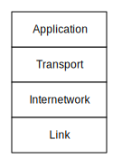
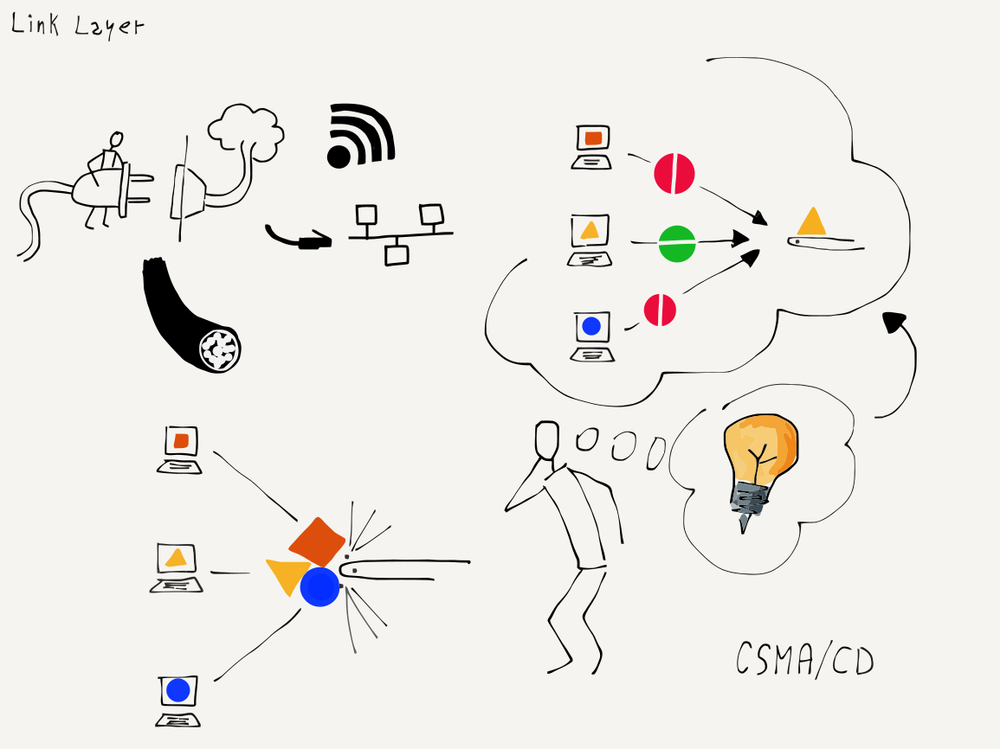
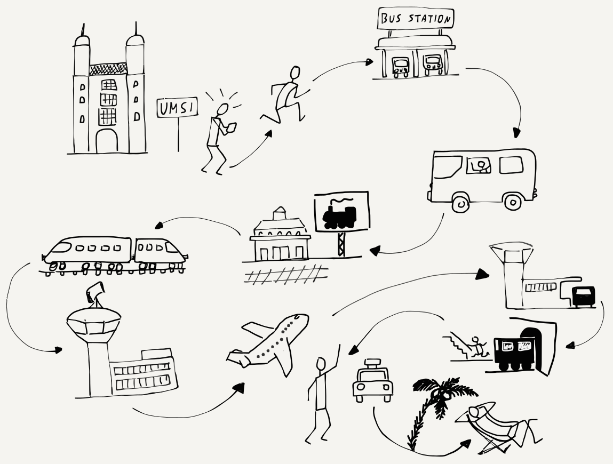

---
hide:
  - navigation
---

# 网络架构

**Network Architecture**

=== "中文"

    为了设计和构建像互联网这样复杂的系统，工程师们会尝试将一个具有挑战性的单一问题分解为一组可以独立解决的小问题，然后再将它们组合起来以解决原始的大问题。构建第一个互联网的工程师们将整体问题分解为四个基本的子问题，这些子问题可以由不同的小组独立工作。
    
    
    
    他们将这四个工程领域命名为：(1) 链接层，(2) 互联网层，(3) 传输层，(4) 应用层。我们将这些不同的领域视为叠加在一起的层，链接层位于底部，应用层位于顶部。链接层处理从您的计算机到局域网的有线或无线连接，而应用层则是我们作为最终用户进行交互的部分。网页浏览器就是这一互联网架构中一个应用的例子。
    
    我们非正式地称这个模型为“TCP/IP 模型”，以此来指代用于实现传输层的传输控制协议（TCP）和用于实现互联网层的互联网协议（IP）。
    
    接下来，我们将快速查看每一层，从“底部”开始。

=== "英文"

    To engineer and build a system as complex as the Internet, engineers try to break a single challenging problem into a set of smaller problems that can be solved independently and then put back together to solve the original large problem. The engineers who built the first internets broke the overall problem into four basic subproblems that could be worked on independently by different groups.
    
    
    
    They gave these four areas of engineering the following names: (1) Link, (2) Internetwork, (3) Transport, and (4) Application.  We visualize these different areas as layers stacked on top of each other, with the Link layer on the bottom and the Application layer on the top.  The Link layer deals with the wired or wireless connection from your computer to the local area network and the Application layer is what we as end users interact with.   A web browser is one example of an application in this Internet architecture.
    
    We informally refer to this model as the "TCP/IP model" in reference to the Transport Control Protocol (TCP) used to implement the Transport layer and Internet Protocol (IP) used to implement the Internetwork layer.
    
    We will take a quick look at each of the layers, starting from the "bottom" of the stack.

## 链接层

**The Link Layer**

=== "中文"

    链接层负责将您的计算机连接到本地网络，并在单个跳跃中传输数据。如今最常见的链接层技术是无线网络。当您使用无线设备时，设备只在有限的距离内发送数据。智能手机与几公里外的基站通信。如果您在火车上使用智能手机，当火车移动时，它每几分钟就需要切换到新的基站。连接到WiFi网络的笔记本电脑通常与200米范围内的基站进行通信。通过有线连接连接的台式计算机通常使用长达100米或更短的电缆。链接层技术通常在同一位置的多台计算机之间共享。
    
    在处理这些共享局域网时，链接层需要解决两个基本问题。第一个问题是如何在链接上编码和发送数据。如果链接是无线的，工程师必须达成一致，决定使用哪些无线频率来传输数据，以及如何将数字数据编码到无线信号中。对于有线连接，他们必须一致决定在线缆上使用何种电压以及以多快的速度发送比特。对于使用光纤的链接层技术，他们必须达成一致，决定使用哪些光频率以及以多快的速度发送数据。
    
    除了就如何使用共享介质（如无线网络）发送数据达成一致外，他们还需要就如何与其他可能希望同时发送数据的计算机进行合作达成一致。如果网络上的所有计算机都试图在有数据要发送时进行传输，它们的消息将会碰撞。结果将是混乱，接收站只会收到噪音。因此，我们需要找到一种公平的方式，允许每个站点等待其使用共享网络的机会。
    
    将大型消息拆分为数据包，然后分别发送每个数据包使这种共享变得更容易。如果只有一台计算机想要发送数据，它将连续发送其数据包，并尽快将数据传输到网络上。但是如果三台计算机想要同时发送数据，每台计算机将发送一个数据包，然后等待另外两台计算机发送数据包。在其他两台计算机发送数据包后，第一台计算机将发送下一个数据包。这样，计算机以公平的方式共享网络访问。
    
    但是，计算机如何知道其他计算机是否想要同时发送数据呢？工程师们设计了一种巧妙的方法来解决这个问题，称为“载波监听多路访问与冲突检测”（CSMA/CD）。这个名称虽然长，但概念简单而优雅。当您的计算机想要发送数据时，它首先监听网络上是否有其他计算机正在发送数据（载波监听）。如果没有其他计算机发送数据，您的计算机就开始发送数据。当您的计算机发送数据时，它也会监听以查看是否能够接收到自己的数据。如果您的计算机接收到自己的数据，它就知道通道仍然清晰，并继续传输。但是如果两台计算机在几乎同一时间开始发送，数据就会发生碰撞，您的计算机不会接收到自己的数据。当检测到碰撞时，两个计算机都会停止传输，等待一段时间后重试。发生碰撞的两台计算机会等待不同的时间长度以减少第二次碰撞的可能性。
    
    
    
    当您的计算机完成数据包的发送后，会暂停一段时间，以便等待的其他计算机有机会发送数据。如果另一台计算机检测到您的计算机已停止发送数据（载波监听），并开始发送自己的数据包，您的计算机将检测到另一台计算机对网络的使用，并在那台计算机的数据包发送完毕后，才会尝试发送自己的下一个数据包。
    
    这个简单的机制在只有一台计算机想要发送数据时效果很好。在许多计算机想要同时发送数据时也能很好地工作。当只有一台计算机在发送数据时，该计算机可以通过连续发送数据包有效地利用共享网络，而当许多计算机同时希望使用共享网络时，每台计算机也能公平地获得链接的使用权。
    
    一些链接层，如智能手机的蜂窝连接、WiFi连接或卫星和电缆调制解调器，都是共享连接，需要像CSMA/CD这样的技术来确保对连接到网络的多台计算机的公平访问。其他链接层，如光纤电缆和租用线路，通常是非共享的，用于路由器之间的连接。这些非共享连接仍然属于链接层。
    
    从事链接层技术的工程师们专注于解决问题，以便计算机可以在距离从几米到数百公里的单个链接上传输数据。但要传输更长距离的数据，我们需要通过多个路由器和多个链接层来发送数据包。每当我们的数据包从一个路由器通过另一个链接层时，我们称之为一次“跳跃”。要将数据发送到全球一半的距离，它将经过大约20个路由器，或者进行20次“跳跃”。

=== "英文"

    The Link layer is responsible for connecting your computer to its local network and moving the data across a single hop. The most common Link layer technology today is wireless networking. When you are using a wireless device, the device is only sending data a limited distance. A smartphone communicates with a tower that is a few kilometers away. If you are using your smartphone on a train, it needs to switch to a new tower every few minutes when the train is moving. A laptop that is connected to a WiFi network is usually communicating with a base station within 200 meters. A desktop computer that is connected using a wired connection is usually using a cable that is 100 meters long or shorter. Link layer technologies are often shared amongst multiple computers at the same location.
    
    The Link layer needs to solve two basic problems when dealing with these shared local area networks. The first problem is how to encode and send data across the link. If the link is wireless, engineers must agree on which radio frequencies are to be used to transmit data and how the digital data is to be encoded in the radio signal. For wired connections, they must agree on what voltage to use on the wire and how fast to send the bits across the wire. For Link layer technologies that use fiber optics, they must agree on the frequencies of light to be used and how fast to send the data.
    
    In addition to agreeing on how to send data using a shared medium such as a wireless network, they also need to agree on how to cooperate with other computers that might want to send data at the same time. If all the computers on the network tried to transmit whenever they had data to send, their messages would collide. The result would be chaos, and receiving stations would only receive noise. So we need to find a fair way to allow each station to wait its turn to use the shared network.
    
    The idea of breaking a large message into packets and then sending each packet separately makes this sharing easier. If only one computer wants to send data,  it will send its packets one right after another and move its data across the network as quickly as it can. But if three computers want to send data at the same time, each computer will send one packet and then wait while the other two computers send packets. After each of the other computers sends a packet, the first computer will send its next packet. This way the computers are sharing access to the network in a fair way.
    
    But how does a computer know if other computers want to send data at the same time?  Engineers designed an ingenious method to solve this problem called  "Carrier Sense Multiple Access with Collision Detection", or CSMA/CD. It is a long name for a simple and elegant concept.  When your computer wants to send data, it first listens to see if another computer is already sending data on the network (Carrier Sense). If no other computer is sending data, your computer starts sending its data. As your computer is sending data it also listens to see if it can receive its own data. If your computer receives its own data, it knows that the channel is still clear and continues transmitting. But if two computers started sending at about the same time, the data collides, and your computer does not receive its own data. When a collision is detected, both computers stop transmitting, wait a bit, and retry the transmission. The two computers that collided wait different lengths of time to retry their transmissions to reduce the chances of a second collision.
    
    
    
    When your computer finishes sending a packet of data, it pauses to give other computers that have been waiting a chance to send data. If another computer senses that your computer has stopped sending data (Carrier Sense) and starts sending its own packet, your computer will detect the other computer's use of the network and wait until that computer's packet is complete before attempting to send its next packet.
    
    This simple mechanism works well when only one computer wants to send data. It also works well when many computers want to send data at the same time. When only one computer is sending data, that computer can make good use of the shared network by sending packets one after another, and when many computers want to use the shared network at the same time, each computer gets a fair share of the link.
    
    Some link layers, like a cellular connection for a smartphone, a WiFi connection, or a satellite or cable modem, are shared connections and need techniques like CSMA/CD to insure fair access to the many different computers connected to the network. Other link layers like fiber optic cables and leased lines are generally not shared and are used for connections between routers. These non-shared connections are still part of the Link layer.
    
    The engineers working on Link layer technologies focus solving the issues so computers can transmit data across a single link that ranges in distance from a few meters to as long as hundreds of kilometers. But to move data greater distances, we need to send our packets through multiple routers connected by multiple link layers. Each time our packet passes through another link layer from one router to another we call it a "hop". To send data halfway around the world, it will pass through about 20 routers, or make 20 "hops".

## 互联网层 (IP)

**The Internetwork Layer (IP)**

=== "中文"

    一旦您的数据包成功通过第一个链接到达互联网，它就会进入一个路由器。您的数据包有一个源地址和一个目的地址，路由器需要查看目的地址，以便找出如何最好地将数据包传送到目的地。由于每个路由器都处理着发送至数十亿个目的计算机的数据包，因此不可能每个路由器都知道每个可能目的计算机的确切位置和最佳路径。因此，路由器会尽力猜测如何将数据包更靠近目的地。
    
    沿途的每个其他路由器也会尽力将数据包送得更接近目的计算机。随着数据包接近最终目的地，路由器对数据包需要去哪里的了解也会更加准确。当数据包到达旅程的最后一个链接时，链接层知道该将数据包发送到哪里。
    
    我们在假期出行时使用类似的方式来规划路线。假期旅行也有很多个跳跃。也许第一次跳跃是开车或乘出租车、公交车到火车站。然后，您搭乘一辆从小镇到大城市的地方列车。在大城市中，您再乘坐长途列车前往另一个国家的大城市。接着，您再乘坐一辆地方列车到达您将在假期中停留的小村庄。当您下车后，您再搭乘公交车，而在下车后，您则步行前往酒店。
    
    如果您在两个大城市之间的火车上，询问列车员您在小村庄的酒店的确切位置，列车员可能并不知道。列车员只知道如何让您更接近目的地，而在您乘坐长途列车的时候，这就是最重要的。当您到达目的地村庄的公交车上时，可以询问公交车司机哪个站点离您的酒店最近。当您在正确的公交站下车时，您可能还可以问街上的人如何找到酒店，并获得确切的答案。
    
    离目的地越远，您就越不需要了解确切的细节。当您离得很远时，您只需知道如何“更接近”目的地。互联网中的路由器也以同样的方式工作。只有离目的计算机最近的路由器知道到该计算机的确切路径。所有位于旅程中间的路由器都在努力将您的消息送向目的地。
    
    但就像旅行时一样，意外的问题或延误可能会出现，这需要您在数据包通过网络时更改计划。
    
    
    
    路由器之间会交换特殊消息，以相互通知任何类型的交通延误或网络故障，从而将数据包从不再有效的路线切换到另一条路线。构成互联网核心的路由器非常智能，并能迅速适应网络连接的小规模和大规模故障。有时连接会因为超载而变慢。其他时候，连接可能在建设团队意外挖到埋藏的电缆并切断时物理断裂。有时会发生自然灾害，如飓风或台风，这会关闭一个大地理区域内的路由器和链接。路由器会迅速检测到这些故障，并在可能的情况下进行重新路由。
    
    但有时会出现问题，数据包会丢失。处理丢失的数据包是我们架构中下一个层次的原因。

=== "英文"

    Once your packet destined for the Internet makes it across the first link, it will be in a router. Your packet has a source address and destination address and the router needs to look at the destination address to figure out how to best move your packet towards its destination. With each router handling packets destined for any of many billions of destination computers, it's not possible for every router to know the exact location and best route to every possible destination computer. So the router makes its best guess as to how to get your packet closer to its destination.
    
    Each of the other routers along the way also does its best to get your packet closer to the destination computer. As your packet gets closer to its final destination, the routers have a better idea of exactly where your packet needs to go. When the packet reaches the last link in its journey, the link layer knows exactly where to send your packet.
    
    We use a similar approach to route ourselves when going on holiday. A holiday trip also has many hops. Perhaps the first hop is driving your car or taking a cab or bus to a train station. Then you take a local train from your small town to a larger city. In the larger city you take a long-distance train to a large city in another country. Then you take another local train to the small village where you will stay for your holiday. When you get off the train, you take a bus, and when you get off the bus, you walk to your hotel.
    
    If you were on the train between the two large cities and you asked the conductor the exact location of your hotel in the small village, the conductor would not know. The conductor only knows how to get you closer to your destination, and while you are on the long-distance train that is all that matters. When you get on the bus at your destination village, you can ask the bus driver which stop is closest to your hotel. And when you get off the bus at the right bus stop, you can probably ask a person on the street where to find the hotel and get an exact answer.
    
    The further you are from your destination, the less you need to know the exact details of how to get there. When you are far away, all you need to know is how to get "closer" to your destination. Routers on the Internet work the same way. Only the routers that are closest to the destination computer know the exact path to that computer. All of the routers in the middle of the journey work to get your message closer to its destination.
    
    But just like when you are traveling, unexpected problems or delays can come up that require a change in plans as your packets are sent across the network.
    
    
    
    Routers exchange special messages to inform each other about any kind of traffic delay or network outage so that packets can be switched from a route that is no longer working to a different route. The routers that make up the core of the Internet are smart and adapt quickly to both small and large outages or failures of network connections. Sometimes a connection slows down because it is overloaded. Other times a connection is physically broken when a construction crew mistakenly digs up a buried wire and cuts it. Sometimes there is a natural disaster like a hurricane or typhoon that shuts down the routers and links in a large geographical area. The routers quickly detect these outages and reroute around them if possible.
    
    But sometimes things go wrong and packets are lost. Dealing with lost packets is the reason for the next layer in our architecture.

## 传输层 (TCP)

**The Transport Layer (TCP)**

=== "中文"

    互联网层既简单又复杂。它查看数据包的目的地址，并寻找跨多个网络跳跃的路径，以将数据包传送到目的计算机。但有时这些数据包会丢失或严重延迟。其他时候，数据包可能会因为后来的数据包找到了一条更快的网络路径而以错序到达目的地。每个数据包都包含源计算机的地址、目的计算机的地址，以及该数据包相对于消息起始位置的偏移量。知道每个数据包的偏移量和数据包的长度，目的计算机即使在接收到的顺序不正确的情况下，也能重建原始消息。
    
    当目的计算机重建消息并将其传递给接收应用程序时，它会定期向源计算机发送确认，指示它已经接收到并重建了多少消息。如果目的计算机发现重建的消息中有部分缺失，这通常意味着这些数据包丢失或严重延迟。在等待一段时间后，目的计算机会向源计算机发送请求，请求重新发送似乎缺失的数据。
    
    发送计算机必须存储已发送的原始消息部分的副本，直到目的计算机确认成功接收这些数据包。一旦源计算机收到部分消息成功接收的确认，它就可以丢弃已确认的数据，并发送更多数据。
    
    源计算机在等待确认之前发送的数据量称为“窗口大小”。如果窗口大小太小，数据传输会变慢，因为源计算机总是在等待确认。如果源计算机在等待确认之前发送了过多的数据，可能会因过载路由器或长途通信线路而无意中造成流量问题。为了解决这个问题，开始时将窗口大小设置得较小，并测量收到第一个确认所需的时间。如果确认快速返回，源计算机会逐渐增加窗口大小；如果确认返回缓慢，源计算机会保持窗口大小较小，以免过载网络。正如在链接层一样，互联网中的一点礼貌在确保共享网络基础设施的良好使用上大有裨益。
    
    这一策略意味着，当网络具有高速连接并且负载较轻时，数据将迅速发送；而如果网络负载较重或连接较慢，数据将被减速，以匹配源计算机和目的计算机之间网络连接的限制。

=== "英文"

    The Internetwork layer is both simple and complex. It looks at a packet's destination address and finds a path across multiple network hops to deliver the packet to the destination computer. But sometimes these packets get lost or badly delayed. Other times the packets arrive at their destination out of order because a later packet found a quicker path through the network than an earlier packet. Each packet contains the source computer's address, the destination computer's address, and an offset of where this packet "fits" relative to the beginning of the message. Knowing the offset of each packet from the beginning of the message and the length of the packet, the destination computer can reconstruct the original message even if the packets were received out of order.
    
    As the destination computer reconstructs the message and delivers it to the receiving application, it periodically sends an acknowledgement back to the source computer indicating how much of the message it has received and reconstructed. But if the destination computer finds that parts of the reconstructed message are missing, this probably means that these packets were lost or badly delayed. After waiting a bit, the destination computer sends a request to the source computer to resend the data that seems to be missing.
    
    The sending computer must store a copy of the parts of the original message that have been sent until the destination computer acknowledges successful receipt of the packets. Once the source computer receives the acknowledgment of successful receipt of a portion of the message, it can discard the data that has been acknowledged and send some more data.
    
    The amount of data that the source computer sends before waiting for an acknowledgement is called the "window size". If the window size is too small, the data transmission is slowed because the source computer is always waiting for acknowledgments. If the source computer sends too much data before waiting for an acknowledgment, it can unintentionally cause traffic problems by overloading routers or long-distance communication lines. This problem is solved by keeping the window size small at the beginning and timing how long it takes to receive the first acknowledgements. If the acknowledgments come back quickly, the source computer slowly increases the window size and if the acknowledgements come back slowly, the source computer keeps the window size small so as not to overload the network. Just like at the Link layer, a little courtesy on the Internet goes a long way toward ensuring good use of the shared network infrastructure.
    
    This strategy means that when the network has high-speed connections and is lightly loaded the data will be sent quickly, and if the network is heavily loaded or has slow connections the data will be slowed down to match the limitations of the network connections between the source and destination computers.

## 应用层

**The Application Layer**

=== "中文"

    链接层、互联网层和传输层共同协作，以快速而可靠的方式在共享的网络中移动数据。这种可靠的数据传输能力引出了下一个问题：将构建哪些网络应用程序来利用这些网络连接。
    
    当1980年代中期，第一代广泛使用的互联网出现时，最早的网络应用程序允许用户登录远程计算机、在计算机之间传输文件、发送邮件，甚至进行实时文本聊天。
    
    在1990年代初期，随着互联网逐渐普及以及计算机处理图像的能力提升，CERN高能物理研究所的科学家们开发了万维网应用。该应用旨在阅读和编辑带有图像的网络超文本文档。如今，万维网是全球最常用的网络应用程序，但其他旧的互联网应用仍然在广泛使用。
    
    每个应用程序通常分为两部分。一部分称为“服务器”，它运行在目的计算机上，等待传入的网络连接。另一部分称为“客户端”，它运行在源计算机上。当您使用如Firefox、Chrome或Internet Explorer等软件浏览网页时，您正在运行一个“网页客户端”应用，该应用与网页服务器建立连接，并显示存储在这些网页服务器上的页面和文档。您的网页浏览器在地址栏中显示的统一资源定位符（URL）是您的客户端正在联系以检索您查看文档的网页服务器。
    
    在开发网络应用的服务器端和客户端时，我们还必须定义一个“应用协议”，以描述应用的两部分如何通过网络交换消息。每个应用程序所使用的协议各不相同，且专门设计以满足特定应用的需求。稍后我们将探讨一些这些应用层协议。

=== "英文"

    The Link, Internetwork, and Transport layers work together to quickly and reliably move data between two computers across a shared network of networks. With this capability to move data reliably, the next question is what networked applications will be built to make use of these network connections.
    
    When the first widely used Internet came into being in the mid-1980s, the first networked applications allowed users to log in to remote computers, transfer files between computers, send mail between computers, and even do real-time text chats between computers.
    
    In the early 1990s, as the Internet came to more people and computers' abilities to handle images improved, the World Wide Web application was developed by scientists at the CERN high-energy physics facility. The web was focused on reading and editing networked hypertext documents with images. Today the web is the most common network application in use around the world.  But all the other older Internet applications are still in wide use.
    
    Each application is generally broken into two halves. One half of the application is called the "server". It runs on the destination computer and waits for incoming networking connections. The other half of the application is called the "client" and runs on the source computer. When you are browsing the web using software like Firefox, Chrome, or Internet Explorer, you are running a "web client" application which is making connections to web servers and displaying the pages and documents stored on those web servers. The Uniform Resource Locators (URLs) that your web browser shows in its address bar are the web servers that your client is contacting to retrieve documents for you to view.
    
    When we develop the server half and the client half of a networked application, we must also define an "application protocol" that describes how the two halves of the application will exchange messages over the network. The protocols used for each application are quite different and specialized to meet the needs of the particular application.  Later we will explore some of these Application layer protocols.

## 层的堆叠

**Stacking the Layers**

=== "中文"

    我们通常将四个不同的层（链接层、互联网层、传输层和应用层）堆叠在一起，应用层位于顶部，链接层位于底部。我们这样展示的原因是，因为每一层都利用其上下层来实现网络通信。
    
    这四个层在您的计算机中运行，您在这里运行客户端应用（如浏览器），而这四个层同样在目的计算机上运行，那里运行着应用服务器。作为最终用户，您与构成堆栈顶部的应用程序互动，而底层则代表您的计算机与互联网其他部分之间的WiFi、蜂窝或有线连接。
    
    转发您的数据包的路由器在移动数据包向目的地的过程中，并不理解传输层或应用层的内容。路由器仅在互联网层和链接层上操作。互联网层的源地址和目的地址是路由器在通过一系列链接（跳跃）移动数据包到达目的地所需的全部信息。传输层和应用层仅在互联网层将数据包传递到目的计算机后才开始发挥作用。
    
    如果您想编写自己的网络应用，您可能只需与传输层进行通信，而完全不关心互联网层和链接层。虽然它们对传输层的功能至关重要，但在编写程序时，您无需了解任何较低层的细节。分层网络模型使编写网络应用程序变得更简单，因为许多复杂的数据在计算机之间移动的细节可以被忽略。
    
    接下来，我们将更详细地讨论这四个层。

=== "英文"

    We usually show the four different layers (Link, Internetwork, Transport, and Application) stacked on top of each other with the Application layer at the top and the Link layer at the bottom. The reason we show them this way is because each layer makes use of the layers above  and below it to achieve networked communications.
    
    All four layers run in your computer where you run the client application (like a browser), and all four layers also run in the destination computer where the application server is running. You as the end user interact with the applications that make up the top layer of the stack, and the bottom layer represents the WiFi, cellular, or wired connection between your computer and the rest of the Internet.
    
    The routers that forward your packets from one to another to move your packets towards their destination have no understanding of either the Transport or Application layers. Routers operate at the Internetwork and Link layers. The source and destination addresses at the Internetwork layer are all that is needed for routers to move your packets across the series of links (hops) to get them to the destination. The Transport and Application layers only come into play after the Internetwork layer delivers your packets to the destination computer.
    
    If you wanted to write your own networked application, you would likely only talk to the Transport layer and be completely unconcerned about the Internetwork and Link layers. They are essential to the function of the Transport layer, but as you write your program, you do not need to be aware of any of the lower-layer details. The layered network model makes it simpler to write networked applications because so many of the complex details of moving data from one computer to another can be ignored.
    
    Up next, we will talk about these four layers in more detail.

## 术语

**Glossary**

=== "中文"

    **客户端**：在网络应用中，客户端应用是请求服务或发起连接的部分。
    
    **光纤**：一种数据传输技术，它使用光来编码数据，并将光发送到一根非常长的薄玻璃或塑料光纤中。光纤连接速度快，可以覆盖很长的距离。
    
    **偏移量**：数据包在整体消息或数据流中的相对位置。
    
    **服务器**：在网络应用中，服务器应用是响应服务请求或等待传入连接的部分。
    
    **窗口大小**：发送计算机在等待确认之前允许发送的数据量。

=== "英文"

    **client**: In a networked application, the client application is the one that requests services or initiates connections.
    
    **fiber optic**: A data transmission technology that encodes data using light and sends the light down a very long strand of thin glass or plastic. Fiber optic connections are fast and can cover very long distances.
    
    **offset**: The relative position of a packet within an overall message or stream of data.
    
    **server**: In a networked application, the server application is the one that responds to requests for services or waits for incoming connections.
    
    **window size**: The amount of data that the sending computer is allowed to  send before waiting for an acknowledgement.

## 问题

**Questions**

=== "中文"

    您可以在 <http://www.net-intro.com/quiz/> 在线参加这个测验。
    
    1. 工程师为什么使用“模型”来组织解决大型复杂问题的方法？
    
        a) 因为它允许他们构建小型模型并在风洞中测试
        
        b) 因为讨论模型会延迟实际的艰苦工作开始
        
        c) 因为他们可以将问题分解为一组可以独立解决的小问题
        
        d) 因为它有助于开发营销材料
    
    2. 在TCP/IP网络使用的网络模型中，哪一层是顶层？
    
        a) 应用层
        
        b) 传输层
        
        c) 互联网层
        
        d) 链接层
    
    3. 哪一层关注于通过单一物理连接传输数据包？
    
        a) 应用层
        
        b) 传输层
        
        c) 互联网层
        
        d) 链接层
    
    4. CSMA/CD代表什么？
    
        a) 带冲突检测的载波侦听多路访问
        
        b) 碰撞侦听媒体访问与连续方向
        
        c) 相关空间媒体分配与常量划分
        
        d) 常量状态多地址通道划分
    
    5. 互联网层的目标是什么？
    
        a) 确保在传输过程中没有数据丢失
        
        b) 将数据包从源头移动到多个网络的目的地
        
        c) 确保只有登录用户可以使用互联网
        
        d) 确保WiFi在多台计算机之间公平共享
    
    6. 除了数据、源地址和目的地址之外，确保消息在到达目的地时可以重新组装还需要什么？
    
        a) 数据包相对于消息开头的位置偏移量
        
        b) 目的计算机故障时发送数据的位置
        
        c) 数据包中数据的压缩和未压缩版本
        
        d) 目的计算机的GPS坐标
    
    7. 什么是“窗口大小”？
    
        a) 数据包的长度和宽度之和
        
        b) 单个数据包的最大大小
        
        c) 构成一条消息的最大数据包数量
        
        d) 计算机在接收确认之前可以发送的最大数据量
    
    8. 在典型的网络客户端/服务器应用中，客户端应用运行在哪里？
    
        a) 在您的笔记本电脑、台式机或移动计算机上
        
        b) 在无线接入点上
        
        c) 在最近的路由器上
        
        d) 在海底光纤电缆中
    
    9. URL代表什么？
    
        a) 通用路由链接
        
        b) 统一重传逻辑
        
        c) 统一资源定位符
        
        d) 统一恢复列表

=== "英文"

    You can take this quiz online at <http://www.net-intro.com/quiz/>
    
    1. Why do engineers use a "model" to organize their approach to  solving a large and complex problem?
    
        a) Because it allows them to build something small and test it in a wind tunnel
        
        b) Because talking about a model delays the actual start of the hard work
        
        c) Because they can break a problem down into a set of smaller problems that can be solved independently
        
        d) Because it helps in developing marketing materials
    
    1. Which is the top layer of the network model used by TCP/IP networks?
    
        a) Application
        
        b) Transport
        
        c) Internetwork
        
        d) Link
    
    1. Which of the layers concerns itself with getting a packet of data across a single physical connection?
    
        a) Application
        
        b) Transport
        
        c) Internetwork
        
        d) Link
    
    1. What does CSMA/CD stand for?
        
        a) Carrier Sense Multiple Access with Collision Detection
        
        b) Collision Sense Media Access with Continuous Direction
        
        c) Correlated Space Media Allocation with Constant Division
        
        d) Constant State Multiple Address Channel Divison
    
    1. What is the goal of the Internetwork layer?
    
        a) Insure that no data is lost while enroute
        
        b) Get a packet of data moved across multiple networks from its source to its destination
        
        c) Make sure that only logged-in users can use the Internet
        
        d) Insure than WiFi is fairly shared across multiple computers
    
    1. In addition to the data, source, and destination addresses, what else is needed to make sure that a message can be reassembled when it reaches its destination?
    
        a) An offset of where the packet belongs relative to the beginning of the message
        
        b) A location to send the data to if the destination computer is down
        
        c) A compressed and uncompressed version of the data in the packet
        
        d) The GPS coordinates of the destination computer
    
    1. What is "window size"?
    
        a) The sum of the length and width of a packet
        
        b) The maximum size of a single packet
        
        c) The maximum number of packets that can make up a message
        
        d) The maximum amount of data a computer can send before receiving an acknowledgement
    
    1. In a typical networked client/server application, where does the client application run?
    
        a) On your laptop, desktop, or mobile computer
        
        b) On a wireless access point
        
        c) On the closest router
        
        d) In an undersea fiber optic cable
    
    1. What does URL stand for?
        
        a) Universal Routing Linkage
        
        b) Uniform Retransmission Logic
        
        c) Uniform Resource Locator
        
        d) Unified Recovery List