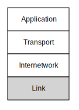

---
hide:
  - navigation
---

# 链路层

**Link Layer**

=== "中文"

    我们互联网架构的最低层是链接层。我们称其为“最低层”，因为它最接近物理网络介质。链接层通常通过电缆、光纤或无线信号传输数据。链接层的一个关键要素是，数据通常只能从源计算机传输到目的计算机的部分距离。有线以太网、WiFi 和蜂窝电话网络是能够传输大约一公里数据的链接层示例。光纤电缆，特别是那些位于海底的光纤，能够传输数据数千公里。卫星链路也能在长距离上传输数据。
    
    
    
    无论我们能传输数据的距离如何，它仍然是在单一链接上行驶，要到达最终的目的计算机，需要通过多个链接转发数据包。在本节中，我们将详细探讨一种最常见的链接层是如何运作的。WiFi 是一个很好的案例，可以用来分析在链接层必须解决的许多问题。我们在这些描述中简化了一些技术细节，以便更易于理解。

=== "英文"

    The lowest layer of our Internet Architecture is the Link layer. We call it the "lowest layer" because it is closest to the physical network media. Often the Link layer transmits data using a wire, a fiber optic cable, or a radio signal. A key element of the Link layer is that usually data can only be transmitted part of the way from the source computer to the destination computer. Wired Ethernet, WiFi, and the cellular phone network are examples of link layers that can transmit data about a kilometer. Fiber optic cables, particularly those under the oceans, can transmit data up to thousands of kilometers. Satellite links can also send data over long distances.
    
    
    
    Regardless of the distance we can send the data, it is still traveling over a single link, and to reach the ultimate destination computer requires forwarding packets across multiple links. In this section we will look at how one of the most common link layers functions in some detail. WiFi is a great way to look at many issues that must be solved at the link layer. We simplify some of the technical detail in these descriptions to make them easier to understand.

## 共享空中信号

**Sharing the Air**

=== "中文"

    当你的笔记本电脑或手机使用 WiFi 连接到互联网时，它通过一个小型低功耗的无线电发送和接收数据。你的计算机中的无线电最多只能发送大约 300 米，因此它将数据包发送到你家中的路由器，路由器通过链接将数据包转发到互联网的其他部分。有时，我们称处理你计算机数据包的第一个路由器为“基站”或“网关”。
    
    所有距离基站足够近并且打开了无线电的计算机都能接收到基站发送的所有数据包，无论这些数据包本应发送给哪台计算机。它们也“听到”每台附近计算机发送的所有数据包。因此，你的计算机需要一种方法来识别哪些数据包是它自己的，哪些是发送给其他计算机的，可以安全忽略。
    
    一个有趣的副作用是，所有范围内的计算机都能接收到所有数据包，这意味着一个恶意计算机也可以监听和捕获你的数据包，可能获取重要信息，比如银行账户号码或在线服务的密码。我们将在后面的章节中回到如何保护你的数据不被窥探的问题。
    
    每个设备中每个构建的 WiFi 无线电在制造时都会被赋予一个唯一的序列号。这意味着每台使用 WiFi 的计算机都有自己的序列号，网关中的无线电也有一个序列号。你通常可以在设备的设置界面中查找 WiFi 无线电的序列号。它通常以以下形式显示：
    
        0f:2a:b3:1f:b3:1a
    
    这只是你 WiFi 无线电的 48 位序列号的表示，也称为“媒体访问控制”（Media Access Control，MAC）地址。MAC 地址就像明信片上的“发件人”或“收件人”地址。通过 WiFi 发送的每个数据包（无线明信片）都有一个源地址和一个目的地址，因此所有计算机都知道哪些消息是它们的。
    
    当你打开计算机并连接到 WiFi 网络时，你的计算机需要确定可以用来向路由器发送数据包的 MAC 地址。当你从一个物理位置移动到另一个位置时，你的计算机将与不同的网关通信，而每个网关都有不同的序列号。因此，当你第一次连接到新的 WiFi 时，你的计算机必须发现该特定 WiFi 网关的 MAC 地址。
    
    为此，你的计算机会向广播地址发送一条特殊消息，实际上是在询问：“谁负责这个 WiFi？”由于你的计算机知道它不是网关，它将以自己的序列号作为“发件人”地址，并将广播地址作为“收件人”地址发送广播消息，以询问该 WiFi 网络上是否存在任何网关。
    
        发件人: 0f:2a:b3:1f:b3:1a
        收件人: ff:ff:ff:ff:ff:ff
        数据: 谁是这个网络的 MAC 网关？
    
    如果网络上有网关，网关会将包含其序列号的消息发送回你的计算机。
    
        发件人: 98:2f:4e:78:c1:b4
        收件人: 0f:2a:b3:1f:b3:1a
        数据: 我是网关
            欢迎来到我的网络
    
    如果没有回复，你的计算机会等几秒钟，然后假设该网络没有网关。当没有网关时，你的计算机可能会显示一个不同的 WiFi 图标，或根本不显示 WiFi 图标。有时可能存在多个网关，但我们暂时忽略这一点，因为这有点复杂且不太常见。
    
    一旦你的计算机接收到包含网关 MAC 地址的消息，就可以使用该地址发送希望网关转发到互联网的数据包。从那时起，你计算机的所有数据包都有实际的目的地序列号。你希望尽量少使用广播地址，因为连接到 WiFi 的每台计算机都会接收并处理发送到广播地址的任何消息，以确保这些消息不是发给它们的。

=== "英文"

    When your laptop or phone is using WiFi to connect to the Internet, it is  sending and receiving data with a small, low-powered radio. The radio in your computer can only send data about 300 meters, so your computer sends your packets to the router in your home, which forwards the packets using a link to the rest of the Internet.  Sometimes we call the first router that handles your computer's packets the "base station" or "gateway".
    
    All computers that are close enough to the base station with their radios turned on receive all of the packets the base station transmits, regardless of which computer the packet is supposed to be sent to. They also  "hear" all the packets sent by every other nearby computer. So your computer needs a way to know which packets to treat as its own and which packets are being sent to other computers and can be safely ignored.
    
    An interesting side effect of the fact that all the computers within range can hear all packets is that a rogue computer could also be listening to and capturing your packets, perhaps getting ahold of important data like bank account numbers or passwords to online services. We will come back to the issue of protecting your data from prying eyes and ears in a later section.
    
    Every WiFi radio in every device that is ever built is given a unique serial number at the time it is manufactured. This means that each of the computers using WiFi has its own serial number, and the radio in the gateway also has a serial number. You can usually go into a settings screen on your device and look up the serial number for the WiFi radio in your device. It is generally shown in the following form:
    
        0f:2a:b3:1f:b3:1a
    
    This is just a representation of a 48-bit serial number for your WiFi radio. It is also called the "Media Access Control" or "MAC" address. A MAC address is like a "from" or "to" address on a postcard. Every packet (radio postcard) sent across the WiFi has a source and destination address, so all of the computers know which messages are theirs.
    
    When you turn on your computer and connect to a WiFi network, your computer needs to figure out which of the MAC addresses on the WiFi can be used to send packets to the router. When you move from one physical location to another, your computer will be talking to different gateways and each of those gateways will have a different serial number. So when you first connect to a new WiFi, your computer must discover the MAC address for the gateway of that particular WiFi.
    
    To do this, your computer sends a special message to a broadcast address, effectively asking the question, "Who is in charge of this WiFi?" Since your computer knows it is not the gateway itself, it sends a broadcast message with its own serial number as the "from" address and the broadcast  address as the "to" address to ask if there are any gateways present on the WiFi network.
    
        From: 0f:2a:b3:1f:b3:1a
        To: ff:ff:ff:ff:ff:ff
        Data: Who is the MAC-Gateway
            for this network?
    
    If there is a gateway on the network, the gateway sends a message containing its serial number back to your computer.
    
        From: 98:2f:4e:78:c1:b4
        To: 0f:2a:b3:1f:b3:1a
        Data: I am the gateway
           Welcome to my network
    
    If there are no replies, your computer waits a few seconds and then assumes there is no gateway for this network. When there is no gateway, your computer might show a different WiFi icon or not show the WiFi icon at all. Sometimes there can be more than one gateway, but we will ignore that for a while because it is a little complex and not very common.
    
    Once your computer receives a message with the MAC address of the gateway, it can use that address to send packets that it wants the gateway to forward to the Internet. From that point on, all of your computer's packets have the actual serial number of the destination. You want to use the broadcast address as little as possible because every computer connected to the WiFi receives and processes any messages sent to the broadcast address to make sure the messages were not intended for them.

## 礼貌与协调

**Courtesy and Coordination**

=== "中文"

    由于许多计算机共享相同的无线频率，协调它们发送数据的方式非常重要。当房间里有一群人时，他们不能同时说话，否则一切都会变得混乱。当多个 WiFi 无线电在相同频率上同时传输时，情况也会如此。因此，我们需要一种方法来协调所有无线电，以便最好地利用共享频率。我们将探讨避免因传输“碰撞”而导致数据丢失的技术基础。
    
    第一种技术称为“载波侦听”。该技术首先监听是否有传输进行，如果已经有传输在进行中，就等待该传输完成。看起来你可能需要等很长时间，但由于所有消息都被分解为数据包，通常你的计算机只需等待当前发送数据的计算机完成一个数据包，然后你的计算机就有机会发送数据。
    
    如果你的计算机的 WiFi 无线电监听到数据并听到静默，它可以开始传输。但是，如果另一台希望发送数据包的计算机的 WiFi 无线电也监听到相同的静默，并决定在完全相同的时间开始传输呢？如果两台或更多 WiFi 无线电同时开始传输，所有数据都会被损坏，两个数据包都会丢失。因此，一旦你的 WiFi 无线电开始发送数据包，它必须监听以确保能够接收到自己的数据。如果它接收到的不是它发送的内容，WiFi 无线电就会认为发生了碰撞（这称为碰撞检测），并停止传输，因为它知道目的地 WiFi 无线电不会收到任何数据。
    
    我们人类在一间满是人的房间里也会做类似的事情。当两个人同时开始说话时，他们通常能很快注意到另一个人在说话，并迅速停止。但问题在于如何重新开始对话。在长时间的停顿后，两个人很可能会再次同时开始说话。这种情况可能反复发生，每个人都说“不是你，是我”，试图找出如何重新开始对话。这有时会显得相当搞笑。
    
    两个计算机中的 WiFi 无线电在发送碰撞数据包时能够比人类更好地解决这个问题。当 WiFi 无线电检测到碰撞或传输混乱时，它们会计算一个随机的等待时间，然后再尝试传输。计算随机等待时间的规则被设定为确保两个发生碰撞的站点选择不同的等待时间，然后再尝试重新传输数据包。
    
    这个监听、传输、监听、等待并在必要时重试的正式名称是“载波侦听多重访问与碰撞检测”（Carrier Sense Multiple Access with Collision Detection，CSMA/CD）。
    
    看起来仅仅“尝试一下”，然后在传输与其他站点发生碰撞时“再尝试一次”似乎有点混乱。但实际上，这种方法运作良好。有一整类链接层使用这种基本的监听、传输、监听和可选重试的模式。以太网、蜂窝电话数据，甚至短消息服务（SMS/文本消息）都使用这种“尝试然后重试”的方法。

=== "英文"

    Because many computers are sharing the same radio frequencies, it's important to coordinate how they send data. When there's a crowd of people in a room, they can't all talk at the same time or everything will be garbled. The same  thing happens when multiple WiFi radios transmit at the same time on the same frequency. So we need some way to coordinate all the radios to make best use of the shared frequencies. We will look at the basics of technical approaches to avoiding lost data due to transmission "collisions".
    
    The first technique is called "Carrier Sense". The technique is to first listen for a transmission, and if there is already a transmission in progress, wait until the transmission finishes. It might seem like you could wait for a long time, but since all messages are broken into packets, usually your computer only has to wait for the computer currently sending data to finish a packet, after which your computer gets its chance to send data.
    
    If your computer's WiFi radio listens for data and hears silence, it can begin transmitting. But what if another computer's WiFi radio that wants to send a packet listened to and heard the same silence and decided to start transmitting at exactly the same time? If two or more WiFi radios start transmitting at the same time, all of the data is corrupted and both packets are lost. So once your WiFi radio starts sending a packet it is important for it to listen to make sure it can receive its own data. If it is not receiving the same thing that it is sending, your WiFi radio assumes that a collision has happened (this is called Collision Detection) and stops transmitting, since it knows that no data will be received by the destination WiFi radio.
    
    We humans do a similar thing in a room full of people. When two people start talking at the same time, they are good at noticing that another person is talking and quickly stop talking. But the problem is how to restart the conversation. After a long pause it is common that both people start talking at the exact same time *again*. This can happen over and over and each person says "No, you" repeatedly to attempt to figure out how to get the conversation restarted. It can be quite comical at times.
    
    The WiFi radios in two computers that send colliding packets are able to solve this problem much better than people can solve the problem. When the WiFi radios detect a collision or garbled transmission, they compute a random amount of time to wait before retrying the transmission. The rules for computing the random wait are set up to make sure the two colliding stations pick different amounts of time to wait before attempting to re-transmit the packet.
    
    The formal name for the listen, transmit, listen, and wait and retry if necessary  is called "Carrier Sense Multiple Access with Collision Detection" or CSMA/CD.
    
    It might sound a little chaotic to just "give it a try" and then "give it another try" if your transmission collides with another station's transmission. But in practice it works well. There is a whole category of link layers that use this basic pattern of listen, transmit, listen, and optionally retry. Wired Ethernet, cellular telephone data, and even Short Message Service (SMS/Texting) all use this "try then retry" approach.

## 其他链路层中的协调

**Coordination in Other Link Layers**

=== "中文"

    有时，当一个链路层有许多发送站点并且需要在长时间内接近 100% 的效率运行时，设计会采取不同的方法。在这种方法中，有一个“令牌”，指示每个站点何时有机会传输数据。站点必须持有令牌才能开始传输，而不是监听“静默”并立即插入，它们必须等待自己的机会。
    
    当一个站点收到令牌并且有数据包要发送时，它会发送该数据包。一旦数据包发送完毕，该站点就放弃令牌，并等待令牌返回。如果没有任何站点有数据要发送，令牌将尽可能快速地从一台计算机移动到另一台计算机。
    
    
    
    一组人坐在会议上，可以通过传递一个小球的方式进行交流，只有持有球的人才能发言。当你得到球并有话要说时，你可以短时间内发言（传输一个数据包），然后再把球传递出去。
    
    “尝试然后重试”的 CSMA/CD 方法在没有数据或传输低或中等水平的数据时非常有效。但在令牌式网络中，如果没有数据要发送，而你又想发送一个数据包，你仍然必须等待一段时间，直到收到令牌才能开始传输。当你完成一个数据包时，你必须等待令牌回来才能发送下一个数据包。如果你是唯一想要发送数据的站点，你将花费很多时间等待令牌在经过其他所有站点后回到你那里。
    
    令牌方法最适合在像卫星链接或海底光纤链接这样的链路介质上使用，因为在这些情况下，检测碰撞可能会耗时太长或成本太高。而 CSMA/CD（监听-尝试）则最适合用于廉价、短距离的介质，并且有很多共享介质的站点，它们只发送短时间的数据。因此，这就是为什么 WiFi（和 CSMA/CD）在咖啡店、家中或学校的教室中提供网络访问如此有效的原因。

=== "英文"

    Sometimes when a link layer has many transmitting stations and needs to operate at near 100% efficiency for long periods of time, the design takes a different approach. In this approach, there is a "token" that indicates when each station is given the opportunity to transmit data. Stations cannot start a transmission unless they have the token. Instead of listening for "silence" and jumping in, they must wait for their turn to come around.
    
    When a station receives the token and has a packet to send, it sends the packet. Once the packet has been sent, the station gives up the token and waits until the token comes back to it. If none of the stations have any data to send, the token is moved from one computer to the next computer as quickly as possible.
    
    
    
    A group of people sitting around a meeting could communicate without ever interrupting each other by having a small ball that they pass around in a circle and only allowing the person who has the ball to speak. When you get the ball and have something to say you talk for a short period (transmit a packet of words) and then pass the ball on.
    
    The "try then retry" CSMA/CD approach works very well when there is no data or when low or moderate levels of data are being sent. But on a token-style network, if there is no data being sent and you want to send a packet, you still have to wait for a while before you receive the token and can start transmitting. When you finish your packet you have to wait until the token comes back before you can send the next packet. If you are the only station that wants to send data, you spend a good bit of time waiting for the token to come back to you after passing through all of the other stations.
    
    The token approach is best suited when using a link medium such as  as a satellite link or a undersea fiber optic link where it might take too long or be too costly to detect a collision. The CSMA/CD (listen-try) is best suited when the medium is inexpensive, shorter distance, and there are a lot of stations sharing the medium that only send data in short bursts. So that is why WiFi (and CSMA/CD) is so effective for providing network access in a coffee shop, home, or room in a school.

## 总结

**Summary**

=== "中文"

    现在我们已经看过我们四层架构中的“最低”层，并且简单了解了链路层的工作原理。链路层的设计中还有许多其他细节，比如连接距离、电压、频率、速度等。
    
    分层架构的一个关键好处是，设计和构建链路层技术的工程师可以忽略链路层上方各层处理的所有问题。这使他们能够专注于构建最佳的数据传输解决方案。现代的链路层，如 WiFi、卫星、宽带调制解调器、以太网和蜂窝技术，都得到了很好的发展。数据传输如此迅速和无缝，以至于一旦我们建立了连接，我们几乎不需要担心链路层。它就是这样运作的。

=== "英文"

    So now we have looked at the "lowest" layer in our four-layer architecture. And we have only taken a simple look at how the Link layer works. There are many other details that must be designed into a link layer like connection distance, voltage, frequency, speed, and many others.
    
    A key benefit of the layered architecture is that engineers who design and build Link layer technologies can ignore all of the issues that are handled by the layers above the Link layer. This allows them to focus on building the best possible solution to moving data across a single "hop". Modern-day link layers like WiFi, satellite, cable modems, Ethernet, and cellular technology are very well developed. Data moves so quickly and seamlessly that once we get our connection we rarely have to worry about the Link layer.  It just works.

## 术语

**Glossary**

=== "中文"

    **基站**：处理您的数据包并将其转发到互联网的第一个路由器的另一种称呼。
    
    **广播**：以一种方式发送数据包，使所有连接到局域网的站点都能接收到该数据包。
    
    **网关**：将局域网连接到更广泛网络（如互联网）的路由器。想要将数据发送到局域网外的计算机必须将数据包发送到网关进行转发。
    
    **MAC 地址**：在设备制造时分配给网络硬件的一种地址。
    
    **令牌**：一种允许多台计算机共享相同物理媒介而不发生碰撞的技术。每台计算机必须在接收到令牌后才能发送数据。

=== "英文"

    **base station**: Another word for the first router that handles your packets as they are forwarded to the Internet.
    
    **broadcast**: Sending a packet in a way that all the stations connected to a local area network will receive the packet.
    
    **gateway**: A router that connects a local area network to a wider area network such as the Internet. Computers that want to send data outside the local network must send their packets to the gateway  for forwarding.
    
    **MAC Address**: An address that is assigned to a piece of network hardware  when the device is manufactured.
    
    **token**: A technique to allow many computers to share the same physical  media without collisions.  Each computer must wait until it has received
    the token before it can send data.

## 问题

**Questions**

=== "中文"
    
    您可以在线进行此测验，网址为 <http://www.net-intro.com/quiz/>
    
    1. 在使用 WiFi 网络与互联网通信时，您的计算机将数据包发送到哪里？
    
        a) 网关
        
        b) 卫星
        
        c) 手机信号塔
        
        d) 互联网中央办公室
    
    2. 网络设备的链接/物理地址是如何分配的？
    
        a) 由信号塔分配
        
        b) 由互联网分配号码管理局 (IANA) 分配
        
        c) 由链接设备的制造商分配
        
        d) 由政府分配
    
    3. 以下哪个是链接地址？
    
        a) 0f:2a:b3:1f:b3:1a
        
        b) 192.168.3.14
        
        c) www.khanacademy.com
        
        d) @drchuck
    
    4. 您的计算机如何找到 WiFi 网络上的网关？
    
        a) 它具有由制造商安装的网关地址
        
        b) 它广播请求网关地址
        
        c) 它不断向所有可能的网关地址发送消息，直到找到一个有效的地址
        
        d) 用户必须手动输入网关地址
    
    5. 当您的计算机想要通过 WiFi 发送数据时，首先必须做什么？
    
        a) 聆听其他计算机是否正在发送数据
        
        b) 直接开始发送数据
        
        c) 向网关发送消息请求发送权限
        
        d) 等待通知轮到自己发送
    
    6. 当一个 WiFi 连接的工作站尝试发送数据并感知到发生了碰撞时，它会怎么做？
    
        a) 继续发送消息，以便部分消息能够传输
        
        b) 等待网关通知碰撞结束
        
        c) 立即重新开始从头发送消息
    
        d) 停止发送并等待随机时间后再重新开始发送
    
    7. 当一个站点想要在“令牌”式网络上发送数据时，它必须首先做什么？
    
        a) 聆听其他计算机是否正在发送数据
        
        b) 直接开始发送数据
        
        c) 向网关发送消息请求发送权限
        
        d) 等待通知轮到自己发送

=== "英文"
    
    You can take this quiz online at <http://www.net-intro.com/quiz/>
    
    1. When using a WiFi network to talk to the Internet, where does your computer send its packets?
    
        a) A gateway
        
        b) A satellite
        
        c) A cell phone tower
        
        d) The Internet Central Office
    
    2. How is the link/physical address for a network device assigned?
    
        a) By the cell tower
        
        b) By the Internet Assignment Numbers Authority (IANA)
        
        c) By the manufacturer of the link equipment
        
        d) By the government
    
    3. Which of these is a link address?
    
        a) 0f:2a:b3:1f:b3:1a
        
        b) 192.168.3.14
        
        c) www.khanacademy.com
        
        d) @drchuck
    
    4. How does your computer find the gateway on a WiFi network?
    
        a) It has a gateway address installed by the manufacturer
        
        b) It broadcasts a request for the address of the gateway
        
        c) It repeatedly sends a message to all possible gateway addresses until it finds one that works
        
        d) The user must enter the gateway address by hand
    
    5. When your computer wants to send data across WiFi, what is the first thing it must do?
    
        a) Listen to see if other computers are sending data
        
        b) Just start sending the data
        
        c) Send a message to the gateway asking for permission to transmit
        
        d) Wait until informed that it is your turn to transmit
    
    6. What does a WiFi-connected workstation do when it tries to send data and senses a collision has happened?
    
        a) Keep sending the message so part of the message makes it through
        
        b) Wait until told by the gateway that the collision is over
        
        c) Immediately restart transmitting the message at the beginning
        
        d) Stop transmitting and wait a random amount of time before restarting
        
    7. When a station wants to send data across a "token"-style network, what is the first thing it must do?
    
        a) Listen to see if other computers are sending data
        
        b) Just start sending the data
        
        c) Send a message to the gateway asking for permission to transmit
        
        d) Wait until informed that it is your turn to transmit

- 
- 
- 
- 

