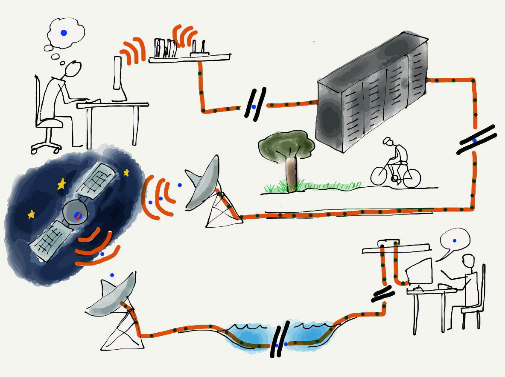
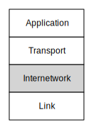
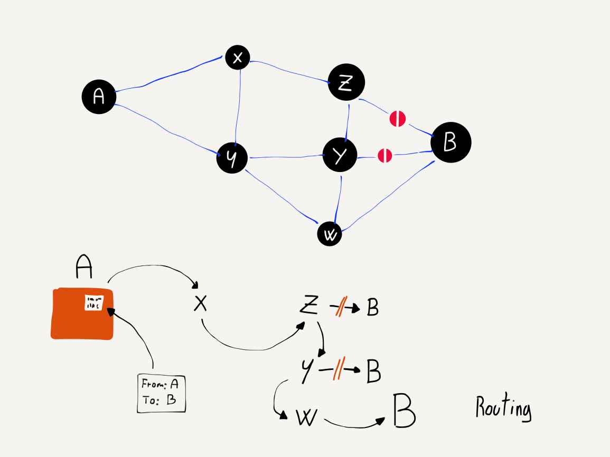
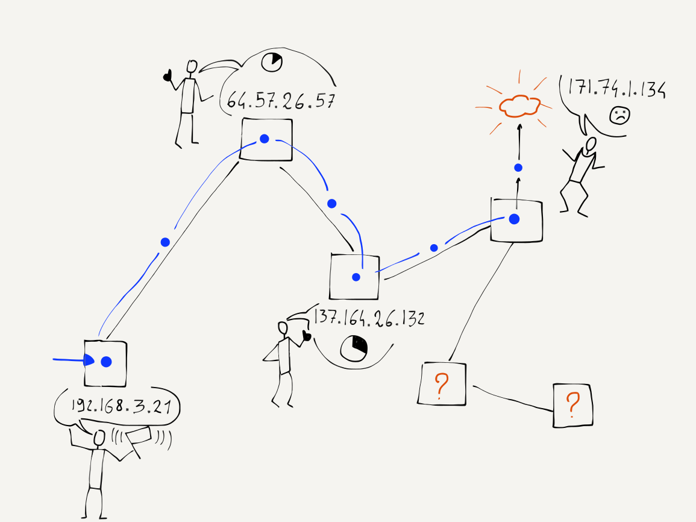

---
hide:
  - navigation
---

# 网络层（IP）

**Internetworking Layer (IP)**

=== "中文"

    现在我们已经能够在单一链路上移动数据，是时候考虑如何在全国甚至全球范围内传输数据了。要将数据从你的计算机发送到数以亿计的目的地，数据需要经过多个跳跃和多个网络。当你从家里旅行到一个遥远的目的地时，你可能会先走到公交车站，然后乘火车到城市，再换乘另一列火车到机场，接着搭飞机到另一个机场，之后打车进入城市，再乘火车到一个小镇，再换乘公交车到更小的镇，最后从公交车站走到你的酒店。数据包也需要通过多种交通方式才能到达目的地。对于一个要前往另一个国家的数据包来说，“走路”、“公交车”、“火车”和“飞机”可以视为不同的链路层，例如 WiFi、以太网、光纤和卫星。
    
    在旅行的每一个环节，你（或者你的数据包）都在使用一个共享媒介进行运输。可能在同一辆公交车、火车或飞机上有数百名其他旅客，但你的旅行与其他旅客的不同在于你在每个“跳跃”结束时所做的决定。例如，当你到达一个火车站时，你可能会下车，然后穿过车站选择一列特定的出发火车继续旅行。来自不同起点和目的地的旅客会做出不同的选择。你在旅行过程中做出的所有选择最终形成了一系列链路（或跳跃），将你从起点带到目的地。
    
    随着数据包从起点到达目的地，它还会经过多个“站点”，在这些地方会决定将数据包转发到哪个输出链路。对于数据包，我们称这些地方为“路由器”。路由器就像火车站一样，拥有多个进出链路。有些链路可能是光纤，有些可能是卫星，还有一些可能是无线的。路由器的任务是确保数据包在路由器中移动，并最终到达正确的出站链路层。一个典型的数据包在从源头到目的地的过程中会经过五到二十个路由器。
    
    但与火车站需要查看显示屏以找出下一班火车不同，路由器是通过查看目的地址来决定数据包需要走哪个输出链路。就好像火车站的工作人员会见到每一位下车的旅客，询问他们的目的地，并带领他们到达下一班火车。如果你是一个数据包，你就不需要再查看列车出发和站台的列表了！
    
    路由器能够快速确定数据包的输出链路，因为每个数据包都有其最终目的地址的标记。这被称为互联网协议地址，简称 IP 地址。我们精心构造 IP 地址，以使路由器转发数据包的工作尽可能高效。

=== "英文"

    Now that we can move data across a single link, it's time to figure out how to move it across the country or around the world. To send data from your computer to any of a billion destinations, the data needs to move across multiple hops and across multiple networks.  When you travel from your home to a distant destination, you might walk from your home to a bus stop, take a train to the city, take another train to the airport, take a plane to a different airport, take a taxi into the city, then take a train to a smaller town, a bus to an even smaller town, and finally walk from the bus stop to your hotel. A packet also needs to take multiple forms of transportation to reach its destination. For a packet taking its "trip" to another country, the "walk", "bus", "train", and "plane" can be thought of as different link layers like WiFi, Ethernet, fiber optic, and satellite.
    
    
    
    At each point during the trip, you (or your packet) are being transported using a shared medium. There might be hundreds of other people on the same bus, train, or plane, but your trip is different from that of every other traveller because of the decisions that you make at the end of each of your "hops". For instance, when you arrive at a train station, you might get off one train, then walk through the station and select a particular outbound train to continue your journey. Travellers with different starting points and destinations make a different series of choices. All of the choices you make during your trip result in you following a series of links (or hops) along a route that takes you from your starting point to your destination.  
    
    As your packet travels from its starting point to its destination, it also passes through a number of "stations" where a decision is made as to which output link your packet will be forwarded on. For packets, we call these places "routers". Like train stations, routers have many incoming and outgoing links. Some links may be fiber optic, others might be satellite, and still others might be  wireless. The job of the router is to make sure packets move through the router and end up on the correct outbound link layer. A typical packet passes through from five to 20 routers as it moves from its source to its destination.
    
    But unlike a train station where you need to look at displays to figure out the next train you need to take, the router looks at the destination address to decide which outbound link your packet needs to take. It is as if a train station employee met every single person getting off an inbound train, asked them where they were headed, and escorted them to their next train. If you were a packet, you would never have to look at another screen with a list of train departures and tracks!
    
    The router is able to quickly determine the outbound link for your packet because every single packet is marked with its ultimate destination address. This is called the Internet Protocol Address, or IP Address for short. We carefully construct IP addresses to make the router's job of forwarding packets as efficient as possible.

## 网络层（IP）地址

**Internet Protocol (IP) Addresses**

=== "中文"

    在上一节中，我们讨论了链路层地址时提到，链路地址是在硬件制造时分配的，并且在计算机的整个生命周期中保持不变。我们无法使用链路层地址在多个网络之间路由数据包，因为链路层地址与计算机连接到网络的位置之间没有关系。由于便携式计算机和手机不断移动，系统需要追踪每台计算机从一个位置移动到另一个位置的情况。而在网络上有数十亿台计算机的情况下，使用链路层地址进行路由决策将变得缓慢且低效。
    
    为了简化这一过程，我们根据计算机连接到网络的位置为每台计算机分配另一个地址。IP 地址有两个不同的版本。旧版（经典）IPv4 地址由四个用点分隔的数字组成，例如：
    
        212.78.1.25
    
    每个数字的范围是 0 到 255。如今，连接到互联网的计算机数量如此之多，以至于我们已经快用完可分配的 IPv4 地址。IPv6 地址更长，格式如下：
    
        2001:0db8:85a3:0042:1000:8a2e:0370:7334
    
    在本节中，我们将重点讨论经典的 IPv4 地址，但所有的概念同样适用于 IPv4 和 IPv6 地址。
    
    关于 IP 地址最重要的事情是，它们可以分为两个部分。IP 地址可以在多个点分为“网络号”和“主机标识符”。在这个例子中，我们将地址简单地分为两半。两部分地址的第一部分称为“网络号”。如果我们将一个 IPv4 地址拆分为两部分，可能会得到以下内容：
    
        网络号：212.78
        主机标识符：1.25
    
    这个概念是许多计算机可以通过一个单一的连接连接到互联网。整个大学校园、学校或企业都可以使用一个或几个网络号进行连接。在上面的例子中，最多可以连接 65,536 台计算机到使用“212.78”的网络号。由于所有计算机对其他互联网的表现是通过一个单一连接，因此所有 IP 地址为：
    
        212.78.*.*
    
    的数据包都可以路由到同一位置。
    
    通过使用网络号和主机标识符的这种方法，路由器不再需要追踪数十亿台个别计算机。相反，它们只需要跟踪大约一百万个或更少的不同网络号。
    
    因此，当你的数据包到达一个路由器时，路由器需要决定将数据包发送到哪个出站链路，它不需要查看整个 IP 地址。它只需查看地址的第一部分以确定最佳的出站链路。

=== "英文"

    In the previous section where we talked about Link layer addresses, we said that link addresses were assigned when the hardware was manufactured and stayed the same throughout the life of a computer. We cannot use link layer addresses to route packets across multiple networks because there is no relationship between a link layer address and the location where that computer is connected to the network. With portable computers and cell phones moving constantly, the system would need to track each individual computer as it moved from one location to another. And with billions of computers on the network, using the link layer address to make routing decisions would be slow and inefficient.
    
    
    
    To make this easier, we assign another address to every computer based on where the computer is connected to the network. There are two different versions of IP addresses. The old (classic) IPv4 addresses consist of four numbers separated by dots like this, and look like this:
    
        212.78.1.25
    
    Each of the numbers can only be from 0 through 255. We have so many computers connected to the Internet now that we are running out of IPv4 addresses to assign to them.  IPv6 address are longer and look like:
    
        2001:0db8:85a3:0042:1000:8a2e:0370:7334
    
    For this section we will focus on the classic IPv4 addresses, but all of the
    ideas apply equally to IPv4 and IPv6 addresses.
    
    The most important thing about IP addresses is that they can be broken into two parts. There are many points where an IP address can be broken into "Network Number" and "Host Identifier" - for this example, we will just split the address in half. The first part of the two-piece address is called the "Network Number". If we break out an IPv4 address into two parts, we might find the following:
    
        Network Number: 212.78
        Host Identifier: 1.25
    
    The idea is that many computers can be connected via a single connection to the Internet. An entire college campus, school, or business could connect using a single network number, or only a few network numbers. In the example above,  65,536 computers could be connected to the network using the network number of "212.78". Since all of the computers appear to the rest of the Internet on a single connection, all packets with an IP address of:
    
        212.78.*.*
    
    can be routed to the same location.
    
    By using this approach of a network number and a host identifier, routers no longer have to keep track of billions of individual computers. Instead, they need to keep track of perhaps a million or less different network numbers.
    
    So when your packet arrives in a router and the router needs to decide which outbound link to send your packet to, the router does not have to look at the entire IP address. It only needs to look at the first part of the address to determine the best outbound link.

## 路由器如何确定路由

**How Routers Determine the Routes**

=== "中文"

    虽然将许多 IP 地址合并为一个单一网络号大大减少了路由器必须跟踪的单个端点数量，但每个路由器仍然需要一种方法来了解从自身到它可能遇到的每个网络号的路径。
    
    当一个新的核心路由器连接到互联网时，它并不知道所有的路由。它可能知道一些预配置的路由，但为了建立如何路由数据包的全貌，它必须在处理数据包时发现路由。当路由器遇到一个它尚不知如何路由的数据包时，它会查询其“邻居”路由器。知道如何路由该网络号的邻居路由器会将其数据发送回请求的路由器。有时，邻居路由器需要询问它们的邻居，依此类推，直到找到实际的路由并发送回请求的路由器。
    
    在最简单的情况下，一个新的核心路由器可以连接到互联网，并慢慢建立网络号到出站链路的映射，从而能够根据每个传入数据包的 IP 地址正确路由数据包。我们将这种网络号到出站链路的映射称为特定路由器的“路由表”。
    
    当互联网正常运行时，每个路由器都有一个相对完整的路由表，并且很少遇到新的网络号。一旦路由器在第一次看到发往该网络号的数据包时找到了通往新网络号的路由，它就不需要重新发现该网络号的路由，除非发生了变化或出现故障。这意味着路由器在处理第一个数据包时会进行查找，但接下来的十亿个数据包可以直接使用路由表中已有的信息进行路由。

=== "英文"

    While the idea of the collapsing many IP addresses into a single network number greatly reduces the number of individual endpoints that a router must track to properly route packets, each router still needs a way to learn the path from itself to each of the network numbers it might encounter.
    
    When a new core router is connected to the Internet, it does not know all the routes. It may know a few preconfigured routes, but to build a picture of how to route packets it must discover routes as it encounters packets. When a router encounters a packet that it does not already know how to route, it queries the routers that are its "neighbors". The neighboring routers that know how to route the network number send their data back to the requesting router.  Sometimes the neighboring routers need to ask their neighbors and so on until the route is actually found and sent back to the requesting router.
    
    In the simplest case, a new core router can be connected to the Internet and slowly build a map of network numbers to outbound links so it can properly route packets based on the IP address for each incoming packet.  We call this mapping of network numbers to outbound links the "routing table" for a particular router.
    
    When the Internet is running normally, each router has a relatively complete routing table and rarely encounters a new network number. Once a router figures out the route to a new network number the first time it sees a packet destined for that network number, it does not need to rediscover the
    route for the network number unless something changes or goes wrong. This means that the router does a lookup on the first packet, but then it could route the next billion packets to that network number just by using the information it already has in its routing tables.

## 情况变得更糟和更好时

**When Things Get Worse and Better**

=== "中文"

    有时网络会出现问题，路由器必须找到绕过这些问题的方式。一个常见的问题是某个出站链路故障。可能是有人绊倒了电缆，拔掉了光纤。这时，路由器有一系列网络号需要通过已经故障的链路进行路由。路由器失去出站链路后的恢复过程出奇简单。路由器会丢弃所有在该链路上进行路由的路由表条目。随后，当更多数据包到达这些网络号时，路由器会重新进行路由发现过程，这次会询问所有邻近路由器，除了那些由于故障链路而无法联系的路由器。
    
    

    在路由表反映新的网络配置重建过程中，数据包的路由速度会变慢，但过一段时间后，事情会恢复正常。
    
    因此，在网络核心中，从源网络到目标网络始终至少存在两条独立路径是非常重要的。如果始终至少有两条独立的可能路径，我们称这样的网络为“二连通网络”。二连通网络可以从任何单一链路故障中恢复。在网络连接很多的地方，比如美国东海岸，网络可以失去许多链路而不会完全断开。但当你在家或学校只有一个连接时，如果该连接中断，你就会完全断开。
    
    在某个时刻，故障链路被修复或新的链路被建立，路由器希望充分利用这些新链路。路由器始终关注改善其路由表，并在空闲时间寻找机会提升路由表。当通信出现间歇时，路由器会向邻近路由器请求其全部或部分路由表。路由器会查看邻居的路由表，如果发现其他路由器到某个网络号的路径更优，则会更新自己的网络表，将该网络号的数据包通过具有更优路径的路由器转发。
    
    通过这些处理故障和交换路由表信息的方法，路由器可以迅速应对网络故障，将数据包从故障或慢速链路重新路由到正常或更快的链路。与此同时，每个路由器也在与其邻近路由器交流，寻找改进自己路由表的方法。尽管没有任何来源到任何目的地的“最佳路径”的中央来源，路由器几乎总是能够找到从源到目的地的最快路径。路由器还擅长检测并动态地将数据包重新路由到慢速或暂时过载的链路。
    
    路由器发现网络结构的方式的一个副作用是，从源到目的地的数据包路径可能会随着时间变化。你甚至可以发送一个数据包，紧接着发送另一个数据包，由于路由的方式，第二个数据包可能会在第一个数据包之前到达目的地。我们不要求 IP 层关注数据包的顺序；它已经有足够多的事情要处理了。
    
    我们将带有源和目的 IP 地址的数据包像在邮局寄信那样倾倒到互联网中。每个数据包在系统中找到自己的路径，最终到达目的地。

=== "英文"

    Sometimes the network has problems and a router must find a way to route data around the problems. A common problem is that one of the outbound links fails. Perhaps someone tripped over a wire and unplugged a fiber optic cable. At this point, the router has a bunch of network numbers that it wants to route out on a link that has failed. The recovery when a router loses an outbound link is surprisingly simple. The router discards all of the entries in its routing table that were being routed on that link. Then as more packets arrive for those network numbers, the router goes through the route discovery process again, this time asking all the neighboring routers except the ones that can no longer be contacted due to the broken link.
    
    
    
    Packets are routed more slowly for a while as routing tables are rebuilt that reflect the new network configuration, but after a while things are humming along nicely.
    
    This is why it is important for there to always be at least two independent paths from a source network to a destination network in the core of the network. If there are always at least two possible independent routes, we say that a network is a "two-connected network". A two-connected network can recover from any single link outage.  In places where there are a lot of network connections, like the east coast of the United States, the network could lose many links without ever becoming completely disconnected. But when you are at your home or school and have only one connection, if that connection goes down you are disconnected completely.
    
    At some point the broken link is repaired or a new link is brought up, and the router wants to make best use of the new links. The router is always interested in improving its routing tables, and looks for opportunities to improve its routing tables in its spare time. When there is a lull in communication, a router will ask a neighboring router for all or part of its routing table. The router looks through the neighbor's tables and if it looks like the other router has a better route to a particular network number, it updates its network table to forward packets for that network number through the link to the router that has a better route.
    
    With these approaches to outages and the exchange of routing table information, routers can quickly react to network outages and reroute packets from links that are down or slow to links that are up and/or faster. All the while, each router is talking to its neighboring routers to find ways to improve its own routing table. Even though there is no central source of the "best route" from any source to any destination, the routers are good at knowing the fastest path from a source to a destination nearly all the time. Routers are also good at detecting and dynamically routing packets around links that are slow or temporarily overloaded.
    
    One of the side effects of the way routers discover the structure of the network is that the route your packets take from the source to the destination can change over time. You can even send one packet immediately followed by another packet and because of how the packets are routed, the second packet might arrive at the destination before the first packet. We don't ask the IP layer to worry about the order of the packets; it already has enough to worry about.
    
    We pour our packets with source and destination IP addresses into the Internet much like we would send out a bunch of letters in the mail at the post office. The packets each find their way though the system and arrive at their destinations.

## 确定你的路由

**Determining Your Route**

=== "中文"

    在互联网中，没有任何地方能够预先知道你的数据包从计算机到特定目的地的路径。即使是参与转发你的数据包的路由器，也并不知道你的数据包将采取的整个路径。它们只知道将数据包发送到哪个链路，以便让其更接近最终目的地。
    
    但是，事实证明，大多数计算机都有一个网络诊断工具，称为“traceroute”（或根据操作系统的不同为“tracert”），可以让你追踪计算机与目标计算机之间的路径。由于任意两个计算机之间的路径可能会因数据包而异，因此当我们“追踪”一条路径时，这只是对数据包实际路径的“相当不错的猜测”。
    
    traceroute 命令实际上并不会“追踪”你的数据包。它利用了 IP 网络协议中的一个特性，该特性旨在避免数据包被“困住”在网络中而无法到达目的地。在查看 traceroute 之前，我们先快速了解一下数据包如何可能在网络中永远被困，以及 IP 协议是如何解决这个问题的。
    
    记住，任何单个路由器中的信息都是不完美的，仅仅是特定网络号的最佳出站链路的近似值，每个路由器都无法知道其他路由器会做什么。但如果我们有三个路由器，其路由表条目形成一个无尽的循环会怎样呢？
    
    
    
    每个路由器都认为它知道以“212.78”开头的 IP 地址的最佳出站链路。但由于某种原因，这些路由器有些混淆，它们的路由表形成了一个循环。如果一个以“212.78”开头的数据包进入其中一个路由器，它将永远在三个链路的圆圈中被路由。没有出路。当更多带有相同前缀的数据包到达时，它们将被添加到“无限数据包漩涡”中。很快，链路上将充满往返流量，路由器将充满等待发送的数据包，所有三个路由器都会崩溃。这个问题比有人绊倒光纤电缆还要严重，因为它可能导致多个路由器崩溃。
    
    为了防止这个问题，互联网协议设计者为每个数据包添加了一个称为生存时间（TTL）的数字。这个数字起始值大约为 30。每当 IP 数据包通过一个链路时，路由器就会将 TTL 值减去 1。因此，如果数据包需要 15 次跳转才能穿越互联网，它在另一端的 TTL 值将为 15。
    
    但现在让我们看看当存在路由循环（或“数据包漩涡”）时 TTL 是如何运作的。由于数据包不断在循环中被转发，最终 TTL 将达到零。当 TTL 达到零时，路由器会假设出现了问题，并丢弃该数据包。这种方法确保了路由循环不会导致网络的整个区域崩溃。
    
    这真是一个相当酷的网络协议工程。为了检测和恢复路由循环，我们只需在数据包中放入一个数字，在每个链路上减去 1，当数字变为零时丢弃数据包。
    
    实际上，当路由器丢弃一个数据包时，它通常会发送一个礼貌通知，类似于“抱歉，我不得不丢弃你的数据包。”这个消息包含了丢弃数据包的路由器的 IP 地址。
    
    网络循环实际上是相当罕见的，但我们可以利用这个丢包通知来绘制数据包在网络中经过的近似路径。traceroute 程序以巧妙的方式发送数据包，以便让通过的路由器返回通知。首先，traceroute 发送一个 TTL 为 1 的数据包。该数据包到达第一个路由器并被丢弃，计算机收到来自第一个路由器的通知。然后 traceroute 发送一个 TTL 为 2 的数据包。该数据包通过第一个路由器，但被第二个路由器丢弃，后者向你发送一条关于丢弃数据包的消息。接着，traceroute 发送一个 TTL 为 3 的数据包，并继续增加 TTL，直到数据包到达目的地。
    
    通过这种方法，traceroute 构建了一个近似路径，展示了数据包在网络中的行进路线。
    
    
    
    从密歇根州安阿伯到加利福尼亚州帕洛阿尔托需要 14 次跳转。数据包经过了堪萨斯、德克萨斯、洛杉矶和奥克兰。如果你开车或乘火车，这可能不是两个城市之间的最佳路线，但在那一天，两个城市之间的数据包通过互联网的最佳路径就是这条。
    
    
    
    你还可以看到数据包从源到每个路由器，以及从源到目的地所需的时间。毫秒（ms）是 1/1000 秒。因此，77.317 ms 仅略低于 0.1 秒。这个网络相当快。
    
    有时 traceroute 可能需要一些时间，最长可达一两分钟。并不是所有路由器都会给你“我丢弃了你的数据包”的消息。在上面的例子中，第 13 跳的路由器在没有说“抱歉”的情况下就丢弃了我们的数据包。traceroute 等待消息，几秒钟后放弃并增加 TTL 值，以便超过那个不礼貌的路由器。
    
    如果你对一个包含海底电缆的连接运行 traceroute，你可以看到数据在海底传输的速度。下面是密歇根大学与中国北京大学之间的 traceroute。
    
    
    
    你可以看到在第七和第八步中，数据包遇到了长海底电缆。时间从不到 0.1 秒增加到近 0.25 秒。尽管 0.25 秒比 0.1 秒慢，但考虑到数据包几乎是绕着世界旅行的，这还是相当令人印象深刻的。
    
    我们 IP 网络的核心是显著的。大多数时候，我们并不在意路由器为确保我们的数据包快速从计算机传输到全球各个目的地所付出的努力。接下来，我们将从查看网络核心的功能转向 IP 地址在边缘的管理。

=== "英文"

    There is no place in the Internet that knows in advance the route your packets will take from your computer to a particular destination. Even the routers that participate in forwarding your packets across the Internet do not know the entire route your packet will take. They only know which link to send your packets to so they will get closer to their final destination.
    
    But it turns out that most computers have a network diagnostic tool called "traceroute" (or "tracert", depending on the operating system) that allows you to trace the route between your computer and a destination computer. Given that the route between any two computers can change from one packet to another, when we "trace" a route, it is only a "pretty good guess" as to the actual route packets will take.
    
    The traceroute command does not actually "trace" your packet at all. It takes advantage of a feature in the IP network protocol that was designed to avoid packets becoming "trapped" in the network and never reaching their destination. Before we take a look at traceroute, let's take a quick look at how a packet might get trapped in the network forever and how the IP protocol solves that problem.
    
    Remember that the information in any single router is imperfect and is only an approximation of the best outbound link for a particular network number, and each router has no way of knowing what any other router will do. But what if we had three routers with routing table entries that formed an endless loop?
    
    
    
    Each of the routers thinks it knows the best outbound link for IP addresses that start with "212.78". But somehow the routers are a little confused and their routing tables form a loop. If a packet with a prefix of "212.78" found its way into one of these routers, it would be routed around a circle of three links forever. There is no way out. As more packets arrived with the same prefix, they would just be added to the "infinite packet vortex". Pretty soon the links would be full of traffic going round and round, the routers would fill up with packets waiting to be sent, and all three routers would crash. This problem is worse than having someone trip over a fiber optic cable, since it can cause several routers to crash.
    
    To solve this problem, the Internet Protocol designers added a number to each packet that is called the Time To Live (TTL). This number starts out with a value of about 30. Each time an IP packet is forwarded down a link, the router subtracts 1 from the TTL value. So if the packet takes 15 hops to cross the Internet, it will emerge on the far end with a TTL of 15.
    
    But now let's look at how the TTL functions when there is a routing loop (or "packet vortex") for a particular network number. Since the packet keeps getting forwarded around the loop, eventually the TTL reaches zero. And when the TTL reaches zero, the router assumes that something is wrong and throws the packet away. This approach ensures that routing loops do not bring whole areas of the network down.
    
    So that is a pretty cool bit of network protocol engineering. To detect and recover from routing loops, we just put a number in, subtract 1 from that number on each link, and when the number goes to zero throw the packet away.
    
    It also turns out that when the router throws a packet away, it usually sends back a courtesy notification, something like, "Sorry I had to throw your packet away." The message includes the IP address of the router that threw the packet away.
    
    Network loops are actually pretty rare, but we can use this notification that a packet was dropped to map the approximate route a packet takes through the network. The traceroute program sends packets in a tricky manner to get the routers that your packets pass through to send it back notifications. First, traceroute sends a packet with a TTL of 1. That packet gets to the first router and is discarded and your computer gets a notification from the first router. Then traceroute sends a packet with a TTL of 2. That packet makes it through the first router and is dropped by the second router, which sends you back a note about the discarded packet. Then traceroute sends a packet with a TTL of 3, and continues to increase the TTL until the packet makes it all the way to its destination.
    
    With this approach, traceroute builds up an approximate path that your packets are taking across the network.
    
    
    
    It took 14 hops to get from Ann Arbor, Michigan to Palo Alto, California. The packets passed through Kansas, Texas, Los Angeles, and Oakland. This might not be the best route between the two cities if you were driving a car or taking a train, but on that day for packets between the two cities this was the best route on the Internet.
    
    
    
    You can also see how long it took the packets to make it from the source to each router, and then from the source to the destination. A millisecond (ms) is a 1/1000 of a second. So 77.317 ms is just under a tenth of a second. This network is pretty fast.
    
    Sometimes a traceroute can take a little while, up to a minute or two. Not all routers will give you the "I discarded your packet" message. In the example above, the router at hop 13 threw our packet away without saying "I am sorry". Traceroute waits for the message and after a few seconds just gives up and increases the TTL value so it gets past the rude router.
    
    If you run a traceroute for a connection that includes an undersea cable, you can see how fast data moves under the sea. Here is a traceroute between the University of Michigan and Peking University in China.
    
    
    
    You can see when the packet is encountering a long undersea cable in steps seven and eight. The time goes from less than 1/10 of a second to nearly 1/4 of a second. Even though 1/4 of a second is slower than 1/10 a second, it is pretty impressive when you consider that the packet is going nearly all of the way around the world in that 1/4 second.
    
    The core of our IP network is remarkable.  Most of the time we don't really care how hard the routers are working to make sure our packets move quickly from our computer to the various destinations around the world.  Next we will move from looking at how the core of the network functions to how IP addresses are managed at the edges.

## 获取 IP 地址

**Getting an IP Address**

=== "中文"

    越来越多的计算机是便携式或移动式的。我们刚刚提到过，IP 层使用网络号跟踪大型计算机组的重要性，而不是单独跟踪每一台计算机。但由于这些网络号表示与网络的特定物理连接，当我们将计算机从一个位置移动到另一个位置时，它将需要一个新的 IP 地址。请记住，链路层地址是在计算机制造时设置的，并在计算机的整个生命周期中不会改变。如果你在一家咖啡店合上笔记本电脑，然后使用家里的 WiFi 重新打开它，你的计算机将需要一个不同的 IP 地址。
    
    当计算机从一个网络移动到另一个网络时获得不同 IP 地址的能力使用了一种称为“动态主机配置协议”（简称 DHCP）的协议。DHCP 相当简单。回到链路层部分，回忆一下你的计算机在链路级别首先要做的事情是通过发送消息到一个特殊的广播地址询问“这个网络上有基站吗？”一旦你的计算机通过该基站成功连接到链路层，它会发送另一个广播消息，这次询问“这个网络上是否有网关可以让我连接到互联网？如果有，请告诉我你的 IP 地址，并告诉我我在这个网络上应该使用哪个 IP 地址。”
    
    当网关路由器回复时，你的计算机会获得一个临时的 IP 地址用于该网络（例如，当你在咖啡店时）。在一段时间内如果路由器没有收到你的计算机的信息，它会认为你已经离开，并将这个 IP 地址借给另一台计算机。
    
    如果这个重用借用的 IP 地址的过程出错，最终会导致两台计算机在同一个网络上使用相同的 IP 地址。也许你在计算机上见过类似的信息：“另一台计算机正在使用 192.168.0.5，我们已停止使用此地址。”你的计算机发现另一台具有不同链路地址的计算机正在使用它认为分配给自己的 IP 地址。
    
    
    
    但大多数时候，这种动态 IP 地址分配（DHCP）工作得非常完美。你打开笔记本电脑，几秒钟后就可以连接并使用互联网。然后你合上笔记本电脑，前往不同的地点，并在该位置获得一个不同的 IP 地址。
    
    在某些操作系统中，当计算机连接到网络时，如果发出 DHCP 请求而没有收到回复，它会决定自己分配一个 IP 地址。这些自分配的地址通常以“169....”开头。当你的计算机拥有这些自分配的 IP 地址时，它认为自己已连接到网络并拥有 IP 地址，但没有网关，它无法将数据包路由到本地网络或互联网。最好的结果是一些计算机可以连接到本地网络，相互发现并进行网络游戏。对于这些自分配的 IP 地址，其他功能并不多。

=== "英文"

    Increasingly, computers are portable or mobile. We just pointed out how important it was for the IP layer to track large groups of computers using network numbers instead of tracking every single computer individually. But since these network numbers indicate a particular physical connection to the network, when we move a computer from one location to another, it will need a new IP address. Remember that the link layer address is set when a computer is manufactured and never changes throughout the life of the computer. If you close your laptop in one coffee shop and reopen it using your home WiFi, your computer will need a different IP address.
    
    This ability for your computer to get a different IP address when it is moved from one network to another uses a protocol called "Dynamic Host Configuration Protocol" (or DHCP for short).  DHCP is pretty simple. Going back to the Link layer section, recall the first thing your computer does at the link level is ask "Is there a base station on this network?" by sending a message to a special broadcast address. Once your computer is successfully connected at the link layer through that base station, it sends another broadcast message, this time asking "Is there a gateway connected to this network that can get me to the Internet? If there is, tell me your IP address and tell me what IP address I should use on this network".
    
    When the gateway router replies, your computer is given a temporary IP address to use on that network (for instance, while you are at the coffee shop). After the router has not heard from your computer for a while, it decides you are gone and loans the IP address to another computer.
    
    If this process of reusing a loaned IP address goes wrong, two computers end up on the same network with the same IP address. Perhaps you have seen a message on your computer to the effect of, "Another computer is using 192.168.0.5, we have stopped using this address". Your computer sees another computer with a link address other than its own using the IP address that your computer thinks is assigned to it.
    
    
    
    But most of the time this dynamic IP address assignment (DHCP) works perfectly. You open your laptop and in a few seconds you are connected and can use the Internet. Then you close your laptop and go to a different location and are given a different IP address to use at that location.
    
    In some operating systems, when a computer connects to a network, issues a DHCP request, and receives no answer, it decides to assign itself an IP address anyway. Often these self-assigned addresses start with "169....".  When your computer has one of these self-assigned IP addresses, it thinks it is connected to a network and has an IP address, but without a gateway, it has no possibility of getting packets routed across the local network and onto the Internet. The best that can be done is that a few computers can connect to a local network, find each other, and play a networked game. There is not much else that can be done with these self-assigned IP addresses.

## 一种不同的地址重用方式

**A Different Kind of Address Reuse**

=== "中文"

    如果你知道如何在笔记本电脑上查找 IP 地址，你可以进行一个小实验，看看在不同位置获得的不同 IP 地址。如果你列出在不同地点接收到的地址，你可能会发现许多地方分配的地址前缀为“192.168。”这似乎违反了网络号（IP 地址前缀）与计算机连接到互联网的位置相关的规则，但针对以“192.168.”开头的地址适用另一条规则（前缀“10.”也是特殊的）。
    
    以“192.168.”开头的地址被称为“非可路由”地址。这意味着它们永远不会作为真实地址在网络核心中路由数据。它们可以在单个本地网络中使用，但不能在全球网络上使用。
    
    那么，为什么你的计算机在家用网络上能获得像“192.168.0.5”这样的地址，并且在整体互联网中运行得很好呢？这是因为你的家用路由器/网关/基站正在进行一种我们称之为“网络地址转换”（NAT）的操作。网关有一个可路由的单一 IP 地址，它在多个连接到网关的工作站之间共享。你的计算机使用其非可路由地址（如“192.168.0.5”）发送数据包，但当数据包经过网关时，网关会将地址替换为其实际的可路由地址。当数据包返回到你的工作站时，路由器会将你的工作站的非可路由地址放回返回的数据包中。
    
    这种方法使我们能够节省真实的可路由地址，并对从一个网络移动到另一个网络的工作站重复使用相同的非可路由地址。

=== "英文"

    If you know how to find the IP address on your laptop, you can do a little experiment and look at the different IP addresses you get at different locations. If you made a list of the different addresses you received at the different locations, you might find that many of the locations give out addresses with a prefix of "192.168.". This seems to be a violation of the rule that the network number (IP address prefix) is tied to the place where the computer is connected to the Internet, but a different rule applies to addresses that start with "192.168." (The prefix "10." is also special).
    
    Addresses that start with "192.168." are called "non-routable" addresses. This means that they will never be used as real addresses that will route data across the core of the network. They can be used within a single local network, but not used on the global network.
    
    So then how is it that your computer gets an address like "192.168.0.5" on your home network and it works perfectly well on the overall Internet?  This is because your home router/gateway/base station is doing something we call "Network Address Translation", or "NAT". The gateway has a single routable IP address that it is sharing across multiple workstations that are connected to the gateway. Your computer uses its non-routable address like "192.168.0.5" to send its packets, but as the packets move across the gateway, the gateway replaces the address with its actual routable address. When packets come back to your workstation, the router puts your workstation's non-routable address back into the returning packets.
    
    This approach allows us to conserve the real routable addresses and use the same non-routable addresses over and over for workstations that move from one network to another.

## 全球 IP 地址分配

**Global IP Address Allocation**

=== "中文"

    如果你想将一个新组织的网络连接到互联网，你需要联系一个互联网服务提供商（ISP）并建立连接。你的 ISP 会给你分配一系列 IP 地址（即一个或多个网络号），这些地址可以分配给连接到你网络的计算机。ISP 通过将其从更高级别的互联网服务提供商那里收到的一部分网络号分配给你来为你分配网络号。
    
    在 IP 地址分配的顶层，有五个区域互联网注册机构（RIRs）。这五个注册机构为一个主要的地理区域分配 IP 地址。在这五个注册机构之间，世界上每个地方都可以被分配一个网络号。这五个注册机构分别是北美（ARIN）、南美和中美洲（LACNIC）、欧洲（RIPE NCC）、亚太地区（APNIC）和非洲（AFRNIC）。
    
    当经典的 IPv4 地址如“212.78.1.25”被发明时，连接到互联网的计算机仅有几千台。那时我们从未想过有一天会有十亿台计算机连接到互联网。但今天，随着互联网的扩展以及“物联网”的兴起，智能汽车、冰箱、温控器甚至灯具都需要 IP 地址，我们需要连接的计算机数量远超过十亿。为了使这些新计算机能够连接到互联网，工程师们设计了一种新的互联网协议，称为“IPv6”。128 位的 IPv6 地址比 32 位的 IPv4 地址要长得多。
    
    区域互联网注册机构（RIRs）正在引领从 IPv4 到 IPv6 的过渡。IPv4 到 IPv6 的过渡将需要很多年。在此期间，IPv4 和 IPv6 必须无缝协作。

=== "英文"

    If you wanted to connect the network for a new organization to the Internet you would need to contact an Internet Service Provider and make a connection. Your ISP would give you a range of IP addresses (i.e., one or more network numbers) that you could allocate to the computers attached to your network. The ISP assigns you network numbers by giving you a portion of the network numbers they received from a higher-level Internet Service Provider.
    
    At the top level of IP address allocations are five Regional Internet Registries (RIRs). Each of the five registries allocates IP addresses for a major geographic area. Between the five registries, every location in the world can be allocated a network number. The five registries are North America (ARIN), South and Central America (LACNIC), Europe (RIPE NCC), Asia-Pacific (APNIC) and Africa (AFRNIC).
    
    When the classic IPv4 addresses like "212.78.1.25" were invented, only a few thousand computers were connected to the Internet. We never imagined then that someday we would have a billion computers on the Internet. But today with the expansion of the Internet and the "Internet of things" where smart cars, refrigerators, thermostats, and even lights will need IP addresses, we need to connect far more than a billion computers to the Internet. To make it possible to connect all these new computers to the Internet, engineers have designed a new generation of the Internet Protocol called "IPv6". The 128-bit IPv6 addresses are much longer than the 32-bit IPv4 addresses.
    
    The Regional Internet Registries (RIRs) are leading the transition from IPv4 to IPv6. The transition from IPv4 to IPv6 will take many years. During that time, both IPv4 and IPv6 must work seamlessly together.

## 总结

**Summary**

=== "中文"

    互联网协议层将我们的网络从单一的跳转（链接层）扩展到一系列跳转，从而使数据包能够快速且高效地从你的计算机路由到目标 IP 地址，然后再返回到你的计算机。IP 层的设计旨在应对网络故障，并在数十亿台计算机之间维护接近理想的路由路径，而无需任何中央路由清算所。每个路由器都学习其在整个网络中的位置，并通过与邻近路由器的合作，有效地在互联网中转发数据包。
    
    IP 层并不是 100% 可靠的。数据包可能因为短暂的故障而丢失，或者因为网络在某个时刻对数据包的路径感到“困惑”。你的系统稍后发送的数据包可能会找到更快的网络路径，甚至在你系统之前发送的数据包之前到达。
    
    设计一个 IP 层，使其永远不丢失数据包并确保数据包按顺序到达，虽然看起来很诱人，但这几乎不可能处理如此多系统连接所涉及的极端复杂性。
    
    因此，我们不对 IP 层要求过多，而是将数据包丢失和数据包到达顺序错误的问题留给上层的传输层处理。

=== "英文"

    The Internetworking Protocol layer extends our network from a single hop (Link layer) to a series of hops that result in packets quickly and efficiently being routed from your computer to a destination IP address and back to your computer. The IP layer is designed to react and route around network outages and maintain near-ideal routing paths for packets moving between billions of computers without any kind of central routing clearinghouse. Each router learns its position within the overall network, and by cooperating with its neighboring routers helps move packets effectively across the Internet.
    
    The IP layer is not 100% reliable. Packets can be lost due to momentary outages or because the network is momentarily "confused" about the path that a packet needs to take across the network. Packets that your system sends later can find a quicker route through the network and arrive before packets that your system sent earlier.
    
    It might seem tempting to design the IP layer so that it never loses packets and insures that packets arrive in order, but this would make it nearly impossible for the IP layer to handle the extreme complexities involved in connecting so many systems.
    
    So instead of asking too much of the IP layer, we leave the problem of packet loss and packets that arrive out of order to our next layer up, the Transport layer.

## 术语

**Glossary**

=== "中文"

    **核心路由器**：在互联网核心中转发流量的路由器。
    
    **DHCP**：动态主机配置协议。DHCP 是便携式计算机在移动到新位置时获取 IP 地址的方式。
    
    **边缘路由器**：提供本地网络与互联网连接的路由器。等同于“网关”。
    
    **主机标识符**：IP 地址中用于识别本地网络内计算机的部分。
    
    **IP 地址**：分配给计算机的全球唯一地址，以便它可以与其他具有 IP 地址并连接到互联网的计算机进行通信。为了简化互联网核心中的路由，IP 地址被划分为网络号和主机标识符。一个例子的 IP 地址可能是“212.78.1.25”。
    
    **NAT**：网络地址转换。这种技术允许多个计算机在单个本地网络上共享一个全球 IP 地址。
    
    **网络号**：IP 地址中用于识别计算机连接到哪个本地网络的部分。
    
    **数据包漩涡**：由于路由表中的错误，数据包进入无限循环的错误情况。
    
    **RIR**：区域互联网注册机构。五个 RIR 大致对应于世界各大洲，负责为全球主要地理区域分配 IP 地址。
    
    **路由表**：每个路由器维护的信息，跟踪每个网络号应使用哪个出站链接。
    
    **生存时间 (TTL)**：存储在每个数据包中的一个数字，在数据包通过每个路由器时减少 1。当 TTL 达到零时，数据包被丢弃。
    
    **traceroute**：在许多 Linux/UNIX 系统上可用的命令，尝试映射数据包从源到目标的路径。在 Windows 系统上可能称为“tracert”。
    
    **双连通网络**：在网络中，任意两个节点之间至少存在两条可能路径的情况。双连通网络可以在不丧失整体连通性的情况下失去任意单一链接。

=== "英文"

    **core router**: A router that is forwarding traffic within the core of the  Internet.  
    
    **DHCP**: Dynamic Host Configuration Protocol. DHCP is how a portable computer gets an IP address when it is moved to a new location.
    
    **edge router**: A router which provides a connection between a local network and the Internet.  Equivalent to "gateway".
    
    **Host Identifier**: The portion of an IP address that is used to  identify a computer within a local area network.
    
    **IP Address**: A globally assigned address that is assigned to a computer so that it can communicate with other computers that have IP addresses and are connected to the Internet.  To simplify routing in the core of the Internet IP addresses are broken into Network Numbers and Host Identifiers.  An example IP address might be "212.78.1.25".
    
    **NAT**: Network Address Translation. This technique allows a single global  IP address to be shared by many computers on a single local area network.
    
    **Network Number**: The portion of an IP address that is used to identify which local network the computer is connected to.
    
    **packet vortex**: An error situation where a packet gets into an infinite  loop because of errors in routing tables.
    
    **RIR**: Regional Internet Registry. The five RIRs roughly correspond  to the continents of the world and allocate IP address  for the major geographical areas of the world.
    
    **routing tables**: Information maintained by each router that keeps track  of which outbound link should be used for each network number.
    
    **Time To Live (TTL)**: A number that is stored in every packet that  is reduced by one as the packet passes through each router.  When the TTL reaches zero, the packet is discarded.
    
    **traceroute**: A command that is available on many Linux/UNIX systems that  attempts to map the path taken by a packet as it moves from its source to its destination.  May be called "tracert" on Windows systems.
    
    **two-connected network**: A situation where there is at least two possible paths between any pair of nodes in a network.  A two-connected network can  lose any single link without losing overall connectivity.

## 问题

**Questions**

=== "中文"

    你可以在 <http://www.net-intro.com/quiz/> 在线参加这个测验。
    
    1. Internetworking 层的目标是什么？
    
        a) 将数据包从源计算机通过多个跳转传输到目标计算机
        
        b) 在单一物理连接上移动数据包
        
        c) 处理网络服务器故障转移
        
        d) 处理敏感数据的加密
    
    2. 在互联网中，典型的数据包从源到目标要跨越多少个不同的物理链接？
    
        a) 1
        
        b) 4
        
        c) 15
        
        d) 255
    
    3. 以下哪项是 IP 地址？
    
        a) 0f:2a:b3:1f:b3:1a
        
        b) 192.168.3.14
        
        c) www.khanacademy.com
        
        d) @drchuck
    
    4. 为什么必须从 IPv4 迁移到 IPv6？
    
        a) 因为 IPv6 拥有更小的路由表
        
        b) 因为 IPv6 减少了数据包必须跨越的跳数
        
        c) 因为 IPv4 地址即将用尽
        
        d) 因为 IPv6 地址由网络硬件制造商选择
    
    5. 网络号是什么？
    
        a) 拥有相同前缀的一组 IP 地址
        
        b) 特定局域网的 GPS 坐标
        
        c) 数据包跨越网络所需的跳数
        
        d) 数据包在跨越网络时所经历的总体延迟
    
    6. 在网络号 "218.78" 内可以有多少台计算机？
    
        a) 650
        
        b) 6500
        
        c) 65000
        
        d) 650000
    
    7. 路由器如何确定数据包在互联网中的传输路径？
    
        a) 路由由 IRG（互联网路由组）控制
        
        b) 每个路由器根据其对正确出站链接的最佳猜测查看数据包并进行转发
        
        c) 每个路由器将所有数据包发送到每个出站链接（洪泛算法）
        
        d) 每个路由器会保存数据包，直到目标计算机发送数据包进来
    
    8. 路由表是什么？
    
        a) 映射到链接地址的 IP 地址列表
        
        b) 映射到 GPS 坐标的 IP 地址列表
        
        c) 映射到 GPS 坐标的网络号列表
        
        d) 映射到路由器出站链接的网络号列表
    
    9. 新连接的路由器如何填充其路由表？
    
        a) 咨询 IANA（互联网分配号码管理局）
        
        b) 下载路由 RFC（请求评论）
        
        c) 联系互联网工程任务组（IETF）
        
        d) 询问邻近路由器它们如何路由数据包
    
    10. 当物理链接出现故障时，路由器会做什么？
    
        a) 丢弃该链接的所有路由表条目
        
        b) 咨询互联网地图（IMAP）服务
        
        c) 进行域名（DNS）查询以获取 IP 地址
        
        d) 将该链接的所有数据包发送回源计算机
    
    11. 为什么至少拥有一个“二连通”网络是好的？
    
        a) 因为路由表要小得多
        
        b) 因为它消除了对网络号的需求
        
        c) 因为它支持更多的 IPv4 地址
        
        d) 因为即使失去单一链接，它仍然可以正常工作
    
    12. 消息中的所有数据包是否都采用相同的路由跨越互联网？
    
        a) 是
        
        b) 否
    
    13. 路由器如何发现新路由并改善其路由表？
    
        a) 每天午夜下载一张新的互联网地图
        
        b) 定期询问邻近路由器它们的网络表
        
        c) 随机丢弃数据包以触发互联网中的错误修正代码
        
        d) 从目标计算机获取传输速度数据
    
    14. 数据包中的“生存时间”字段的目的是什么？
    
        a) 确保数据包不会陷入“无限循环”
        
        b) 跟踪数据包通过网络所需的分钟数
        
        c) 维护网络号与 GPS 坐标之间的映射
        
        d) 告诉路由器特定数据包的正确输出链接
    
    15. “traceroute”命令是如何工作的？
    
        a) 发送一系列低 TTL 值的数据包，以便获取数据包被丢弃的位置
        
        b) 从互联网地图（IMAP）加载网络路由
        
        c) 联系域名服务器以获取特定网络号的路由
        
        d) 询问路由器在数据包从源到目标传输时附加路由信息
    
    16. 数据包通过海底光纤电缆横穿太平洋大约需要多长时间？
    
        a) 0.0025 秒
        
        b) 0.025 秒
        
        c) 0.250 秒
        
        d) 2.5 秒
    
    17. 在 WiFi 网络中，计算机如何获取互联网协议（IP）地址？
    
        a) 使用 DHCP 协议
        
        b) 使用 DNS 协议
        
        c) 使用 HTTP 协议
        
        d) 使用 IMAP 协议
    
    18. 网络地址转换（NAT）是什么？
    
        a) 查找与文本名称（如“www.dr-chuck.com”）相关联的 IP 地址
        
        b) 允许 IPv6 流量通过 IPv4 网络
        
        c) 查找特定路由器和网络号的最佳出站链接
        
        d) 在多个位置的多个网络网关之间重用像“192.168”这样的特殊网络号
    
    19. IP 地址和网络号是如何在全球范围内管理的？
    
        a) 有五个顶级注册机构在五个地理区域管理网络号
        
        b) IP 地址在全球范围内随机分配，类似彩票
        
        c) IP 地址由网络设备制造商分配
        
        d) IP 地址基于 GPS 坐标
    
    20. IPv6 地址比 IPv4 地址大多少？
    
        a) 大小相同
        
        b) IPv6 地址比 IPv4 地址大 50%
        
        c) IPv6 地址是 IPv4 地址的两倍
        
        d) IPv6 地址是 IPv4 地址的 10 倍
    
    21. 当计算机收到以“169..”开头的 IP 地址时，这意味着什么？
    
        a) 你的互联网连接支持多播协议
        
        b) 网关正在使用 NAT 将你的本地地址映射到全球地址
        
        c) 没有可用的网关可以将你的数据包转发到互联网
        
        d) 该网络的网关是一个低速网关，具有较小的窗口大小
    
    22. 如果你在波兰创办一家互联网服务提供商，哪个区域互联网注册机构（RIR）会分配给你一块 IP 地址？
    
        a) ARIN
        
        b) LACNIC
        
        c) RIPE NCC
        
        d) APNIC
        
        e) AFRNIC
        
        f) 联合国

=== "英文"

    You can take this quiz online at <http://www.net-intro.com/quiz/>
    
    1. What is the goal of the Internetworking layer?
    
        a) Move packets across multiple hops from a source to destination computer
        
        b) Move packets across a single physical connection
        
        c) Deal with web server failover
        
        d) Deal with encryption of sensitive data
        
    1. How many different physical links does a typical packet cross from  its source to its destination on the Internet?
        
        a) 1
        
        b) 4
        
        c) 15
        
        d) 255
        
    1. Which of these is an IP address?
    
        a) 0f:2a:b3:1f:b3:1a
        
        b) 192.168.3.14
        
        c) www.khanacademy.com
        
        d) @drchuck
    
    1. Why is it necessary to move from IPv4 to IPv6?
    
        a) Because IPv6 has smaller routing tables
        
        b) Because IPv6 reduces the number of hops a packet must go across
        
        c) Because we are running out of IPv4 addresses
        
        d) Because IPv6 addresses are chosen by network hardware manufacturers
    
    1. What is a network number?
    
        a) A group of IP addresses with the same prefix
        
        b) The GPS coordinates of a particular LAN
        
        c) The number of hops it takes for a packet to cross the network
        
        d) The overall delay packets experience crossing the network
    
    1. How many computers can have addresses within network number "218.78"?
    
        a) 650
        
        b) 6500
        
        c) 65000
        
        d) 650000
    
    1. How do routers determine the path taken by a packet across the Internet?
    
        a) The routes are controlled by the IRG (Internet Routing Group)
        
        b) Each router looks at a packet and forwards it based on its best guess  as to the correct outbound link
        
        c) Each router sends all packets on every outbound link (flooding algorithm)
        
        d) Each router holds on to a packet until a packet comes in from the  destination computer
    
    1. What is a routing table?
    
        a) A list of IP addresses mapped to link addresses
        
        b) A list of IP addresses mapped to GPS coordinates
        
        c) A list of network numbers mapped to GPS coordinates
        
        d) A list of network numbers mapped to outbound links from the router
    
    1. How does a newly connected router fill its routing tables?
    
        a) By consulting the IANA (Internet Assigned Numbers Authority)
        
        b) By downloading the routing RFC (Request for Comments)
        
        c) By contacting the Internet Engineering Task Force (IETF)
        
        d) By asking neighboring routers how they route packets
    
    1.  What does a router do when a physical link goes down?
    
        a) Throws away all of the routing table entries for that link
        
        b) Consults the Internet Map (IMAP) service
        
        c) Does a Domain Name (DNS) looking for the IP address
        
        d) Sends all the packets for that link back to the source computer
    
    1.  Why is it good to have at least a "two-connected" network?
    
        a) Because routing tables are much smaller
        
        b) Because it removes the need for network numbers
        
        c) Because it supports more IPv4 addresses
        
        d) Because it continues to function even when a single link goes down
    
    1.  Do all packets from a message take the same route across the Internet?
    
        a) Yes
        
        b) No
    
    1.  How do routers discover new routes and improve their routing tables?
    
        a) Each day at midnight they download a new Internet map from IMAP
        
        b) They periodically ask neighboring routers for their network tables
        
        c) They randomly discard packets to trigger error-correction code within the Internet
        
        d) They are given transmission speed data by destination computers
    
    1.  What is the purpose of the "Time to Live" field in a packet?
    
        a) To make sure that packets do not end up in an "infinite loop"
        
        b) To track how many minutes it takes for a packet to get through the network
        
        c) To maintain a mapping between network numbers and GPS coordinates
        
        d) To tell the router the correct output link for a particular packet
    
    1.  How does the "traceroute" command work?
    
        a) It sends a series of packets with low TTL values so it can get a  picture of where the packets get dropped
        
        b) It loads a network route from the Internet Map (IMAP)
        
        c) It contacts a Domain Name Server to get the route for a  particular network number
        
        d) It asks routers to append route information to a packet as it is  routed from source to destination
    
    1.  About how long does it take for a packet to cross the Pacific Ocean via an undersea fiber optic cable?
    
        a) 0.0025 Seconds
        
        b) 0.025 Seconds
        
        c) 0.250 Seconds
        
        d) 2.5 Seconds
        
    1.  On a WiFi network, how does a computer get an Internetworking (IP) address?
    
        a) Using the DHCP protocol
        
        b) Using the DNS protocol
        
        c) Using the HTTP protocol
        
        d) Using the IMAP protocol
    
    1.  What is Network Address Translation (NAT)?
    
        a) It looks up the IP address associated with text names  like "www.dr-chuck.com"
        
        b) It allows IPv6 traffic to go across IPv4 networks
        
        c) It looks up the best outbound link for a particular router  and network number
        
        d) It reuses special network numbers like "192.168" across multiple network gateways at multiple locations
    
    1.  How are IP addresses and network numbers managed globally?
    
        a) There are five top-level registries that manage network numbers in  five geographic areas
        
        b) IP addresses are assigned worldwide randomly in a lottery
        
        c) IP addresses are assigned by network equipment manufacturers
        
        d) IP addresses are based on GPS coordinates
        
    1.  How much larger are IPv6 addresses than IPv4 addresses?
    
        a) They are the same size
        
        b) IPv6 addresses are 50% larger than IPv4 addresses
        
        c) IPv6 addresses are twice as large as IPv4 addresses
        
        d) IPv6 addresses are 10 times larger than IPv4 addresses
    
    1.  What does it mean when your computer receives an IP address that starts with "169.."?
    
        a) Your connection to the Internet supports the Multicast protocol
        
        b) The gateway is mapping your local address to a global address using NAT
        
        c) There was no gateway available to forward your packets to the Internet
        
        d) The gateway for this network is a low-speed gateway with a small window size
    
    1.  If you were starting an Internet Service Provider in Poland, which Regional Internet Registry (RIR) would assign you a block of IP addresses.
    
        a) ARIN
        
        b) LACNIC
        
        c) RIPE NCC
        
        d) APNIC
        
        e) AFRNIC
        
        f) United Nations