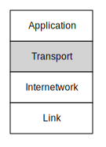

---
hide:
  - navigation
---

# 传输层

**Transport Layer**

=== "中文"

    从互联层向上的下一个层是传输层。互联层的一个关键元素是它不试图保证任何特定数据包的送达。尽管互联层几乎是完美的，但有时数据包可能会丢失或被错误路由。
    
    
    
    但网络用户希望能够可靠地发送整个文件或消息。如果网络只能发送大多数情况下能接收到的数据包，那它对我们没有太大用处。为了使网络有用，所有数据包需要重新组装成正确的顺序，以在接收系统上重建消息。网络还必须处理乱序到达或根本不到达的数据包。传输层是我们处理可靠性和在目标计算机上重建消息的地方。
    
    与IP层一样，传输层会在每个数据包中添加少量数据，以帮助解决数据包重组和重传的问题。

=== "英文"

    The next layer up from the Internetworking layer is the Transport layer. A key element of the Internetworking layer is that it does not attempt to guarantee delivery of any particular packet.   The Internetworking layer is nearly perfect, but sometimes packets can be lost or misrouted.
    
    
    
    But users of the network want to reliably send entire files or messages across the Internet. A network is not much good to us if all it can do is send packets that are received most of the time. For the network to be useful, all of the packets need to be reassembled into the right order to reconstruct the message on the receiving system. The network must also deal with packets that arrive out of order or never arrive at all. The Transport layer is where we handle reliability and message reconstruction on the destination computer.
    
    Just like the IP layer, the Transport layer adds a small amount of data to each packet to help solve the problems of packet reassembly and retransmission.

## 数据包头

**Packet Headers**

=== "中文"

    如果你观察一个数据包在其源计算机和目标计算机之间的多个链接中传输，你会看到一个链路头部、一个IP头部和一个传输控制协议（TCP）头部，以及数据包中的实际数据。
    
    
    
    当数据包在一个链接上接收时，链路头部会被移除，而当数据包在下一个链接上发送时，会添加一个新的链路头部。IP和TCP头部在数据包经过每个链接时始终保留。请记住，数据包在通过互联网路由时可能会经过多种类型的链路层。
    
    IP头部包含源和目标互联网协议（IP）地址，以及数据包的生存时间（TTL）。IP头部在源计算机上设置，并在数据包通过各个路由器传输时保持不变（除了TTL）。
    
    TCP头部指示每个数据包中数据的位置。当源计算机将消息或文件分割成数据包时，它会跟踪每个数据包相对于消息或文件起始位置的偏移，并在每个创建和发送的数据包中放入该偏移量。

=== "英文"

    If you were to look at a packet going across one of many links between its source and destination computers, you would see a link header, an IP header, and a Transport Control Protocol (TCP) header, along with the actual data in the packet.
    
    
    
    The link header is removed when the packet is received on one link and a new link header is added when the packet is sent out on the next link on its journey. The IP and TCP headers stay with a packet as it is going across each link in its journey. Remember that a packet may go across several types of link layers as it is routed through the Internet.
    
    The IP header holds the source and destination Internet Protocol (IP) addresses as well as the Time to Live (TTL) for the packet. The IP header is set on the source computer and is unchanged (other than the TTL) as the packet moves through the various routers on its journey.
    
    The TCP headers indicate where the data in each packet belongs. As the source computer breaks the message or file into packets, it keeps track of the position of each packet relative to the beginning of the message or file and places the offset in each packet that is created and sent.

## 数据包重组与重传

**Packet Reassembly and Retransmission**

=== "中文"

    当目标计算机接收到数据包时，它会查看数据包相对于消息开头的偏移位置，以便将数据包放入重组消息的正确位置。通过确保将数据包数据放在相对于消息开头的正确位置，传输层可以轻松处理乱序到达的数据包。如果它接收到一个在消息后面的数据包，它会将该数据包放入缓冲区，并记录当前在重构的消息中存在一个缺口。当稍后接收到之前的数据包时，它恰好填补了重组数据中的缺口。
    
    为了避免网络过载，发送计算机的传输层在发送一定量的数据后，会等待目标计算机的传输层确认数据包已被接收。发送计算机在暂停等待确认之前可以发送的数据量称为“窗口大小”。
    
    发送计算机会跟踪从接收计算机开始接收确认的速度。如果确认快速返回，发送计算机会增加窗口大小；如果确认返回缓慢，发送计算机会减少发送的数据量。通过调整窗口大小，发送计算机可以在快速且负载轻的连接上快速发送大量数据，而在慢速或负载重的链接上则可以以不致于过载网络的方式发送数据。
    
    如果一个数据包丢失，它将永远无法到达目标计算机，因此目标计算机将永远不会发送该数据的确认。由于发送计算机没有收到确认，它会迅速达到发送了足够的未确认数据以填满窗口的程度，并停止发送新数据包。
    
    此时，两个计算机都在等待。发送计算机在等待一个永远不会到来的丢失数据包的确认，而接收计算机在等待一个永远不会到来的丢失数据包。为了确保计算机不会永远等待，目标计算机会跟踪自收到最后一个数据包以来经过的时间。在某个时刻，接收计算机会判断时间已过太久，并向发送计算机发送一个数据包，指示接收计算机最后接收到数据的流位置。当发送计算机收到该消息时，它会“回退”并从接收计算机最后成功接收的位置重新发送数据。
    
    
    
    接收计算机确认接收的数据、限制发送计算机过快（窗口大小），以及接收计算机在数据似乎丢失时请求发送计算机“回退并重启”的结合，创建了一种相对简单的方法来可靠地通过网络发送大型消息或文件。
    
    在传输层发送数据流的同时，它会持续监控接收确认的速度，并动态调整窗口大小。这确保了在两个计算机之间的连接快速时，数据能迅速发送；而在连接慢或负载重的情况下，数据则会以更慢的速度发送。

=== "英文"

    As the destination computer receives the packets, it looks at the offset position from the beginning of the message so it can put the packet into the proper place in the reassembled message. Simply by making sure to put the packet data at the correct position relative to the beginning of the message, the Transport layer easily handles packets that arrive out of order.  If it receives a packet further down a message, it places that packet in a buffer, keeping track of the fact that there is now a gap in the message that is being reconstructed. When the earlier packet arrives a moment later, it fits perfectly into the gap in the reassembled data.
    
    To avoid overwhelming the network, the Transport layer in the sending computer only sends a certain amount of data before waiting for an acknowledgement from the Transport layer on the destination computer that the packets were received. The amount of data that the sending computer will send before pausing to wait for an acknowledgment is called the "window size".
    
    The sending computer keeps track of how quickly it starts to receive acknowledgements from the receiving computer. If the acknowledgments come back quickly, the sending computer increases its window size, but if the acknowledgments come back slowly, the sending computer transmits less data. By adjusting the window size, transmitting computers can send large amounts of data quickly over fast connections that have light loads. When sending data over slow or heavily loaded links, they can send the data in a way that does not overwhelm the network.
    
    If a packet is lost, it will never arrive at the destination computer and so the destination computer will never send an acknowledgment for that data. Because the sending computer does not receive an acknowledgment, it quickly reaches the point where it has sent enough unacknowledged data to fill up the window and stops sending new packets.
    
    At this point, both computers are waiting. The sending computer is waiting for an acknowledgement for a lost packet that will never come and the receiving computer is waiting for a lost packet that will never come. To make sure that the computers do not wait forever, the destination computer keeps track of the amount of time since it received the last packet of data. At some point, the receiving computer decides too much time has passed and sends a packet to the sending computer indicating where in the stream the receiving computer has last received data. When the sending computer receives this message, it "backs up" and resends data from the last position that the receiving computer had successfully received.
    
    
    
    The combination of the receiving computer acknowledging received data, not allowing the transmitting computer to get too far ahead (window size), and the receiving computer requesting the sending computer to "back up and restart" when it appears that data has been lost creates a relatively simple method to reliably send large messages or files across a network.
    
    While the Transport layer is sending a stream of data, it continuously monitors how quickly it receives acknowledgements and dynamically adjusts its window size. This ensures that data is sent rapidly when the connection between two computers is fast and much more slowly when the connection has slow links or a heavy load.

## 传输层的运行

**The Transport Layer In Operation**

=== "中文"

    传输层的一个关键元素是发送计算机必须在数据被确认之前保持所有发送的数据。一旦接收计算机确认了数据，发送计算机就可以丢弃已发送的数据。当一条消息被分成多个数据包时，我们可以通过图形来观察这一过程。在这里，消息的前十个数据包已被发送并得到目标计算机（'a'）的确认。发送计算机又发送了六个数据包（'S'），然后因达到窗口大小而停止。
    
    
    
    有三个数据包已发送但尚未接收（“S”）。由于网络中存在许多跳数，多个数据包同时在网络中传输是非常常见的。
    
    接收计算机的传输层已经接收并确认了十个数据包，并将它们交付给接收应用程序（'a'）。目标计算机的传输层接收了另外三个数据包（'R'），但有一个数据包是乱序的。如果缺失的数据包在合理的时间内到达，接收乱序数据包并不是一个问题。只要所有数据包都被接收，接收传输层就会重构消息，将数据包像拼图一样拼接在一起，并将其交付给接收应用程序。

=== "英文"

    One of the key elements of the Transport layer is that the sending computer must hold on to all of the data it is sending until the data has been acknowledged. Once the receiving computer acknowledges the data, the sending computer can discard the sent data.  We can look at this graphically when a message is broken into many packets. Here, the first ten packets of the message have been sent and acknowledged by the destination computer ('a'). The sending computer has sent six more packets ('S'), and then stopped because it reached its window size.
    
    
    
    There are three packets that have been sent but not yet received ("S").  Since there are many hops in the network, it is very common for more than one packet to be enroute in the network at the same time.
    
    The Transport layer on the receiving computer has received and acknowledged ten packets and delivered them to the receiving application ('a').^[We talk about the Application layer in later material.] The Transport layer on the destination computer has received more three packets ('R'), but one packet is out of order. Receiving a packet out of order is not a cause for concern if the missing packet arrives in a reasonably short amount of time. As long as all the packets are received, the receiving Transport layer will reconstruct the message, fitting the packets together like puzzle pieces, and deliver them to the receiving application.

## 应用程序客户端和服务器

**Application Clients and Servers**

=== "中文"

    传输层的目的是为网络应用提供可靠的连接，以便这些应用能够发送和接收数据流。对于应用来说，这就像简单地请求传输层与运行在远程主机上的应用建立连接。我们将发起本地计算机连接的应用称为“客户端”，而响应连接请求的应用称为“服务器”。我们称这两个网络应用的组合为“客户端/服务器”应用，因为这两个部分必须协同工作。
    
    为了简化与远程计算机建立连接并在该连接上发送和接收数据的过程，我们的架构在底层的三个层级上进行了大量的工程设计。

=== "英文"

    The purpose of the Transport layer is to provide reliable connections between networked applications so those applications can send and receive streams of data. For an application, this is as simple as asking the Transport layer to make a connection to an application running on a remote host. We call the application that initiates the connection on the local computer the "client" and the application that responds to the connection request the "server". We call the combination of the two networked applications at the ends of the connection a "client/server" application because the two pieces of the application must work together.
    
    A lot of engineering has gone into the lower three layers of our architecture to make it easy to open a connection to a remote computer and then send and receive data over that connection.

## 服务器应用程序与端口

**Server Applications and Ports**

=== "中文"

    当客户端应用程序想要与远程计算机建立连接时，确保连接到正确的服务器应用程序是很重要的。远程计算机上可能同时运行多个不同的服务器应用程序。常见的服务器应用程序包括：
    
    * 网络服务器
    * 视频服务器
    * 邮件服务器
    
    例如，网络客户端（如浏览器）需要连接到远程计算机上运行的网络服务器。因此，客户端应用程序不仅需要知道要连接哪个远程计算机，还需要选择与该远程计算机上的特定应用程序进行交互。
    
    我们使用一个叫做“端口”的概念，允许客户端应用程序选择想要交互的服务器应用程序。端口就像电话的分机。所有的分机都有相同的电话号码（IP 地址），但每个分机（服务器应用程序）都有不同的分机号（端口号）。
    
    当服务器应用程序启动时，它会在指定的端口上“监听”传入的连接。一旦服务器应用程序注册了自己准备好接收连接，它就会等待第一个连接的到来。
    
    为了让客户端应用程序知道要连接哪个端口，各种服务器应用程序都有一份众所周知的默认端口列表：
    
    * Telnet (23) - 登录
    * SSH (22) - 安全登录
    * HTTP (80) - 万维网
    * HTTPS (443) - 安全网页
    * SMTP (25) - 收件邮件
    * IMAP (143/220/993) - 邮件检索
    * POP (109/110) - 邮件检索
    * DNS (53) - 域名解析
    * FTP (21) - 文件传输
    
    这些是这些应用程序的常用端口。有时，服务器会在非标准端口上提供应用程序。如果你在进行网页开发，你可能会在非标准端口上运行网络服务器，如3000、8080或8888。如果你看到一个 URL 如：
    
        http://testing.example.com:8080/login
    
    这里的“8080”表示你的浏览器将使用网络协议与服务器交互，但连接到8080端口，而不是默认的80端口。

=== "英文"

    When a client application wants to make a connection to a remote computer, it is important that the connection is made to the correct server application on that remote computer.  A remote computer might have any number of different server applications running at the same time. Example server applications would include:
    
    * Web Server
    * Video Server
    * Mail Server
    
    
     
    For instance, a web client (a browser) needs to connect to the web server running on the remote computer. So a client application not only needs to know which remote computer to connect to, it also needs to choose a particular application to interact with on that remote computer.
    
    We use a concept called "ports" to allow a client application to choose which server application it wants to interact with. Ports are like telephone extensions. All of the extensions have the same phone number (IP Address) but each extension (server application) has a different extension number (port number).
    
    When a server application starts up, it "listens" for incoming connections on the specified port. Once the server application has registered that it is ready to receive incoming connections, it waits until the first connection is made.
    
    So that client applications know which port to connect to, there is a list of well-known default ports for various server applications:
    
    * Telnet (23) - Login
    * SSH (22) - Secure Login
    * HTTP (80) - World Wide Web
    * HTTPS (443) - Secure Web
    * SMTP (25) - Incoming Mail
    * IMAP (143/220/993) - Mail Retrieval
    * POP (109/110) - Mail Retrieval
    * DNS (53) - Domain Name Resolution
    * FTP (21) - File Transfer
    
    These are the normal ports for these applications.  Sometimes servers will make applications available at non-standard ports.  If you are doing web development, you may run a web server at a non-standard port like 3000, 8080, or 8888.  If you see a URL like:
    
    	http://testing.example.com:8080/login
    
    the "8080" indicates that your browser is going to use the web protocols to interact with the server, but connect to port 8080 instead of the default port 80.

## 总结

**Summary**

=== "中文"

    从某种意义上说，传输层的目的是弥补链路层和互联网层可能会丢失数据的事实。当下两层丢失或重新路由数据包时，传输层负责重新组装和/或重传这些数据。传输层的存在使得下两层能够忽略重传和速率限制的问题。
    
    分层架构的目标之一是将过于复杂的问题拆分为较小的子问题。每一层专注于解决整体问题的一部分，并假设其他层解决它们应该解决的问题。

=== "英文"

    In a sense, the purpose of the Transport layer is to compensate for the fact that the Link and Internetworking layers might lose data. When the two lower layers lose or reroute packets, the Transport layer works to reassemble and/or retransmit that data. The existence of the Transport layer makes it possible for the two lower layers to ignore retransmission and rate-limiting issues.
    
    Part of the goal of a layered architecture is to break an overly complex problem into smaller subproblems. Each layer focuses on solving part of the overall problem and assumes that the other layers solve the problems they are supposed to solve.

## 术语

**Glossary**

=== "中文"

    **确认**：当接收计算机向源计算机发送通知，指示数据已被接收。
    
    **缓冲**：暂时保存已发送或接收的数据，直到计算机确认这些数据不再需要。
    
    **监听**：当服务器应用程序启动并准备接受来自客户端应用程序的传入连接时的状态。
    
    **端口**：一种允许多个不同服务器应用程序在单台计算机上等待传入连接的方式。每个应用程序在不同的端口上监听。客户端应用程序通过连接到知名端口号来确保它们与正确的服务器应用程序进行通信。

=== "英文"

    **acknowledgement**: When the receiving computer sends a notification back to the source computer indicating that data has been received.
    
    **buffering**: Temporarily holding on to data that has been sent or received until the computer is sure the data is no longer needed.
    
    **listen**: When a server application is started and ready to accept incoming connections from client applications.
    
    **port**: A way to allow many different server applications to be waiting for incoming connections on a single computer. Each application listens on a different port. Client applications make connections to well-known port numbers to make sure they are talking to the correct server application.

## 问题

**Questions**

=== "中文"

    您可以在 <http://www.net-intro.com/quiz/> 在线参加这个测验。
    
    1. 传输（TCP）层要解决的主要问题是什么？
    
        a) 在多个跳跃之间传送数据包，从源计算机到目标计算机
        
        b) 通过单个物理连接移动数据包
        
        c) 处理丢失和乱序的数据包
        
        d) 处理敏感数据的加密
    
    2. TCP头中包含什么？
    
        a) 物理地址
        
        b) IP地址和生存时间（TTL）
        
        c) 端口号和偏移量
        
        d) 正在请求的文档
    
    3. “窗口大小”对网络正常运行为什么重要？
    
        a) 因为过大的数据包会堵塞光纤连接
        
        b) 它防止快速计算机在慢速连接上发送过多数据
        
        c) 它限制数据包在被丢弃之前可以经过的跳数
        
        d) 它确定IP地址的哪个部分是网络号
    
    4. 当发送计算机收到来自接收计算机的确认时会发生什么？
    
        a) 发送计算机重新发送数据，以确保准确传输
    
        b) 发送计算机发送更多数据，直到达到窗口大小
        
        c) 发送计算机发送“对确认的确认”
        
        d) 发送计算机将确认发送到互联网地图（IMAP）
    
    5. 哪一个能够检测并采取措施处理丢失的数据包？
    
        a) 发送计算机
        
        b) 网络网关
        
        c) 核心互联网路由器
        
        d) 接收计算机
    
    6. 哪一个保留数据包，以便在数据包丢失时可以重新传输？
    
        a) 发送计算机
        
        b) 网络网关
        
        c) 核心互联网路由器
        
        d) 接收计算机
    
    7. 哪一个最类似于TCP端口？
    
        a) 火车站
        
        b) 海底网络电缆
        
        c) 公寓号
        
        d) 雕塑花园
    
    8. 客户端/服务器应用程序的哪一部分必须先启动？
    
        a) 客户端
        
        b) 服务器
    
    9. 域名系统的端口号是什么？
    
        a) 22
        
        b) 80
        
        c) 53
        
        d) 143
    
    10. IMAP邮件检索协议的端口号是什么？
    
        a) 22
        
        b) 80
        
        c) 53
        
        d) 143

=== "英文"

    You can take this quiz online at <http://www.net-intro.com/quiz/>
    
    1. What is the primary problem the Transport (TCP) layer is supposed to solve?
    
        a) Move packets across multiple hops from a source to destination computer
        
        b) Move packets across a single physical connection
        
        c) Deal with lost and out-of-order packets
        
        d) Deal with encryption of sensitive data
    
    1. What is in the TCP header?
    
        a) Physical address
        
        b) IP Address and Time to Live
        
        c) Port number and offset
        
        d) Which document is being requested
    
    1. Why is "window size" important for the proper functioning of the network?
        
        a) Because packets that are too large will clog fiber optic connections
        
        b) It prevents a fast computer from sending too much data on a slow connection
        
        c) It limits the number of hops a packet can take before it is dropped
        
        d) It determines what part of an IP address is the network number
    
    1. What happens when a sending computer receives an acknowledgement from the receiving computer?
    
        a) The sending computer resends the data to make sure it was transmitted accurately
    
        b) The sending computer sends more data up to the window size
        
        c) The sending computer sends an "acknowledgment for the acknowledgment"
        
        d) The sending computer sends the acknowledgement to the Internet Map (IMAP)
    
    1. Which of these detects and takes action when packets are lost?
    
        a) Sending computer
        
        b) Network gateway
        
        c) Core Internet routers
        
        d) Receiving computer
    
    1. Which of these retains data packets so they can be retransmitted if a packets lost?
    
        a) Sending computer
        
        b) Network gateway
        
        c) Core Internet routers
        
        d) Receiving computer
    
    1. Which of these is most similar to a TCP port?
    
        a) Train station
        
        b) Undersea network cable
        
        c) Apartment number
        
        d) Sculpture garden
    
    1. Which half of the client/server application must start first?
        
        a) Client
        
        b) Server
    
    1. What is the port number for the Domain Name System?
    
        a) 22
        
        b) 80
        
        c) 53
        
        d) 143
    
    1.  What is the port number for the IMAP mail retrieval protocol?
    
        a) 22
        
        b) 80
        
        c) 53
        
        d) 143