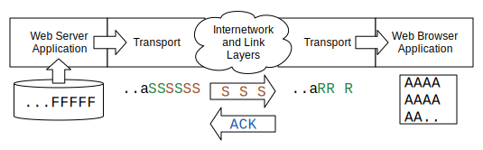

---
hide:
  - navigation
---

# 应用层

**Application Layer**

=== "中文"

    我们一直在从四层TCP/IP网络模型的底部向顶部进行讨论，现在我们终于来到了顶部。应用层是网络软件运行的地方，比如网页浏览器、邮件程序、视频播放器或网络视频播放器。作为用户，我们与这些应用程序进行互动，而这些应用程序则代表我们与网络进行交互。
    
    

=== "英文"

    We have been working from the bottom to the top of our four-layer TCP/IP network model and we are finally at the top.  The Application layer is where the networked software like web browsers, mail programs, video players, or networked video players operate. We as users interact with these applications and the applications interact with the network on our behalf.
    
    

## 客户端和服务器应用程序

**Client and Server Applications**

=== "中文"

    重要的是要记住，网络应用程序的运行需要两个部分。网络应用程序的架构称为“客户端/服务器”。服务器部分运行在互联网上的某个地方，并拥有用户想要查看或互动的信息。客户端部分则与服务器应用程序建立连接，检索信息并展示给用户。这些应用程序在各自的计算机上使用传输层来交换数据。
    
    
    
    要浏览像 <www.khanacademy.org> 这样的网页地址，您必须在计算机上运行一个网页应用程序。当您在网页浏览器中输入地址时，它会连接到相应的网页服务器，检索页面供您查看，然后将页面展示给您。
    
    计算机上的网页浏览器会发送请求连接到 <www.khanacademy.org> 。您的计算机会查找域名以找到对应的服务器IP地址，并与该IP地址建立传输连接，然后开始通过该网络连接向服务器请求数据。当数据被接收后，网页浏览器会将其展示给您。有时，网页浏览器会显示一个小的动画图标，以让您知道数据正在通过网络被检索。
    
    连接的另一端是另一个名为“网页服务器”的应用程序。网页服务器程序始终处于活动状态，等待传入连接。因此，当您想查看网页时，实际上是连接到一个已经在运行并等待您连接的服务器应用程序。
    
    从某种意义上说，传输层、互联网层和链路层，以及域名系统，就像网络应用程序的电话网络。它们“拨号”网络上的不同服务器应用程序，并与这些应用程序“对话”以交换数据。

=== "英文"

    It is important to remember that two parts are required for a networked application to function. The architecture for a networked application is called "client/server". The server portion of the application runs somewhere on the Internet and has the information that users want to view or interact with. The client portion of the application makes connections to the server application, retrieves information, and shows it to the user. These applications use the Transport layer on each of their computers to exchange data.
    
    
    
    To browse a web address like www.khanacademy.org, you must have a web application running on your computer. When you type an address into your web browser, it connects to the appropriate web server, retrieves pages for you to view, and then shows you the pages.
    
    The web browser on your computer sends a request to connect to www.khanacademy.org. Your computer looks up the domain name to find the corresponding IP address for the server and makes a transport connection to that IP address, then begins to request data from the server over that network connection. When the data is received, the web browser shows it to you. Sometimes web browsers display a small animated icon to let you know that the data is being retrieved across the network.
    
    On the other end of the connection is another application called a "web server". The web server program is always up and waiting for incoming connections. So when you want to see a web page, you are connecting to a server application that is already running and waiting for your connection.
    
    In a sense, the Transport, Internetwork, and Link layers, along with the Domain Name System, are like a telephone network for networked applications. They "dial up" different server applications on the network and have "conversations" with those applications to exchange data.

## 应用层协议

**Application Layer Protocols**

=== "中文"

    就像人们在电话上交谈一样，每对网络应用程序之间需要一套规则来管理对话。在大多数文化中，当电话响起时，接电话的人通常会说“你好”。通常，拨打电话的人（客户端）在接电话的人（服务器端）说“你好”之前是保持沉默的。如果您曾拨打过一个不遵循这一简单规则的人，可能会感到困惑。您可能会认为连接出了问题，于是挂断电话并重试。
    
    管理我们如何沟通的一套规则称为“协议”。“协议”这个词的定义是“描述活动应如何执行的规则，特别是在外交领域”。这个想法是，在正式场合，我们应该根据一套精确的规则行事。我们用这个词来描述网络应用程序，因为没有精确的规则，应用程序就无法建立和管理对话。计算机喜欢精确。
    
    
    
    网络应用程序有很多种，因此确保每个网络应用程序都有良好文档的协议非常重要，以便所有服务器和客户端能够互操作。其中一些协议复杂而繁琐。
    
    描述网页浏览器与网页服务器之间通信的协议在许多大型文档中有所说明，其中一个是：
    
    <https://tools.ietf.org/html/rfc7230>
    
    网页客户端与网页服务器之间协议的正式名称是“超文本传输协议”，简称HTTP。当您在浏览器中输入URL时以“http:”或“https:”开头时，您表示希望使用HTTP协议检索文档。
    
    如果您查看上述文档，并转到第41页的5.3.2节，您会找到网页客户端应该发送给网页服务器的确切文本：
    
        GET http://www.example.org/pub/WWW/TheProject.html HTTP/1.1
    
    HTTP如此成功的原因之一是，与大多数客户端/服务器协议相比，它相对简单。尽管HTTP的基本使用相对简单，但有很多细节可以使网页客户端和服务器高效地通信并传输广泛的信息和数据。HTTP协议有六个不同的文档，总共305页。这似乎包含很多细节，但设计协议的关键是考虑协议的所有可能使用场景，并仔细描述每种情况。

=== "英文"

    Just like people talking on telephones, each pair of network applications needs a set of rules that govern the conversation. In most cultures, when your phone rings and you pick up the phone you say "Hello". Normally the person who made the call (the client person) is silent until the person who picked up the phone (the server person) says "Hello". If you have ever called someone who does not follow this simple rule, it can be quite confusing. You probably would assume that the connection was not working, hang up, and retry the call.
    
    A set of rules that govern how we communicate is called a "protocol". The definition of the word protocol is "a rule which describes how an activity should be performed, especially in the field of diplomacy." The idea is that in formal situations, we should behave according to a precise set of rules. We use this word to describe networked applications, because without precise rules, applications have no way to establish and manage a conversation. Computers like precision.
    
    
    
    There are many different networked applications and it is important that each networked application have a well-documented protocol so that all servers and clients can interoperate. Some of these protocols are intricate and complex.
    
    The protocol that describes how a web browser communicates with a web server is described in a number of large documents starting with this one:
    
    <https://tools.ietf.org/html/rfc7230>
    
    The formal name of the protocol between web clients and web servers is the "HyperText Transport Protocol", or HTTP for short. When you put "http:" or "https:" on the beginning of a URL that you type into the browser, you are indicating that you would like to retrieve a document using the HTTP protocol.
    
    If you were to read the above document, and go to section 5.3.2 on page 41, you find the exact text of what a web client is supposed to send to a web server:
    
        GET http://www.example.org/pub/WWW/TheProject.html HTTP/1.1
    
    One of the reasons that HTTP is so successful is that it is relatively simple compared to most client/server protocols. Even though the basic use of HTTP is relatively simple, there is a lot of detail that allows web clients and servers communicate efficiently and transfer a wide range of information and data. Six different documents describe the HTTP protocol, in a total of 305 pages. That might seem like a lot of detail, but the key in designing protocols is to think through all possible uses of the protocol and describe each scenario carefully.

## 探索 HTTP 协议

**Exploring the HTTP Protocol**

=== "中文"

    在本节中，我们将手动演练HTTP协议，通过模拟网页浏览器向网页服务器发送HTTP命令以检索数据。为了体验HTTP协议，我们将使用互联网早期构建的应用程序之一。
    
    “telnet”应用程序于1968年首次开发，遵循了互联网的早期标准之一：
    
    <https://tools.ietf.org/html/rfc15>
    
    该标准仅有五页长，此时您可能已经能够轻松阅读并理解文档中的大部分内容。Telnet客户端应用程序如此古老，以至于在互联网的历史中，它几乎成了一种“恐龙”，因为它源于“史前”时代。互联网是由NSFNet项目于1985年创建的，而其前身ARPANET在1969年上线。Telnet的设计和构建甚至早于第一个TCP/IP网络投入生产。
    
    有趣的是，telnet应用程序仍然存在于大多数现代操作系统中。您可以通过Macintosh和Linux的终端（命令行）访问telnet。Telnet应用程序也在Windows 95到Windows XP中存在，但在后续版本的Windows中并不包含。如果您使用的是较新版本的Windows，可以下载并安装telnet客户端，以进行本节中的示例。
    
    Telnet是一个简单的应用程序。在命令行（或终端）中运行telnet，并输入以下命令：
    
        telnet www.dr-chuck.com 80
    
    第一个参数是域名（这里也可以使用IP地址），后面跟着要连接的主机端口。我们使用端口来指示希望连接的应用服务器。端口80是我们通常期望在主机上找到HTTP（网页）服务器应用程序的地方。如果在端口80上没有监听的网页服务器，我们的连接将超时并失败。但是，如果有网页服务器，我们将连接到该网页服务器，输入的任何内容将直接发送到服务器。在这一点上，我们需要了解HTTP协议，并按照预期的格式输入命令。如果我们不知道协议，网页服务器可能不会太友好。以下是一个未能顺利进行的例子：
    
        telnet www.dr-chuck.com 80
        Trying 198.251.66.43...
        Connected to www.dr-chuck.com.
        Escape character is '^]'.
        HELP
        <!DOCTYPE HTML PUBLIC "-//IETF//DTD HTML 2.0//EN">
        <html><head>
        <title>501 Method Not Implemented</title>
        ...
        </body></html>
        Connection closed by foreign host.
    
    我们在终端中输入“telnet”，请求连接到主机www.dr-chuck.com的端口80（网页服务器）。您可以看到我们的传输层正在查找域名，发现实际地址是“198.251.66.43”，然后成功连接到该服务器。一旦连接成功，服务器将等待我们输入命令并按下回车键。由于我们不知道协议，因此输入了“HELP”并按回车。服务器不高兴，给出错误信息，然后关闭连接。我们没有第二次机会。如果我们不知道协议，网页服务器就不想与我们交谈。
    
    但让我们回过头来，阅读RFC-7230文档的5.3.2节，再次尝试使用正确的语法请求文档：
    
        telnet www.dr-chuck.com 80
        Trying 198.251.66.43...
        Connected to www.dr-chuck.com.
        Escape character is '^]'.
        GET http://www.dr-chuck.com/page1.htm HTTP/1.0
    
        HTTP/1.1 200 OK
        Last-Modified: Sun, 19 Jan 2014 14:25:43 GMT
        Content-Length: 131
        Content-Type: text/html
    
        <h1>The First Page</h1>
        

        If you like, you can switch to the
        <a href="http://www.dr-chuck.com/page2.htm">
        Second Page</a>.
        

        Connection closed by foreign host.
    
    我们再次使用telnet连接到网页浏览器，然后发送一个GET命令，指示我们希望检索哪个文档。我们使用HTTP协议的1.0版本，因为它比HTTP 1.1简单。然后，我们按下“回车”或“输入”键发送一个空行，以表示请求已完成。
    
    
    
    由于我们发送了正确的请求，主机以一系列描述文档的头信息响应，后面跟着一个空行，然后发送实际文档。
    
    这些头信息传达了关于我们请求检索的文档的元数据（关于数据的数据）。例如，第一行包含状态码。
    
    在这个例子中，状态码“200”表示一切正常。头信息第一行中的状态码“404”表示请求的文档未找到。状态码“301”表示文档已移动到新位置。
    
    HTTP的状态码分为几个范围：2XX代码表示成功，3XX代码用于重定向，4XX代码表示客户端应用程序出错，5XX代码表示服务器出错。
    
    这是一个超文本标记语言（HTML）文档，因此它使用&lt;h1&gt;和&lt;p&gt;等标签进行标记。当您的浏览器以HTML格式接收文档时，它会查看文档中的标记，解释它，并向您呈现格式化后的文档。

=== "英文"

    In this section we will manually exercise the HTTP protocol by pretending to be a web browser and sending HTTP commands to a web server to retrieve data. To play with the HTTP protocol, we will use one of the earliest Internet applications ever built.
    
    The "telnet" application was first developed in 1968, and was developed according to one of the earliest standards for the Internet:
    
    <https://tools.ietf.org/html/rfc15>
    
    This standard is only five pages long and at this point, you probably can easily read and understand most of what is in the document. The telnet client application is so old that it is effectively a dinosaur, as it comes from "prehistoric" times in terms of the age of the Internet. The Internet was created in 1985 by the NSFNet project and the precursor to the NSFNet called the ARPANET was brought up in 1969. Telnet was designed and built even before the first TCP/IP network was in production.
    
    Interestingly, the telnet application is still present in most modern operating systems. You can access telnet from the terminal (command line) in Macintosh and Linux. The telnet application was also present in Windows 95 through Windows XP, but is not included in later versions of Windows. If you have a later version of Windows, you can download and install a telnet client to do the examples in this section.
    
    Telnet is a simple application.  Run telnet from the command line (or terminal) and type the following command:
    
        telnet www.dr-chuck.com 80
    
    The first parameter is a domain name (an IP address would work here as well) and a port to connect to on that host. We use the port to indicate which application server we would like to connect to. Port 80 is where we typically expect to find an HTTP (web) server application on a host. If there is no web server listening on port 80, our connection will time out and fail. But if there is a web server, we will be connected to that web server and whatever we type on our keyboard will be sent directly to the server. At this point, we need to know the HTTP protocol and type the commands precisely as expected. If we don't know the protocol, the web server will not be too friendly. Here is an example of things not going well:
    
        telnet www.dr-chuck.com 80
        Trying 198.251.66.43...
        Connected to www.dr-chuck.com.
        Escape character is '^]'.
        HELP
        <!DOCTYPE HTML PUBLIC "-//IETF//DTD HTML 2.0//EN">
        <html><head>
        <title>501 Method Not Implemented</title>
        ...
        </body></html>
        Connection closed by foreign host.
    
    We type "telnet" in the terminal requesting a connection to port 80 (the web server) on the host www.dr-chuck.com.  You can see as our transport layer is looking up the domain name, finding that the actual address is "198.251.66.43", and then making a successful connection to that server. Once we are connected, the server waits for us to type a command followed by the enter or return key. Since we don't know the protocol, we type "HELP" and enter. The server is not pleased, gives us an error message, and then closes the connection. We do not get a second chance. If we do not know the protocol, the web server does not want to talk to us.
    
    But let's go back and read section 5.3.2 of the RFC-7230 document and try again to request a document using the correct syntax:
    
        telnet www.dr-chuck.com 80
        Trying 198.251.66.43...
        Connected to www.dr-chuck.com.
        Escape character is '^]'.
        GET http://www.dr-chuck.com/page1.htm HTTP/1.0
    
        HTTP/1.1 200 OK
        Last-Modified: Sun, 19 Jan 2014 14:25:43 GMT
        Content-Length: 131
        Content-Type: text/html
    
        <h1>The First Page</h1>
        

        If you like, you can switch to the
        <a href="http://www.dr-chuck.com/page2.htm">
        Second Page</a>.
        

        Connection closed by foreign host.
    
    We make the connection to the web browser again using telnet, then we send a GET command that indicates which document we want to retrieve. We use version 1.0 of the HTTP protocol because it is simpler than HTTP 1.1. Then we send a blank line by pressing "return" or "enter" to indicate that we are done with our request.
    
    
    
    Since we have sent the proper request, the host responds with a series of headers describing the document, followed by a blank line, then it sends the actual document.  
    
    The headers communicate metadata (data about data) about the document that we have asked to retrieve. For example, the first line contains a status code.
    
    In this example, the status code of "200" means that things went well. A status code of "404" in the first line of the headers indicates that the requested  document was not found. A status code of "301" indicates that the document has moved to a new location.
    
    The status codes for HTTP are grouped into ranges:  2XX codes indicate success, 3XX codes are for redirecting,  4XX codes indicate that the client application did something wrong, and 5xx codes indicate that the server did something wrong.
    
    This is a HyperText Markup Language (HTML) document, so it is marked up with tags like &lt;h1&gt; and &lt;p&gt;. When your browser receives the document in HTML format, it looks at the markup in the document, interprets it, and presents you a formatted version of the document.

## 用于检索邮件的 IMAP 协议

**The IMAP Protocol for Retrieving Mail**

=== "中文"

    HTTP协议只是互联网上许多客户端/服务器应用程序协议之一。另一个常见的协议用于让您计算机上的邮件应用程序从中央服务器检索邮件。由于您的个人计算机可能并不总是开启，因此当邮件发送给您时，它会被发送到服务器并存储在该服务器上，直到您打开计算机并检索任何新邮件。
    
    像许多应用标准一样，互联网消息访问协议（IMAP）在一系列请求评论（RFC）文档中进行了描述，起始文档为：
    
    <https://tools.ietf.org/html/rfc3501>
    
    IMAP是一种比网页协议更复杂的协议，因此我们无法使用telnet命令来模拟该协议。但如果您要开发一个邮件阅读应用程序，您可以仔细阅读该文档并编写代码与符合标准的IMAP服务器进行成功的对话。以下是上述文档第6.3.1节中的一个简单示例，显示客户端（C:）发送的内容以及服务器（S:）的响应：
    
        C: A142 SELECT INBOX
        S: * 172 EXISTS
        S: * 1 RECENT
        S: * OK [UNSEEN 12] Message 12 is first unseen
        S: * OK [UIDVALIDITY 3857529045] UIDs valid
        S: * OK [UIDNEXT 4392] Predicted next UID
        S: * FLAGS (\Answered \Flagged \Deleted \Seen \Draft)
        S: * OK [PERMANENTFLAGS (\Deleted \Seen \*)] Limited
        S: A142 OK [READ-WRITE] SELECT completed
    
    客户端和服务器发送的消息并非旨在供最终用户查看，因此它们并不特别描述。这些消息格式精确，并以精确的顺序发送，以便可以被连接两端的网络计算机应用程序生成和读取。

=== "英文"

    The HTTP protocol is only one of many client/server application protocols used on the Internet. Another common protocol is used so that a mail application running on your computer can retrieve mail from a central server. Since your personal computer might not be turned on at all times, when mail is sent to you it is sent to a server and stored on that server until you turn on your computer and retrieve any new email.
    
    Like many application standards, the Internet Message Access Protocol (IMAP) is described in a series of Request For Comment (RFC) documents starting with this RFC:
    
        https://tools.ietf.org/html/rfc3501
    
    IMAP is a more complicated protocol than the web protocol, so we won't be able to use the telnet command to fake the protocol. But if you were going to develop a mail reading application, you could carefully read this document and develop code to have a successful conversation with a standards-compliant IMAP server. Here is a simple example from section 6.3.1 of the above document showing what the client (C:) sends and how the server (S:) responds:
    
        C: A142 SELECT INBOX
        S: * 172 EXISTS
        S: * 1 RECENT
        S: * OK [UNSEEN 12] Message 12 is first unseen
        S: * OK [UIDVALIDITY 3857529045] UIDs valid
        S: * OK [UIDNEXT 4392] Predicted next UID
        S: * FLAGS (\Answered \Flagged \Deleted \Seen \Draft)
        S: * OK [PERMANENTFLAGS (\Deleted \Seen \*)] Limited
        S: A142 OK [READ-WRITE] SELECT completed
    
    The messages that are sent by the client and server are not designed to be viewed by an end user so they are not particularly descriptive. These messages are precisely formatted and are sent in a precise order so that they can be generated and read by networked computer applications on each end of the connection.

## 流量控制

**Flow Control**

=== "中文"

    当我们查看传输层时，提到了“窗口大小”，即发送计算机上的传输层在暂停等待确认之前将发送的数据量。
    
    
    
    在这个图中，我们看到一条消息被拆分成多个数据包，其中一些数据包已被发送并确认。六个数据包已发送但尚未确认，发送传输层达到了传输窗口的限制，因此它正在暂停，直到接收计算机的传输层收到确认。接收计算机已收到三个数据包，其中一个数据包是乱序的。
    
    在之前从传输层的角度看这个例子时，我们忽略了要发送的数据包来自哪里，以及数据包在接收计算机中去往何处。现在我们在查看应用层时，可以添加两个应用程序，分别是数据流的源和目的地。
    
    假设网页浏览器已与网页服务器建立了传输连接，并开始下载一个图像文件。网页服务器打开了图像文件，并尽可能快速地将文件中的数据发送到其传输层。但传输层必须遵循窗口大小的规则，因此每次只能发送一定量的数据。当窗口填满时，网页服务器暂停，直到目标计算机上的传输层开始接收并确认数据包。
    
    随着目标计算机的传输层开始接收数据包、重组数据流并确认数据包，它将重组后的数据包流传递给用户屏幕上的网页浏览器应用程序显示。在慢速连接上，您有时可以看到浏览器在下载数据时“绘制”图像。在快速连接上，数据来得如此之快，以至于图像瞬间出现。
    
    如果我们重新绘制传输层中数据包的图像，添加两个应用层，并且数据包处于图像中间，现在的样子是这样的：
    
    
    
    网页服务器正在读取图像文件（'F'）并尽可能快地将其作为数据流发送给网页浏览器。源传输层将数据流拆分为数据包，并使用IP将数据包发送到目标计算机。
    
    传输层已发送六个数据包（'S'），并已停止发送，因为它达到了窗口大小并暂停了网页服务器。这六个数据包中的三个已到达目标计算机的传输层（'R'），另外三个数据包仍在互联网上传输（'S'）。
    
    当目标传输层将数据流重新组合时，它同时发送确认（ACK）并将数据传递给接收应用程序（网页浏览器）。网页浏览器重建图像（'A'），并在接收数据时将其显示给用户。
    
    这个图中的一个关键点是，传输层不会保留整个文件的所有数据包。它们只保留“在传输中”的未确认数据包。一旦数据包被确认并传递给目标应用程序，源或目标传输层就没有理由继续保留这些数据包。
    
    当确认从目标计算机流回源计算机时，源计算机上的传输层解除对网页服务器应用程序的暂停，网页服务器继续从文件中读取数据，并将其发送到源传输层以进行传输。
    
    这种确保以尽可能快的速度发送数据而不至于使数据流堵塞互联网的能力称为“流量控制”。应用程序并不负责流量控制，它们只是尽可能快地发送或接收数据，而两个传输层则根据网络的速度和可靠性来开始和停止应用程序。

=== "英文"

    When we looked at the Transport layer, we talked about the "window size", which was the amount of data that the Transport layer on the sending computer will send before pausing to wait for an acknowledgement.
    
    
    
    In this figure, we see a message broken into packets, with some of the  packets sent and acknowledged. Six packets have been sent but not yet acknowledged and the sending Transport layer has reached the limit of the transmit window, so it is pausing until it receives an acknowledgement from the receiving computer's Transport layer. The receiving computer has received three packets, one of which is out of order.
    
    When we were looking at this example before from the point of view of the Transport layer, we ignored where the packets to be sent were coming from and where the packets were going to in the receiving computer. Now that we are looking at the Application layer, we can add the two applications that are the source and the destination of the stream of data.
    
    Let's assume the web browser has made a transport connection to the web server and has started downloading an image file. The web server has opened the image file and is sending the data from the file to its Transport layer as quickly as possible. But the Transport layer must follow the rules of window size, so it can only send a certain amount of data at a time. When the window fills up, the web server is paused until the Transport layer on the destination computer has started to receive and acknowledge packets.
    
    As the Transport layer on the destination computer starts to receive packets, reconstruct the stream of data, and acknowledge packets, it delivers the reconstructed stream of packets to the web browser application display on the user's screen. Sometimes on a slow connection you can see your browser "paint" pictures as the data is downloaded. On a fast connection the data comes so quickly that the pictures appear instantaneously.
    
    If we redraw our picture of packets in the Transport layer, adding both of the application layers where the packets are in the middle of an image, now it looks like this:
    
    
    
    The web server is reading the image file ('F') and sending it as a stream to the web browser as quickly as it can send the data.  The source Transport layer has broken the stream into packets and used IP to send the packets to the destination computer. 
    
    The Transport layer has sent six packets ('S') and has stopped sending because it has reached its window size and paused the web server. Three of those six packets have made it to the Transport layer on the destination computer ('R') and three of the packets are still making their way across the Internet ('S'). 
    
    As the destination Transport layer pieces the stream back together, it both sends an acknowledgement (ACK) and delivers the data to the receiving application (the web browser). The web browser reconstructs the image ('A') and displays it to the user as the data is received.
    
    A key thing to notice in this picture is that the transport layers do not keep the packets for the entire file. They only retain packets that are "in transit" and unacknowledged. Once packets are acknowledged and delivered to the destination application, there is no reason for either the source or destination Transport layer to hold on to the packets.
    
    When the acknowledgment flows back from the destination computer to the source computer, the Transport layer on the source computer unpauses the web server application and the web server continues to read data from the file and send it to the source Transport layer for transmission.
    
    This ability to start and stop the sending application to make sure we send data as quickly as possible without sending data so fast that they clog up the Internet is called "flow control". The applications are not responsible for flow control, they just try to send or receive data as quickly as possible and the two transport layers start and stop the applications as needed based on the speed and reliability of the network.

## 编写网络应用程序

**Writing Networked Applications**

=== "中文"

    在网络上发送和接收数据的应用程序是用一种或多种编程语言编写的。许多编程语言都提供了代码库，使得编写应用程序代码以在网络上发送和接收数据变得非常简单。借助良好的编程库，与运行在服务器上的应用程序建立连接、向服务器发送数据和从服务器接收数据通常就像读写文件一样简单。
    
    例如，下面的代码就是在Python编程语言中建立与网页服务器的连接并检索文档所需的全部代码：
    
    
    
    虽然您可能不熟悉Python编程语言，但关键点是只需十行应用程序代码即可建立和使用网络连接。这段代码之所以简单，是因为传输层、互联网层和链路层有效地解决了各自层级的问题，使得使用网络的应用程序几乎可以忽略网络实现的所有细节。
    
    在Python应用程序中，以下代码行
    
        mysock.connect(('www.py4inf.com', 80))
    
    指定我们要连接到远程计算机www.py4inf.com上监听端口80的应用程序。
    
    通过选择端口80，我们表明希望连接到该主机上的万维网服务器，并期望使用超文本传输协议与该服务器进行通信。

=== "英文"

    The applications which send and receive data over the network are written in one or more programming languages.   Many programming languages have libraries of code that make it quite simple to write application code to send and receive data across the network. With a good programming library, making a connection to an application running on a server, sending data to the server, and receiving data from the server is generally as easy as reading and writing a file.
    
    As an example, the code below is all it takes in the Python programming language to make a connection to a web server and retrieve a document:
    
    
    
    While you may or not know the Python programming language, the key point is that it only takes ten lines of application code to make and use a network connection. This code is simple because the Transport, Internetwork, and Link layers so effectively solve the problems at each of their layers that applications using the network can ignore nearly all of the details of how the network is implemented.
    
    In the Python application, in this line of code
    
        mysock.connect(('www.py4inf.com', 80))
    
    we have specified that we are connecting to the application that is listening for incoming connections on port 80 on the remote computer www.py4inf.com.
    
    By choosing port 80 we are indicating that we want to connect to a World Wide Web server on that host and are expecting to communicate with that server using the HyperText Transport Protocol.

## 总结

**Summary**

=== "中文"

    下三层（传输层、互联网层和链路层）的整个目的是让运行在应用层的应用程序能够专注于需要解决的应用问题，并将几乎所有与跨网络移动数据相关的复杂性留给网络模型的下层来处理。
    
    正因为这种方法使得构建网络应用程序变得如此简单，我们看到了各种各样的网络应用程序，包括网页浏览器、邮件应用程序、网络视频游戏、基于网络的电话应用程序以及许多其他应用程序。更令人兴奋的是，实验和构建全新类型的网络应用程序以解决尚未设想的问题变得非常容易。

=== "英文"

    The entire purpose of the lower three layers (Transport, Internetwork, and Link) is to make it so that applications running in the Application layer can focus the application problem that needs to be solved and leave virtually all of the complexity of moving data across a network to be handled by the lower layers of the network model.
    
    Because this approach makes it so simple to build networked applications, we have seen a wide range of networked applications including web browsers, mail applications, networked video games, network-based telephony applications, and many others. And what is even more exciting is that it is easy to experiment and build whole new types of networked applications to solve problems that have not yet been imagined.

## 术语

**Glossary**

=== "中文"

    **HTML**：超文本标记语言。一种文本格式，使用被小于号和大于号字符包围的标签对文本进行标记。示例 HTML 如：&lt;p&gt;这是 &lt;strong&gt;很不错&lt;/strong&gt;&lt;/p&gt;。
    
    **HTTP**：超文本传输协议。一个应用层协议，允许网页浏览器从网页服务器检索网页文档。
    
    **IMAP**：互联网邮件访问协议。一个允许邮件客户端登录并从支持 IMAP 的邮件服务器检索邮件的协议。
    
    **流量控制**：发送计算机减速，以确保不会使网络或目标计算机不堪重负。流量控制还会在发送计算机确信网络和目标计算机能够处理更快的数据速率时，增加发送数据的速度。
    
    **套接字**：许多编程语言中可用的软件库，使创建网络连接和交换数据几乎像在计算机上打开和读取文件一样简单。
    
    **状态码**：HTTP 协议的一个方面，指示请求文档的整体成功或失败。最著名的 HTTP 状态码是“404”，它表示 HTTP 服务器告诉 HTTP 客户端（即浏览器）请求的文档未找到。
    
    **telnet**：一个简单的客户端应用程序，可以与各种地址/端口组合建立 TCP 连接，并允许通过连接发送输入的数据。在互联网早期，telnet 用于远程登录到网络上的计算机。
    
    **网页浏览器**：你在计算机上运行的客户端应用程序，用于检索和显示网页。
    
    **网页服务器**：一个提供（服务）网页的应用程序。

=== "英文"

    **HTML**: HyperText Markup Language.  A textual format that marks up  text using tags surrounded by less-than and greater-than characters. Example HTML looks like: &lt;p&gt;This is &lt;strong&gt;nice&lt;/strong&gt;&lt;/p&gt;.
    
    **HTTP**: HyperText Transport Protocol.  An Application layer protocol that allows web browsers to retrieve web documents from web servers.
    
    **IMAP**: Internet Message Access Protocol.  A protocol that allows mail clients to log into and retrieve mail from IMAP-enabled mail servers.
    
    **flow control**: When a sending computer slows down to make sure that it does not overwhelm either the network or the destination computer. Flow control also causes the sending computer to increase the speed at which data is sent when it is sure that the network and destination computer can handle the faster data rates.
    
    **socket**: A software library available in many programming languages that makes creating a network connection and exchanging data nearly as easy as opening and reading a file on your computer.
    
    **status code**: One aspect of the HTTP protocol that indicates the overall  success or failure of a request for a document. The most well-known HTTP status code is "404", which is how an HTTP server tells an  HTTP client (i.e., a browser) that it the requested document  could not be found.
    
    **telnet**: A simple client application that makes TCP connections to various address/port combinations and allows typed data to be sent across the connection.  In the early days of the Internet, telnet was used to remotely log in to a computer across the network.
    
    **web browser**: A client application that you run on your computer to retrieve and display web pages.
    
    **web server**: An application that deliver (serves up) Web pages

## 问题

**Questions**

=== "中文"

    你可以在 <http://www.net-intro.com/quiz/> 在线参加这个测验。
    
    1. 应用层下方的哪一层是？
    
        a) 传输层
        
        b) 网络层
        
        c) 链路层
        
        d) 钝角层
    
    
    2. 用于描述广泛使用的应用层协议的文档是什么？
    
        a) DHCP
        
        b) RFC
        
        c) APPDOC
        
        d) ISO 9000
    
    
    3. 下面哪个是应用层发明的概念？
    
        a) 0f:2a:b3:1f:b3:1a
        
        b) 192.168.3.14
        
        c) www.khanacademy.com
        
        d) http://www.dr-chuck.com/
    
    
    4. 以下哪项不是应用层关心的内容？
    
        a) 客户端或服务器哪一方先开始通信
        
        b) 通过套接字交换的命令和响应的格式
        
        c) 随着数据通过套接字发送，窗口大小如何变化
        
        d) 数据在网络中传输时如何表示以确保互操作性
    
    
    5. 以下哪个是应用层协议？
    
        a) HTTP
        
        b) TCP
        
        c) DHCP
        
        d) 以太网
    
    
    6. 通常用于与网页服务器通信的端口是？
    
        a) 23
        
        b) 80
        
        c) 103
        
        d) 143
    
    
    7. 网页浏览器向网页服务器发送以检索网页文档的命令是什么？
    
        a) RETR
        
        b) DOCUMENT
        
        c) 404
        
        d) GET
    
    
    8. 当通过网络协议检索文档时，“Content-type:”头的目的是什么？
    
        a) 告诉浏览器如何显示检索到的文档
        
        b) 告诉浏览器如果找不到文档该去哪里
        
        c) 告诉浏览器检索到的文档是否为空
        
        d) 告诉浏览器头部结束和内容开始的位置
    
    
    9. 哪个常见的 UNIX 命令可以用来向网页服务器发送简单的命令？
    
        a) ftp
        
        b) ping
        
        c) traceroute
        
        d) telnet
    
    
    10. HTTP 状态码“404”是什么意思？
    
        a) 文档已移动
        
        b) 成功检索文档
        
        c) 协议错误
        
        d) 文档未找到
    
    
    11. 用于标记 HTML 文档的字符是什么？
    
        a) 小于号和大于号 < >
        
        b) 感叹号 !
        
        c) 方括号 [ ]
        
        d) 大括号 { }
    
    
    12. 用于检索邮件的常见应用协议是什么？
    
        a) RFC
        
        b) HTML
        
        c) ICANN
        
        d) IMAP
    
    
    13. RFC15 描述的应用协议是什么？
    
        a) telnet
        
        b) ping
        
        c) traceroute
        
        d) www
    
    
    14. 当 TCP 层发送了足够的数据以填满窗口大小并尚未收到确认时，发送大文件的服务器应用程序会发生什么？
    
        a) 应用程序将其传输切换到新的套接字
        
        b) 应用程序崩溃并必须重新启动
        
        c) 应用程序暂停，直到远程计算机确认已接收一些数据
        
        d) 最近的网关路由器开始丢弃超过窗口大小的数据包
    
    
    15. 互联网中的“套接字”是什么？
    
        a) 设备获取无线电源的一种方式
        
        b) 设备获取 IP 地址的一种方式
        
        c) 路由表中的一项条目
        
        d) 客户端和服务器应用程序之间的双向数据连接
    
    
    16. 应用程序在软件中建立套接字连接需要知道什么？
    
        a) 服务器的地址和服务器上的端口号
        
        b) 源计算机和目标计算机之间的路线
        
        c) IP 地址的哪一部分是网络号
        
        d) 传输过程中 TCP 窗口的初始大小

=== "英文"

    You can take this quiz online at <http://www.net-intro.com/quiz/>
    
    1. Which layer is right below the Application layer?
    
        a) Transport
        
        b) Internetworking
        
        c) Link Layer
        
        d) Obtuse layer
    
    
    1. What kind of document is used to describe widely used Application layer protocols?
    
        a) DHCP
        
        b) RFC
        
        c) APPDOC
        
        d) ISO 9000
    
    
    1. Which of these is an idea that was invented in the Application layer?
        
        a) 0f:2a:b3:1f:b3:1a
        
        b) 192.168.3.14
        
        c) www.khanacademy.com
        
        d) http://www.dr-chuck.com/
    
    
    1. Which of the following is *not* something that the Application layer worries about?
    
        a) Whether the client or server starts talking first
        
        b) The format of the commands and responses exchanged across a socket
        
        c) How the window size changes as data is sent across a socket
        
        d) How data is represented as it is sent across the network to assure interoperability.
    
    1. Which of these is an Application layer protocol?
    
        a) HTTP
        
        b) TCP
        
        c) DHCP
        
        d) Ethernet
    
    
    1. What port would typically be used to talk to a web server?
        
        a) 23
        
        b) 80
        
        c) 103
        
        d) 143
    
    
    1. What is the command that a web browser sends to a web server to retrieve an web document?
    
        a) RETR
        
        b) DOCUMENT
        
        c) 404
        
        d) GET
    
    
    1. What is the purpose of the "Content-type:" header when you retrieve a document over the web protocol?
    
        a) Tells the browser how to display the retrieved document
        
        b) Tells the browser where to go if the document cannot be found
        
        c) Tells the browser whether or not the retrieved document is empty
        
        c) Tells the browser where the headers end and the content starts
    
    
    1. What common UNIX command can be used to send simple commands to  a web server?
    
        a) ftp
        
        b) ping
        
        c) traceroute
        
        d) telnet
    
    
    1.  What does an HTTP status code of "404" mean?
        
        a) Document has moved
        
        b) Successful document retrieval
        
        c) Protocol error
        
        d) Document not found
    
    
    1.  What characters are used to mark up HTML documents?
    
        a) Less-than and greater-than signs < > 
        
        b) Exclamation points ! 
        
        c) Square brackets [ ]
        
        d) Curly brackets { }
    
    
    1.  What is a common application protocol for retrieving mail?
    
        a) RFC
        
        b) HTML
        
        c) ICANN
        
        d) IMAP
    
    
    1.  What application protocol does RFC15 describe?
    
        a) telnet
        
        b) ping
        
        c) traceroute
        
        d) www
    
    
    1.  What happens to a server application that is sending a large file when the TCP layer has sent enough data to fill the window size and has not yet received an acknowledgement?
    
        a) The application switches its transmission to a new socket
        
        b) The application crashes and must be restarted
        
        c) The application is paused until the remote computer acknowledges that it has received some of the data
        
        d) The closest gateway router starts to discard packets that  would exceed the window size
    
    1.  What is a "socket" on the Internet?
    
        a) A way for devices to get wireless power
        
        b) A way for devices to get an IP address
        
        c) An entry in a routing table
        
        d) A two-way data connection between a pair of client and server applications
    
    
    1.  What must an application know to make a socket connection in software?
    
        a) The address of the server and the port number on the server
        
        b) The route between the source and destination computers
        
        c) Which part of the IP address is the network number
        
        d) The initial size of the TCP window during transmission