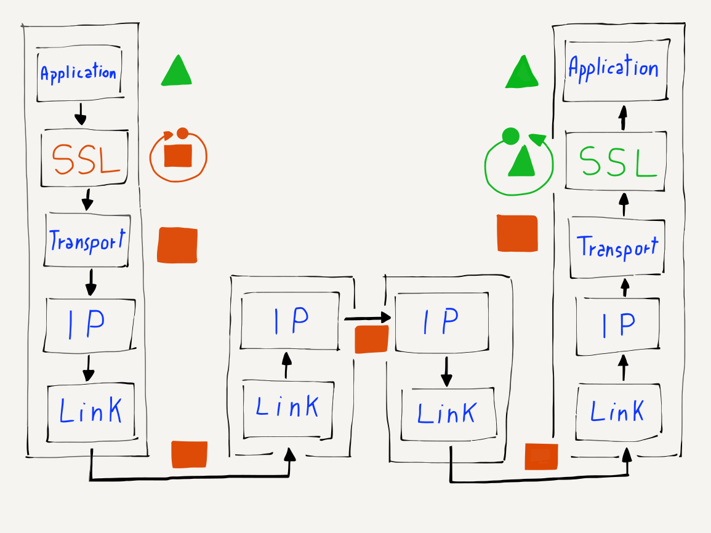

---
hide:
  - navigation
---

# 安全传输层

**Secure Transport Layer**

=== "中文"

    在互联网的早期，网络规模较小，所有路由器都位于安全的位置。只要每台连接到互联网的计算机能保护自己免受不必要的入侵，就认为在数据传输过程中没有必要保护数据免受窥探。
    
    因此，链路层、互联网层和传输层专注于数据的高效移动，解决大规模共享分布式网络中的问题，而不考虑数据的隐私。
    
    但是，随着互联网在1980年代末的快速增长，以及在1994年网络成为主流时的爆炸性发展，网络流量的安全性和隐私性变得非常重要。当我们开始使用互联网进行商务交易，并且信用卡和银行账户号码频繁在网络上传输时，数据的安全性变得至关重要。当我们开始使用无线技术（如 WiFi）时，甚至在最简单的互联网使用中，安全性也变得必要。
    
    保护网络活动有两种普遍的方法。第一种是确保所有网络硬件（路由器和链路）都处于物理安全的位置，这样就无法让人潜入并监控网络流量。然而，这种方法对成千上万由不同组织拥有和运营的网络路由器来说并不实际。虽然你可能能够确保某些路由器运营商遵循严格的安全程序和政策，但总会出现失误。而一旦 WiFi 加入到这个组合中，数据包通过无线电波传输，网络攻击者就可以坐在咖啡店里截获经过空气的数据包。
    
    在这种情况下，唯一合理的解决方案是在计算机内部对数据进行加密，然后再通过第一个物理链接发送，在数据到达目标计算机后再进行解密。使用这种方法，我们假设攻击者可以看到你发送的所有数据包，但无法解密他们捕获的数据。加密还确保了在数据穿越互联网时没有办法篡改你的数据。

=== "英文"

    In the early days of the Internet, networks were small and all of the routers were in secure locations. As long as each computer connected to the Internet protected itself from unwanted incoming connections, it was felt that there was no need to protect data from prying eyes while it was crossing the network.
    
    So the Link, Internetwork, and Transport layers were focused on the efficient movement of data and solving the problems of a large-scale shared distributed network without worrying about the privacy of that data.
    
    But as the use of the Internet grew rapidly in the late 1980s and literally exploded when the Web became mainstream in 1994, security and privacy of network traffic became very important problems to solve. When we began using the Internet to conduct commerce and credit cards and bank account numbers were being routinely sent across the network, securing data became essential. And when we started using wireless technologies like WiFi, security became necessary for even the simplest uses of the Internet.
    
    There are two general approaches to securing network activity. The first makes sure that all of the network hardware (routers and links) is in physically secure locations so it is not possible for someone to sneak in and monitor traffic while it is crossing the Internet. This approach is not practical for hundreds of thousands of network routers owned and operated by many different organizations. While you might be able to ensure that some of the router operators adhered to strict security procedures and policies, sooner or later a mistake will be made. And once WiFi was added to the mix and your packets went over radio waves, a network attacker could just sit in a coffee shop and intercept packets as they passed through the air.
    
    Under these conditions, the only reasonable solution is to encrypt data in your computer before it is sent across its first physical link, and then decrypt the data in the destination computer after it arrives. Using this approach, we assume that an attacker can see all of the packets that you send, but they cannot decrypt the data that they have captured. The encryption also guarantees that there is no way to alter your data while it is crossing the Internet.

## 加密和解密数据

**Encrypting and Decrypting Data**

=== "中文"

    保护信息以防止其在不安全的媒介上传输时被读取的概念已有数千年历史。罗马军队的指挥官们使用一种称为“凯撒密码”的编码方法相互发送密信。这种方法的最简单版本是将实际消息中的每个字符（我们称之为“明文”）向字母表中固定距离移动，从而生成混淆后的消息或“密文”。
    
    然后，我们通过信使或其他不安全的运输方式将密文发送给对方。信使无法读取消息，因为它看起来像是随机字符，除非知道用于编码该消息的技术。
    
    只要接收消息的人知道用于移动消息的数字，他们就可以将编码消息中的字符进行还原，以重现原始消息。
    
    以下是一个简单的明文和密文的示例，使用的移动距离为1：
    
    ```
    明文： Go to the river
    密文： Hp up uif sjwfs
    ```
    
    我们用“加密”一词来描述将明文转换为密文的过程，用“解密”来描述反向过程。
    
    凯撒密码很容易被破解，但直到大约150年前，它仍被用来保护重要消息。现代加密技术远比简单的字符移动复杂，但所有加密系统都依赖于某种双方都知晓的秘密密钥，以便解密接收到的数据。

=== "英文"

    The concept of protecting information so it cannot be read while it is being transported over an insecure medium is thousands of years old. The leaders in Roman armies sent coded messages to each other using a code called the "Caesar Cipher". The simplest version of this approach is to take each of the characters of the actual message (we call this "plain text") and shift each character a fixed distance down the alphabet to produce the scrambled message or "ciphertext".
    
    Then we send the ciphertext via the courier or other insecure transport to the other person. The courier cannot read the message because it appears to be random characters unless you know the technique used to encode the message.
    
    As long as the person receiving the message knew the number used to shift the message, they could unshift the characters in the encoded message to reproduce the original message.
    
    Here is a simple example of plain text and ciphertext using a shift of one:
    
        Plain text:  Go to the river
        Cipher text: Hp up uif sjwfs
    
    We use the word "encrypt" to describe transforming the plain text to the ciphertext and "decrypt" to describe the reverse process.
    
    The Caesar Cipher is very simple to defeat, but it was used to protect important messages until about 150 years ago. Modern encryption techniques are far more sophisticated than a simple character shift, but all encryption systems depend on some kind of a secret key that both parties are aware of so they can decrypt received data.

## 两种加密方式

**Two Kinds of Secrets**

=== "中文"

    传统的加密传输方式是使用一个共享秘密（一个密码、一个句子或一个数字），只有发送方和接收方知道。掌握这个秘密后，解密接收到的数据非常简单，但如果在没有这个秘密的情况下接收到数据，就几乎不可能解密该消息。
    
    
    
    在互联网早期，两个人可以通过一个人先打电话给另一个人并告知他们解密秘密来相互发送加密邮件。这在网络用户较少时运作良好，但无法扩展到一个公司可能拥有数百万客户的情况，无法为每个客户拨打电话以建立共享秘密，才可以进行购买。
    
    虽然通过互联网分发共享秘密似乎是个好主意，但如果假设攻击者正在监视并捕获所有网络流量，他们也能捕获包含共享秘密的未加密消息。此时，攻击者使用共享秘密解密消息将变得轻而易举。而更糟糕的是，攻击者可以拦截一条消息，延迟它，然后解密、修改并重新加密，再将修改后的消息发送回去。接收计算机将解密该消息，而不会知道它在传输过程中被攻击者修改过。
    
    因此，显然共享秘密无法解决亿万对网络计算机之间保护网络流量的问题。
    
    解决这个问题的方案出现在1970年代，当时提出了非对称密钥加密的概念。非对称密钥加密的思路是使用一个密钥加密消息，另一个密钥用来解密。接收加密数据的计算机选择加密密钥和解密密钥。然后，加密密钥被发送给将要发送数据的计算机。发送计算机加密数据并通过网络发送。接收计算机使用解密密钥解密数据。
    
    我们称加密密钥为“公钥”，因为它可以被广泛分享。我们称解密密钥为“私钥”，因为它从不离开创建它的计算机。非对称密钥的另一种名称是公钥/私钥。
    
    整个过程的设计是，如果攻击者拥有公钥（未加密发送）和密文，那么几乎不可能解密加密数据。使用大质数的数学使得从公钥和密文中猜测私钥变得困难。
    
    因此，随着公钥/私钥技术的出现，剩下的唯一问题就是如何在我们的网络模型中应用它。

=== "英文"

    The traditional way to encrypt transmissions is using a  shared secret (a password, a sentence, a number) that only the sending and receiving parties know. With the secret, it is easy to decrypt the received data, but if you received the data without possessing the secret, it would be effectively impossible to decrypt the message.
    
    
    
    In the early days of the Internet, two people could send encrypted email to each other by one person first calling the other person on the phone and giving them the decryption secret. This worked well when there were only a few users on the network, but could not scale to situations where a company might have millions of customers and could not afford to make a phone call to each customer to establish a shared secret before they could make a purchase.
    
    It might seem like a good idea to distribute the shared secrets over the Internet, but if we assume that the attackers are monitoring and capturing all network traffic, they could also capture the unencrypted message that contained the shared secret.  At that point it would be trivial for the attacker to use the shared secret to decrypt a message. And even worse, the attacker could intercept a message, delay it, then decrypt it, change and re-encrypt it, and send the modified message back on its way.  The receiving computer would decrypt the message and never know that it had been modified by an attacker while in transit.
    
    So shared secrets clearly would not work to solve the problem of securing network traffic between trillions of pairs of networked computers.
    
    The solution to this problem came in the 1970s when the concept of asymmetric key encryption was developed. The idea of asymmetric key encryption is that one key is used to encrypt the message and another key is used to decrypt it. The computer that will be receiving the encrypted data chooses both the encryption key and decryption key. Then the encryption key is sent to the computer that will be sending the data. The sending computer encrypts the data and sends it across the network. The receiving computer uses the decryption key to decrypt the data.
    
    We call the encryption key the "public" key because it can be widely shared. We call the decryption key the "private" key because it never leaves the computer where it was created. Another name for asymmetric keys is public/private keys.
    
    The whole process is designed so that if an attacker has the public key (which was sent unencrypted) and the encrypted text, it is virtually impossible to decrypt the encrypted data. There is a lot of math with large prime numbers that makes it hard to guess the private key from the public key and encrypted data.
    
    So with the advent of public/private key technology, the only question left was how to apply it in our network model.

## 安全套接层（SSL）

**Secure Sockets Layer (SSL)**

=== "中文"

    由于网络工程师在互联网协议开发近20年后才决定添加安全性，因此确保不破坏现有的互联网协议或架构变得十分重要。他们的解决方案是在传输层和应用层之间添加一个可选的部分层，称为安全套接字层（SSL）或传输层安全性（TLS）。
    
    当应用程序请求传输层与远程主机建立连接时，可以选择请求加密或不加密的连接。如果请求了加密连接，传输层将在将数据分解为数据包之前对其进行加密。这意味着，无论数据包是加密还是未加密，传输层、互联层和物理（链路）层仍然可以完全相同地执行其功能。同时，进行连接的应用程序也免去了了解加密和解密工作原理的细节。
    
    由于加密是对传输层的简单且透明的添加，因此无需更改在互联层和链路层上运行的路由器。也不需要更改任何链路层硬件以使加密生效。应用程序只需在适当时请求连接加密，无需进行其他修改。

=== "英文"

    Since network engineers decided to add security nearly 20 years after the Internet protocols were developed, it was important not to break any existing Internet protocols or architecture. Their solution was to add an optional partial layer between the Transport layer and the Application layer. They called this partial layer the Secure Sockets Layer (SSL) or Transport Layer Security (TLS).
    
    
    
    When an application requested that the Transport layer make a connection to a remote host, it could request that the connection either be encrypted or unencrypted. If an encrypted connection was requested, the Transport layer encrypted the data before breaking the stream into packets. This meant that the Transport layer, Internetwork layer, and physical (link) layers could still perform exactly the same way whether the packets were encrypted or non-encrypted. The applications making the connections were also spared the details of how encryption and decryption worked.
    
    Since encryption was a simple and transparent addition to the Transport layer, there was no need to change the routers that operate at the Internetwork and Link layers. There was no need to change any Link layer hardware to make encryption work. And applications did not need to be modified except to request that a connection be encrypted when appropriate.

## 加密网页浏览器流量

**Encrypting Web Browser Traffic**

=== "中文"

    由于网页浏览器和网页服务器在应用层操作，我们几乎不会注意到自己是在使用加密连接还是未加密连接。网页浏览器使用将“http:”替换为“https:”的URL约定，以指示浏览器应使用安全传输层与网页服务器通信，而不是未加密的传输层。您的浏览器通常会在地址栏中显示一个“锁”图标，以告诉您正在与安全网站进行通信。
    
    设置https连接时会有一些小的开销，以及加密和解密正在发送的数据时会产生小额成本。由于https的成本稍高，一段时间内它仅用于包含密码、银行账号或其他敏感数据的页面。
    
    但随着时间的推移，网络变得更快，https的实现变得更加高效，因此逐渐出现了在与您有账户的网页服务器进行交互时加密所有网页服务器交互的趋势。目前的趋势是对所有网页流量使用https。

=== "英文"

    Since web browsers and web servers operate at the application layer, we barely notice whether we are using encrypted or unencrypted connections. Web browsers use the URL convention of replacing "http:" with "https:" to indicate that the browser is to communicate with the web server using the Secure Transport Layer instead of the unencrypted Transport layer.   Your browser will usually show a  "lock" icon in the address bar to let you know that you are communicating with a secure web site.
    
    There is a small overhead in setting up the https connections and a small cost to encrypt and decrypt the data that is being sent. Since https was slightly more costly, for a while it was used only for pages that contained passwords, bank account numbers, or other sensitive data.
    
    But over time as networks have become faster and the https implementations have gotten much more efficient, there is a trend toward encrypting all web server interactions whenever you are interacting with a web server where you have an account.  The current trend is towards using https for all web traffic.

## 证书和证书授权

**Certificates and Certificate Authorities**

=== "中文"

    虽然公钥/私钥加密可以在不安全的网络上分发加密密钥，并使用这些密钥加密传输，但仍然存在一个问题，即你无法确定在连接到服务器时收到的公钥是否确实来自声称的组织。
    
    
    
    也许你认为自己正在连接到 www.amazon.com ，但一台恶意计算机拦截了你的流量，声称是 www.amazon.com ，并给你提供一个用于加密的公钥。如果你的网页浏览器信任这个密钥，它将使用恶意计算机的公钥加密你的银行信息并发送给恶意计算机。由于恶意计算机提供了公钥，它也拥有相应的私钥，从而能够解密并窃取你的银行信息。
    
    因此，你的计算机需要知道这个密钥的实际来源。这通过发送一个由证书颁发机构（CA）数字签名的公钥来实现。当你的计算机或浏览器最初安装时，它会知道一些知名的证书颁发机构。如果你的浏览器收到一个由其中一个知名证书颁发机构签名的公钥，它将信任这个密钥并使用它来加密和发送你的数据。如果你的计算机收到一个没有经过其受信任的证书颁发机构签名的公钥，它会在使用该密钥发送数据之前警告你。
    
    如果你看到关于不受信任证书的警告消息，你应该说“不”，并在发送任何敏感数据之前弄清楚你的网络流量为何没有被路由到你认为的服务器。

=== "英文"

    While public/private key encryption works to allow the distribution of encryption keys across insecure networks and the use of those keys to encrypt transmissions, there is still a problem of knowing if the public key that you have received when you connected to a server is really from the organization it claims to be from.
    
    
    
    Perhaps you think you are connecting to www.amazon.com but a rogue computer intercepts your traffic, claiming to be www.amazon.com and giving you a public key to use for encryption. If your web browser trusts the key, it will use the rogue computer's public key to encrypt your banking information and send it to the rogue computer. Since the rogue computer gave you the public key, it also has the corresponding private key and is able to decrypt and abscond with your banking information.
    
    So your computer needs to know who the key is actually coming from.   This is achieved by sending you a public key that is digitally signed by a Certificate Authority (CA). When your computer or browser is initially installed, it knows about a number of well-known certificate authorities. If your browser is given a public key that is signed by one of the well-known certificate authorities, it trusts the key and uses it to encrypt and send your data. If your computer receives a public key that is not signed by one of its trusted certificate authorities, it will warn you before sending your data using the key.
    
    If you see a warning message about an untrusted certificate, you should probably say "no" and figure out why your network traffic is not being routed to the server that you think it is going to before sending any sensitive data.

## 总结

**Summary**

=== "中文"

    由于互联网在需要广泛部署安全性时几乎已经存在了20年，我们必须找到一种方法在已经存在的四层模型上添加安全性。添加安全性的最佳位置是作为传输层的一个选项。这就是为什么我们将互联网的安全连接称为“安全套接字层”（SSL）或“传输层安全性”（TLS）。SSL和TLS之间有细微的区别，但它们都在传输层加密数据。
    
    公钥/私钥加密的发明恰逢其时，解决了共享密钥加密方法的密钥分发问题。使用公钥/私钥时，公钥可以在不安全的媒介上进行常规共享。这意味着我们可以使用未加密的连接来交换数据，并将连接升级为安全连接。
    
    通过在传输层顶部插入安全层，我们能够避免更改应用层、互联网层和链路层，同时轻松地保护任何传输层连接。这种方法确保所有通过连接发送的数据在离开计算机之前都被加密。考虑到我们中的许多人使用像WiFi这样的无线连接，攻击者很容易监控这些连接，在通过WiFi发送数据之前加密是一个好主意。
    
    浏览器通过将URL的前缀从“http:”更改为“https:”来支持安全连接。通过关注URL，最终用户可以确保他们不会在不安全的连接上发送敏感数据。一系列受信任的证书颁发机构将签名公钥，以保证您收到的密钥确实来自您期望的组织。
    
    安全传输层的设计提供了一种安全且易于使用的机制，以实现跨互联网的安全通信，适用于数万亿对交互计算机的规模。

=== "英文"

    Since the Internet was nearly 20 years old before we needed broadly deployed security, we had to find a way to add security to the already existing four-layer model. The perfect place to add security was as an option in the Transport layer. This is why we call secure connections on the Internet "Secure Sockets Layer" (SSL) or "Transport Layer Security" (TLS).  There are subtle differences between SSL and TLS but they both encrypt data at the Transport layer.
    
    The invention of public/private key encryption was well timed in that it solved the key distribution problem of shared-secret encryption approaches. With public/private keys, the public encryption key can be routinely shared across insecure media. This means we can use an unencrypted connection to exchange data and upgrade the connection to a secure connection.
    
    By inserting the secure layer at the top of the Transport layer, we were able to avoid changing the Application, Internetwork, and Link layers while still easily securing any Transport layer connection. This approach ensures that all data being sent across a connection is encrypted before it leaves your computer.  Given that many of us use wireless connections like WiFi, which are easily monitored by attackers, it is a good idea to encrypt data before it is sent across WiFi.
    
    Browsers support secure connections by changing the prefix on the URL from "http:" to "https:". By keeping an eye on the URL, end users can make sure they never send sensitive data across insecure connections. A series of trusted Certificate Authorities will sign public keys to give you an assurance that the key you received is indeed from the organization you expect it to be.
    
    The design of the Secure Transport Layer provides a secure and yet easy-to-use mechanism for secure communications across the Internet at a scale of trillions of pairs of interacting computers.

## 术语

**Glossary**

=== "中文"

    **非对称密钥**：一种加密方法，使用一个（公钥）加密数据，然后用不同的（私钥）解密接收到的数据。
    
    **证书授权**：一个组织，在验证公钥上列出的名称确实是拥有该公钥的人或组织后，数字签署公钥。
    
    **密文**：一种混淆的信息版本，未掌握解密密钥和技术无法读取。
    
    **解密**：将密文消息转换为明文消息的行为，使用秘密或密钥。
    
    **加密**：将明文消息转换为密文消息的行为，使用秘密或密钥。
    
    **明文**：即将被加密的可读消息。
    
    **私钥**：用于解密传输的密钥对的一部分。
    
    **公钥**：用于加密传输的密钥对的一部分。
    
    **共享密钥**：一种加密方法，使用相同的密钥进行加密和解密。
    
    **SSL**：安全套接层，一种允许应用程序请求在网络上进行加密的传输层连接的方法。类似于传输层安全性（TLS）。
    
    **TLS**：传输层安全性，一种允许应用程序请求在网络上进行加密的传输层连接的方法。类似于安全套接层（SSL）。

=== "英文"

    **asymmetric key**: An approach to encryption where one (public) key is used to encrypt data prior to transmission and a different (private) key is used to decrypt data once it is received.
    
    **certificate authority**: An organization that digitally signs public keys after verifying that the name listed in the public key is actually the person or organization in possession of the public key.
    
    **ciphertext**: A scrambled version of a message that cannot be read without knowing the decryption key and technique.
    
    **decrypt**: The act of transforming a ciphertext message to a plain text message using a secret or key.
    
    **encrypt**: The act of transforming a plain text message to a ciphertext message using a secret or key.
    
    **plain text**: A readable message that is about to be encrypted before being sent.
    
    **private key**: The portion of a key pair that is used to decrypt transmissions.
    
    **public key**: The portion of a key pair that is used to encrypt transmissions.
    
    **shared secret**: An approach to encryption that uses the same key for encryption and decryption.
    
    **SSL**: Secure Sockets Layer.  An approach that allows an application to request that a Transport layer connection is to be encrypted as it crosses the network. Similar to Transport Layer Security (TLS).
    
    **TLS**: Transport Layer Security. An approach that allows an application to request that a Transport layer connection is to be encrypted as it crosses the network.  Similar to Secure Sockets Layer (SSL).


## 问题

**Questions**

=== "中文"

    你可以在网上参加这个测验，网址为 <http://www.net-intro.com/quiz/>
    
    1. 使用网页浏览器时，我们如何表示希望建立安全连接？
    
       a) 在网址中使用 https://
    
       b) 使用安全的网页浏览器
    
       c) 打开无痕窗口
    
       d) 手动使用 SHA1 编码服务器地址
    
    2. 为什么共享密钥的方法不适合在互联网上使用？
    
       a) 因为人们会丢失或误放秘密
    
       b) 秘密分发困难
    
       c) 共享密钥的加密和解密太容易被破解
    
       d) 共享密钥的加密和解密需要过多的计算资源
    
    3. 公钥/私钥加密安全的基础数学概念是什么？
    
       a) 连续函数
    
       b) 泰勒级数
    
       c) 卡诺图
    
       d) 素数
    
    4. 哪种密钥可以以明文形式在互联网上发送而不影响安全性？
    
       a) 加密密钥
    
       b) 解密密钥
    
       c) 共享密钥
    
       d) 通用安全密钥 (USK)
    
    5. 安全套接层（SSL）在四层互联网架构中的位置是？
    
       a) 在链路层下方
    
       b) 在链路层和互联层之间
    
       c) 在互联层和传输层之间
    
       d) 在传输层和应用层之间
    
    6. 如果你在咖啡馆的 WiFi 上正确使用 https，那么在进行在线购买时，最大风险是什么？
    
       a) 有人捕获了在 WiFi 上传输的包
    
       b) 有人捕获了网关路由器中的包
    
       c) 有人捕获了经过核心互联网路由器的包
    
       d) 你的计算机上有病毒在捕获击键
    
    7. 使用安全套接层时，数据包在哪里进行加密和解密？
    
       a) 它们在路由器传输时被加密和解密
    
       b) 每个物理链路都有自己的独立加密
    
       c) 它们在你的计算机上加密，在服务器上解密
    
       d) 它们在 WiFi 网关加密，在到达目标计算机前的最后一个路由器解密
    
    8. 为使安全套接层（SSL）正常工作，IP 层需要哪些更改？
    
       a) 不需要任何更改
    
       b) 需要增加对安全 IP（IPSEC）的支持
    
       c) 需要在 IP 中支持更长的数据包
    
       d) 需要加密生存时间（TTL）值
    
    9. 如果一个恶意元素能够监控通过海底电缆的所有数据包，而你正确使用公钥/私钥加密，以下哪项对他们来说最难获取？
    
       a) 你在与哪些服务器通信
    
       b) 你使用服务器的频率
    
       c) 你从服务器检索了多少数据
    
       d) 你从服务器检索了哪些文档
    
    10. 在公钥/私钥加密中，证书授权的目的是什么？
    
        a) 确保人们不伪造学习活动的徽章
    
        b) 确保数据包被路由到正确的目标计算机
    
        c) 确保公钥来自其声称的组织
    
        d) 确定某个国家何时必须从 IPv4 切换到 IPv6
    
    11. ARPANET 网络自 1960 年代起开始运营，安全套接层（SSL）直到 1980 年代才被发明。ARPANET 是如何确保其网络数据安全的？
    
        a) 使用公钥/私钥并加密所有传输
    
        b) 在链路层使用加密
    
        c) 确保没有人能够访问物理链路
    
        d) 只使用安全的 WiFi 路由器
    
    12. 以下哪个答案是 "Security is fun" 通过凯撒密码（Caesar Cipher）位移 1 加密的结果？
    
        a) Ptsjduao rt dii
    
        b) Wentudhs di dju
    
        c) Tfdvsjuz jt gvo
    
        d) Asdfghjk qw zxc
    
    13. 用于加密 "V yvxr frphevgl" 的凯撒密码位移是多少？
    
        a) 1
    
        b) 6
    
        c) 13
    
        d) 24

=== "英文"

    You can take this quiz online at <http://www.net-intro.com/quiz/>
    
    1. How do we indicate that we want a secure connection when using a web browser?
    
        a) Use https:// in the URL
        
        b) Use a secure web browser
        
        c) Open an incognito window
        
        d) Manually encode the address of the server using SHA1
    
    1. Why is a shared-secret approach not suitable for use on the Internet?
    
        a) Because people would lose or misplace the secret
        
        b) It is difficult to distribute the secrets
        
        c) Encryption and decryption with shared secrets are too easily broken
        
        d) Encryption and decryption with shared secrets take too much compute power
    
    1. What is the underlying mathematical concept that makes public/private key encryption secure?
    
        a) Continuous functions
        
        b) Taylor series
        
        c) Karnaugh Maps
        
        d) Prime numbers
    
    1. Which of the keys can be sent across the Internet in plain text without compromising security?
    
        a) Encryption key
        
        b) Decryption Key
        
        c) Shared Secret
        
        d) Univerally Safe Key (USK)
    
    1. Where does the Secure Sockets Layer (SSL) fit in the four-layer Internet architecture?
    
        a) Below the Link layer
        
        b) Between the Link and Internetworking layers
        
        c) Between the Internetworking and Transport layers
        
        d) Between the Transport and Application layers
    
    1. If you were properly using https in a browser over WiFi in a cafe, which of the following is the greatest risk to your losing credit card information when making an online purchase?
    
        a) Someone captured the packets that were sent across the WiFi
        
        b) Someone captured the packets in the gateway router
        
        c) Someone captured the packets as they passed through a core Intenet router
        
        d) You have a virus on your computer that is capturing keystrokes
    
    1. With the Secure Sockets Layer, where are packets encrypted and decrypted?
    
        a) They are encrypted and decrypted as they pass through the router
        
        b) Each physical link has its own separate encryption
        
        c) They are encrypted in your computer and decrypted in the server
        
        d) They are encrypted in the WiFi gateway and decrypted in the last router before the destination computer
    
    1. What changes to the IP layer were needed to make secure socket layer (SSL) work?
    
        a) No changes were needed
        
        b) We had to add support for Secure IP (IPSEC)
        
        c) We needed to support longer packets in IP
        
        d) The Time-To-Live (TTL) value needed to be encrypted
    
    1. If a rogue element was able to monitor all packets going through an undersea cable and you were using public/private key encryption properly, which of the following would be the most difficult for them to obtain?
    
        a) What servers you were communicating with
        
        b) How often you used the servers
        
        c) How much data you retrieved from the servers
        
        d) Which documents you retrieved from the servers
    
    1.  What is the purpose of a Certificate Authority in public/private key encryption?
    
        a) To make sure people do not forge badges for learning activities
        
        b) To make sure packets get routed to the correct destination computer
        
        c) To assure us that a public key comes from the organization it claims to be from
        
        d) To choose when a particular country must switch from IPv4 to IPv6
    
    1.  The ARPANET network was in operation starting in the 1960s. Secure Sockets Layer (SSL) was not invented util the 1980s. How did the ARPANET insure the security of the data on its network?
    
        a) By using public/private keys and encrypting all transmissions
        
        b) By using encryption at the Link layer
        
        c) By making sure no one could access the physical links
        
        d) By only using secure WiFi routers
    
    1.  Which of these answers is "Security is fun" encrypted with a Caesar Cipher shift of 1.
    
        a) Ptsjduao rt dii
        
        b) Wentudhs di dju
        
        c) Tfdvsjuz jt gvo
        
        d) Asdfghjk qw zxc
    
    13. What Caesar Cipher shift was used to encrypt "V yvxr frphevgl"?
    
        a) 1
        
        b) 6
        
        c) 13
        
        d) 24