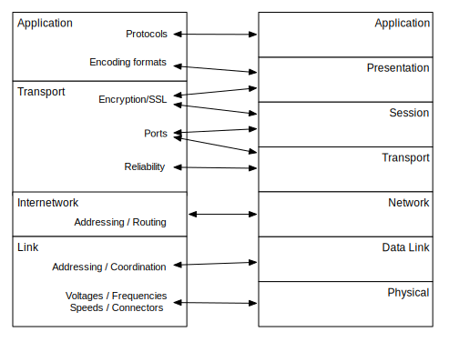

---
hide:
  - navigation
---

# OSI 模型

**The OSI Model**

=== "中文"

    到目前为止，我们花了所有时间描述用于设计和实施组成互联网的 TCP/IP 协议和应用的四层模型。然而，TCP/IP 模型并不是我们理解网络工作原理的唯一模型。另一个常用的网络设计模型叫做开放系统互联（OSI）模型。TCP/IP 模型是在 TCP/IP 协议开发、部署和变更过程中设计和演变而来的，而 OSI 模型则是许多网络专家经过仔细设计过程的结果，旨在开发一种通用的网络模型。
    
    在当今网络化的世界中，OSI 模型和 TCP/IP 模型服务于两个不同的目的。^[当然，这是一种过于简单化的说法。在1990年之前，确实存在基于 ISO 规范的操作性网络实现，这些实现与 OSI 网络模型非常接近。但如今，这些 ISO/OSI 网络实现不再广泛使用。] TCP/IP 模型是一个*实现*模型，它为那些构建 TCP/IP 兼容网络硬件或软件的人提供指导。而 OSI 模型则更像一个*抽象*模型，可以用于理解广泛的网络架构。
    
    尽管 TCP/IP 是当今使用最广泛的网络技术，但过去 50 年间实施和部署了许多不同类型的网络。随着我们继续改进和发展网络，新的实现模型可能会出现。
    
    OSI 模型有七层，而 TCP/IP 模型只有四层。从 OSI 模型的底部（离物理连接最近的地方）开始，层次依次为：（1）物理层，（2）数据链路层，（3）网络层，（4）传输层，（5）会话层，（6）表示层，以及（7）应用层。接下来，我们将依次查看 OSI 模型中的每一层，从物理层开始。

=== "英文"

    So far we have spent all of our time describing the four-layer model used to design and implement the TCP/IP protocols and applications that make up the Internet. However, the TCP/IP  model is not the only model we can use to help us understand how networks work. The other model commonly used to make sense of network design is called the Open System Interconnection (OSI) model. While the TCP/IP model was designed and evolved as the TCP/IP protocols were developed, deployed, and changed, the OSI model was the result of a careful design process by many networking experts who worked to develop a general approach to network models.
    
    In today's networked world, the OSI model and the TCP/IP model serve two different purposes.^[This, of course, is an oversimplification. Prior to 1990, there *were* operational network implementations based on ISO specifications that followed the OSI network model very closely. But today, those ISO/OSI  network implementations no longer are in broad use.] The TCP/IP model is an *implementation* model, in that it provides the guidance for those who would build TCP/IP-compatible network hardware or software. The OSI model is more of an *abstract* model that  can be used to understand a wide range of network architectures.
    
    While TCP/IP is the most widely used network technology today, many different types of networks have been implemented and deployed  over the past 50 years. And as we continue to improve and evolve networking,  new implementation models may emerge.
    
    The OSI model has seven layers instead of the four layers of the TCP/IP model. Starting at the bottom (nearest the physical connections) of the OSI model, the layers are: (1) Physical, (2) Data Link, (3) Network, (4) Transport, (5) Session, (6) Presentation, and (7) Application. We will look at each layer in the OSI model in turn, starting with the Physical layer.

## 物理层（层 1）

**Physical (Layer 1)**

=== "中文"
        
    OSI 物理层处理用于通过单个连接传输数据的实际有线、无线、光纤或其他连接的物理属性。物理层还定义了连接器的形状和可以使用的媒体类型。此层解决的另一个问题是如何编码组成要通过介质发送的数据的比特（0 和 1）。^[“曼彻斯特编码”是用于通过电缆传输比特的常见编码技术。] “比特编码”（或调制）决定了数据在连接上发送的速度。

=== "英文"
    
    The OSI Physical layer deals with the physical attributes of the actual wired, wireless, fiber optic, or other connection that is used to transport data across a single link. The Physical layer also defines the shapes of the connectors and type of media which can be used. Another problem solved at this layer is how to encode the bits (0's and 1's) that make up the data being sent across the medium.^["Manchester Encoding" is a common technique for encoding  bits for transmission across a wire.] The "bit encoding" (or modulation) determines how fast data can be sent across the link.

## 数据链路层（层 2）

**Data Link (Layer 2)**

=== "中文"
    
    OSI 数据链路层关注使用物理连接的系统如何相互协作。当数据被分割成数据包时，数据链路层定义特殊的序列以指示每个数据包的开始和结束。通过物理连接进行通信的站点被分配地址，以便有效使用介质。有时多个站点共享同一介质（例如在无线网络中），数据链路层定义了这些站点如何与连接到网络的其他系统共享连接。大多数数据链路层还具有某种形式的校验和，用于检测和/或纠正传输数据中的错误。
    
    OSI 模型的物理层和数据链路层解决的设计问题在 TCP/IP 模型的链路层中得到了处理。

=== "英文"

    The OSI Data Link layer is concerned with how the systems using a physical link cooperate with one another. When data is broken into packets, the Data Link layer defines special sequences to indicate the beginning and end of each packet. The stations communicating using the physical connection are assigned addresses to allow for effective use of the media. Sometimes multiple stations are sharing the same media (as on a wireless network) and the Data Link layer defines how those stations will share the connections with the other systems connected to the network. Most Data Link layers also have some form of checksum to detect and/or correct for errors in the transmitted data.
    
    The design problems solved in the Physical and Data Link layers of the OSI model are addressed by the Link layer of the TCP/IP model.

## 网络层（层 3）

**Network (Layer 3)**

=== "中文"
    
    与 TCP/IP 模型中的互联层（IP）类似，OSI 网络层处理连接到网络的各个系统的“可路由”地址的全局分配。网络层管理路由器如何在多个跳跃中转发数据包，以便从源地址到达目的地。与 IP 层一样，OSI 网络层不试图做到无错误，因为它假设丢失的数据将在上层被检测到并重新传输。

=== "英文"
    
    Like the Internetwork Layer (IP) in the TCP/IP model, the OSI Network layer deals with the global assignment of "routable" addresses to the various systems connected to the network. The Network layer governs how routers forward packets across multiple hops to get from their source to their destination. Like the IP layer, The OSI Network layer does not attempt to be error free, as it assumes that lost data will be detected and retransmitted at the next layer up.

## 传输层（层 4）

**Transport (Layer 4)**

=== "中文"

    OSI 模型中的传输层管理数据包丢失和重传，以及流量控制和窗口大小。TCP/IP 传输层的其余功能在 OSI 模型的会话层中处理。

=== "英文"

    The Transport layer in the OSI model manages packet loss and retransmission as well as flow control and window size. The rest of the functionality of the TCP/IP Transport layer is handled in the Session layer in the OSI model.

## 会话层（层 5）

**Session (Layer 5)**

=== "中文"
    
    OSI 会话层负责在应用程序之间建立连接。会话层处理“端口”，以便连接的客户端应用程序能够“找到”特定系统上的正确服务器应用程序。某些安全传输方面的处理也在 OSI 会话层中进行。

=== "英文"
    
    The OSI Session layer handles establishing connections between applications. The Session layer deals with "ports" so that a connecting client application can "find" the correct server application on a particular system. Some aspects of secure transmission are also handled in the OSI Session layer.

## 表示层（层 6）

**Presentation (Layer 6)**

=== "中文"
    
    表示层关注数据在网络上传输时的表示和编码方式。例如，表示层将描述如何编码图像的像素，以便接收应用程序能够正确解码数据。表示层还处理数据的加密和解密。

=== "英文"
    
    The Presentation layer focuses on how data is represented and encoded for transmission across the network. As an example, the Presentation layer would describe how to encode the pixels of an image so that the receiving application can properly decode the data. The Presentation layer also handles data encryption and decryption.

## 应用层（层 7）

**Application (Layer 7)**

=== "中文"
    
    OSI 应用层与 TCP/IP 模型中的应用层非常相似，因为它包含了应用程序本身。一些应用程序是发起连接的客户端应用程序，其他应用程序是响应这些连接请求的服务器应用程序。各种应用程序对有协议标准，定义了来自不同供应商的多个客户端和多个服务器之间的互操作性。

    

=== "英文"
    
    The OSI Application Layer is very similar to the Application layer in the TCP/IP model, in that it contains the applications themselves. Some applications are client applications that initiate connections, and other applications are the server applications that respond to those connection requests. The various pairs of applications have protocol standards that define interoperability between multiple clients and multiple servers from different vendors.

    

## 比较 OSI 和 TCP/IP 模型

**Comparing the OSI and TCP/IP Models**

=== "中文"

    我们可以使用 OSI 模型为 TCP/IP 模型提供一种替代“视角”，通过比较 OSI 模型如何将网络功能划分为不同层次，以及 TCP/IP 模型如何划分其功能。

=== "英文"
    
    We can use the OSI model to provide an alternative "view" of the TCP/IP model by comparing how the OSI model breaks network functionality into its layers and how the TCP/IP model breaks its functionality into layers.

## 链路层（TCP/IP）

**Link Layer (TCP/IP)**

=== "中文"
    
    TCP/IP 链路层将 OSI 模型中的物理层和数据链路层合并。物理层和数据链路层通常在硬件中实现。像以太网、WiFi、卫星或光纤等产品通常在插入计算机或路由器后面的网络驱动卡中实现。网络驱动卡一般在卡上的硬件中实现连接的物理和数据链路方面。在大多数情况下，数据链路层会根据其相应物理层的限制和要求进行调优。因此，在实际系统中，特定的数据链路层与任意数量的物理层随意配对的情况比较少见。由于将特定链路技术的物理和数据链路方面分开可能很困难，TCP 模型为了简化而将它们合并为一个层次。

=== "英文"
    
    The TCP/IP Link layer combines the Physical and Data Link layers from the OSI model. The Physical and Data Link layers are usually implemented in hardware.  Products like Ethernet, WiFi, satellite, or fiber optic often are implemented in a network driver card that plugs into the back of a computer or router. The network driver card generally implements both the physical and the data link aspects of the connection in the hardware on the card.  In most cases, the data link layers are tuned to the limitations and requirements of their corresponding physical layers. So in real systems, it is somewhat rare for a particular data link layer to be arbitrarily paired with any number of physical layers. Since it can be hard to separate the physical and data link aspects for a particular link technology, the  TCP model combines them into a single layer for simplicity.

## 互联层（TCP/IP）

**Internetwork Layer (TCP/IP)**

=== "中文"
    
    在两个模型之间映射得比较清晰的一个地方是 OSI 网络层和 TCP/IP 互联层。它们执行相同的功能，即创建全球可路由的地址空间，并构建路由器以确保数据包在多个跳跃中正确从源地址找到目的地。

=== "英文"
    
    One place that maps pretty cleanly between the two models is the OSI Network and TCP/IP Internetwork layers. They perform the same functions of creating a globally routable address space and building routers to insure that packets properly find their way from the source to the destination across multiple hops.

## 传输层（TCP/IP）

**Transport Layer (TCP/IP)**

=== "中文"
    
    TCP/IP 中传输层的功能分散在 OSI 模型的传输层和会话层中。OSI 传输层处理流量控制和数据包重传，而 OSI 表示层则处理在多个端口上运行的多个应用程序，以及会话的建立和拆除。
    
    TCP/IP 模型中的安全套接层（SSL）对应于 OSI 模型中会话层和表示层的部分功能。

=== "英文"

    The features of the Transport layer in TCP/IP are spread across the Transport and Session layers of the OSI model.  The OSI Transport layer deals with flow control and packet retransmission, while the OSI Presentation layer deals with multiple applications running on multiple ports as well as session establishment and teardown.
    
    The Secure Sockets Layer (SSL) in the TCP/IP model corresponds to parts of the Session and Presentation layers in the OSI model.

## 应用层（TCP/IP）

**Application Layer (TCP/IP)**

=== "中文"
    
    TCP/IP 应用层结合了 OSI 表示层和 OSI 应用层的非安全方面。虽然许多 TCP/IP 应用程序涉及编码和解码各种数据类型的问题，但 TCP/IP 模型并不将数据格式化视为单独的“层”。在 TCP/IP 应用程序中使用各种数据编码和解码技术，但 TCP/IP 更倾向于将这些能力视为库代码，应用程序根据需要使用。

=== "英文"
    
    The TCP/IP Application Layer combines the non-security aspects of the OSI Presentation layer and the OSI Application layer. While many TCP/IP applications deal with issues like encoding and decoding various types of data, the TCP/IP model does not see data formatting as a separate "layer". Various data encoding and decoding technologies are used in TCP/IP applications, but TCP/IP tends to treat these capabilities as library code that applications make use of as needed for the application.

## 结论

**Conclusion**

=== "中文"
    
    尽管本书中描述的 TCP/IP 模型广泛用于指导 TCP/IP 网络、硬件和软件的实施，但 OSI 模型可以帮助我们观察和比较从开放开发网络到专有厂商特定网络的广泛网络架构。

=== "英文"
    
    While the TCP/IP model described in this book is widely used to guide the implementation of TCP/IP networks, hardware, and software, the OSI model can help us look at and compare a wide range of network architectures ranging from openly developed networks to proprietary vendor-specific networks.

## 术语

**Glossary**

=== "中文"

    **抽象模型**：用于一般理解某一问题领域的模型和术语集，指导标准和实现的开发以解决问题。
    
    **实现模型**：用于指导标准和特定问题实现开发的模型和术语集。
    
    **ISO**：国际标准化组织。一个在计算、网络及其他许多领域制定标准的全球性机构。
    
    **OSI**：开放系统互联。一个七层模型，用于帮助组织各种网络架构设计的方法。

=== "英文"

    **abstract model**: A model and set of terminology that is used to generally understand a problem area and guide the development of standards and implementations to solve problems.
    
    **implementation model**: A model and set of terminology that is used to  guide the development of standards and an implementation to solve a particular problem.
    
    **ISO**: International Organization for Standardization.  A worldwide body that develops standards in computing, networking, and many other areas.
    
    **OSI**: Open System Interconnection.  A seven-layer model used to help organize  the design of various approaches to network architecture.

## 问题

**Questions**

=== "中文"

    您可以在此链接在线测试此测验：<http://www.net-intro.com/quiz/>
    
    1. OSI 网络模型的主要价值是什么？
    
        a) OSI 网络用于南半球
        
        b) OSI 方法可以用来分析许多不同的网络模型
        
        c) OSI 网络更好地利用有限带宽
        
        d) OSI 网络更安全
    
    2. OSI 模型有多少层？
    
        a) 四层
        
        b) 六层
        
        c) 七层
        
        d) 九层
    
    3. OSI 层中哪个层处理网络连接的连接器形状？
    
        a) 物理层
        
        b) 数据链路层
        
        c) 网络层
        
        d) 传输层
    
    4. 在 OSI 和 TCP 网络模型中，哪个层最相似？
    
        a) TCP 链路层和 OSI 数据链路层
        
        b) TCP 互联层和 OSI 网络层
        
        c) TCP 传输层和 OSI 传输层
        
        d) TCP 应用层和 OSI 会话层
    
    5. TCP/IP 安全套接层在 OSI 网络模型中对应哪个层？
    
        a) 安全数据链路层（SDLL）
        
        b) 安全网络层（SNL）
        
        c) 安全传输层（STL）
        
        d) 会话层和表示层
    
    6. 为什么 TCP 模型将 OSI 数据链路层和物理层合并为一个链路层？
    
        a) 因为 TCP 模型不担心物理层
        
        b) 因为 TCP 模型设计者在1981年荷兰乌特勒支的 OSI 会议上被忽视
        
        c) 因为数据链路层和物理层的设计通常与特定技术紧密相关
        
        d) 为了让最终用户更容易理解 TCP 模型

=== "英文"

    You can take this quiz online at <http://www.net-intro.com/quiz/>
    
    1. What is the primary value of the OSI network model?
    
        a) OSI networks are used in the southern hemisphere
        
        b) The OSI approach can be use to analyze many different network models
        
        c) OSI networks make better use of limited bandwidth
        
        d) OSI networks are more secure
    
    1. How many layers does the OSI model have?
    
        a) Four
        
        b) Six
        
        c) Seven
        
        c) Nine
    
    1. Which of the OSI layers deals with the shape of connectors for network connections?
    
        a) Physical
        
        b) Data Link
        
        c) Network
        
        d) Transport
    
    1. Which of the layers is most similar between the OSI and TCP network models?
    
        a) TCP Link Layer and OSI Data Link Layer
        
        b) TCP Internetwork Layer and OSI Network Layer
        
        c) TCP Transport Layer and OSI Transport Layer
        
        d) TCP Application Layer and OSI Session Layer
    
    1. What layer does the TCP/IP Secure Sockets Layer map to in the OSI network model?
    
        a) Secure Data Link Layer (SDLL)
        
        b) Secure Network Layer (SNL)
        
        c) Secure Transport Layer (STL)
        
        d) Session and Presentation Layers
    
    1. Why does the TCP model combine the OSI Data Link and Physical layers into a single Link layer?
    
        a) Because the TCP model does not worry about the Physical layer
        
        b) Because the TCP model designers were ignored at the 1981 OSI meeting in Utrect, Netherlands
        
        c) Because quite often the design of Data Link and Physical layers are tightly connected for a particular technology
        
        d) To make the TCP model easier to understand by end users